# 🚛 Shipping and Logistics Use Cases

**Open-source, end-to-end machine learning for the logistics and shipping community.**

[](https://github.com/immu4989/Logistics_UseCases/actions/workflows/ci.yml)
[](https://huggingface.co/spaces/immu4989/Logistics-UseCases-Demo)


> 🤖 **Looking for the agentic-AI versions of these problems?** LLM agents with verified
> evals, cost-per-run in dollars, and observed failure modes live in
> [awesome-agentic-usecases](https://github.com/immu4989/awesome-agentic-usecases) —
> starting with an [exception-triage agent](https://github.com/immu4989/awesome-agentic-usecases/tree/main/logistics-supply-chain/exception-triage-agent)
> built on the same problem as this repo's classic-ML exception-triage pipeline.

Each use case in this repo is a complete, self-contained project: dataset story, audited
cleaning, feature engineering, modeling, evaluation, and explainability that is grounded
by tests rather than eyeballed. The patterns come from production carrier ML, so shipping
teams can adapt working code instead of starting from a blank notebook.

Together the projects cover the operational loop end to end: **predict** which shipments
are at risk, **quote** promises and prices you can stand behind, **plan** the capacity
and staffing to meet the wave, **act** on the riskiest shipments within a real budget,
and **watch** the network and the fleet for drift before the monthly report sees it.

## Use cases

| Use case | The question it answers | Status |
|---|---|---|
| [📦 delivery-commit-prediction](delivery-commit-prediction/) | Which shipments will miss their delivery commitment, and which operational drivers cause it? | ✅ Ready |
| [⏱️ eta-regression](eta-regression/) | When will each package *actually* arrive, and what transit time can you promise and keep 9 times out of 10? | ✅ Ready |
| [🎛️ intervention-optimization](intervention-optimization/) | Given miss-risk scores and a daily ops budget, which shipments get rerouted, upgraded, or flagged to the customer? | ✅ Ready |
| [📡 network-anomaly-detection](network-anomaly-detection/) | Which lanes are drifting toward trouble weeks before the monthly OTP report notices? | ✅ Ready |
| [📈 volume-forecasting](volume-forecasting/) | How many parcels hit each hub tomorrow and through the peak, so you can staff before the wave? | ✅ Ready |
| [🗺️ route-optimization](route-optimization/) | Same stops, same trucks: how many miles is your zone-based routing leaving on the table? | ✅ Ready |
| [💰 dynamic-pricing](dynamic-pricing/) | What should this freight quote cost, priced by each lane's own elasticity instead of cost-plus? | ✅ Ready |
| [🔧 predictive-maintenance](predictive-maintenance/) | Which vehicles break down in the next two weeks, with enough warning to fix on a schedule? | ✅ Ready |
| [🏠 address-resolution](address-resolution/) | Which typed address matches which real delivery point, and when should nobody auto-match? | ✅ Ready |
| [↩️ returns-prediction](returns-prediction/) | Which orders come back, why, and which returns are worth preventing before the parcel ships? | ✅ Ready |
| [🚂 capacity-planning](capacity-planning/) | How many linehaul trailers do you book a week ahead, priced by the cost of guessing wrong in each direction? | ✅ Ready |
| [🎫 exception-triage](exception-triage/) | Which resolution team should each stuck-shipment ticket go to, and which tickets can route themselves? | ✅ Ready |
| [🧬 uplift-modeling](uplift-modeling/) | Which shipments actually *benefit* from an intervention — targeting by treatment effect instead of risk? | ✅ Ready |

Every use case runs end-to-end on synthetic data with one command, in about a minute,
with no proprietary data and no downloads:

```bash
cd <use-case-folder>
pip install -e .
<use-case-cli> all      # e.g. delivery-commit all, eta-regression all
```

## 📦 Delivery commit prediction

Ranks shipments by risk of missing the committed delivery date using only information
available at induction time, then explains every score. On the held-out final month:
**ROC-AUC 0.81**, the riskiest decile misses at **3.6x** the base rate, flagging the
top 10% catches **36% of all misses**, and the probabilities are calibrated (30% means
30%). Validated on the real Olist dataset too (96k orders, ROC-AUC 0.75, 3.9x lift) —
including a mid-test regime shift from Brazil's 2018 truckers' strike that breaks the
tree model and proves why the linear baseline is load-bearing.

The SHAP driver analysis reads like an operations briefing, and it's asserted in CI
against the synthetic generator's documented ground truth — planted noise features land
at the bottom, real drivers at the top:

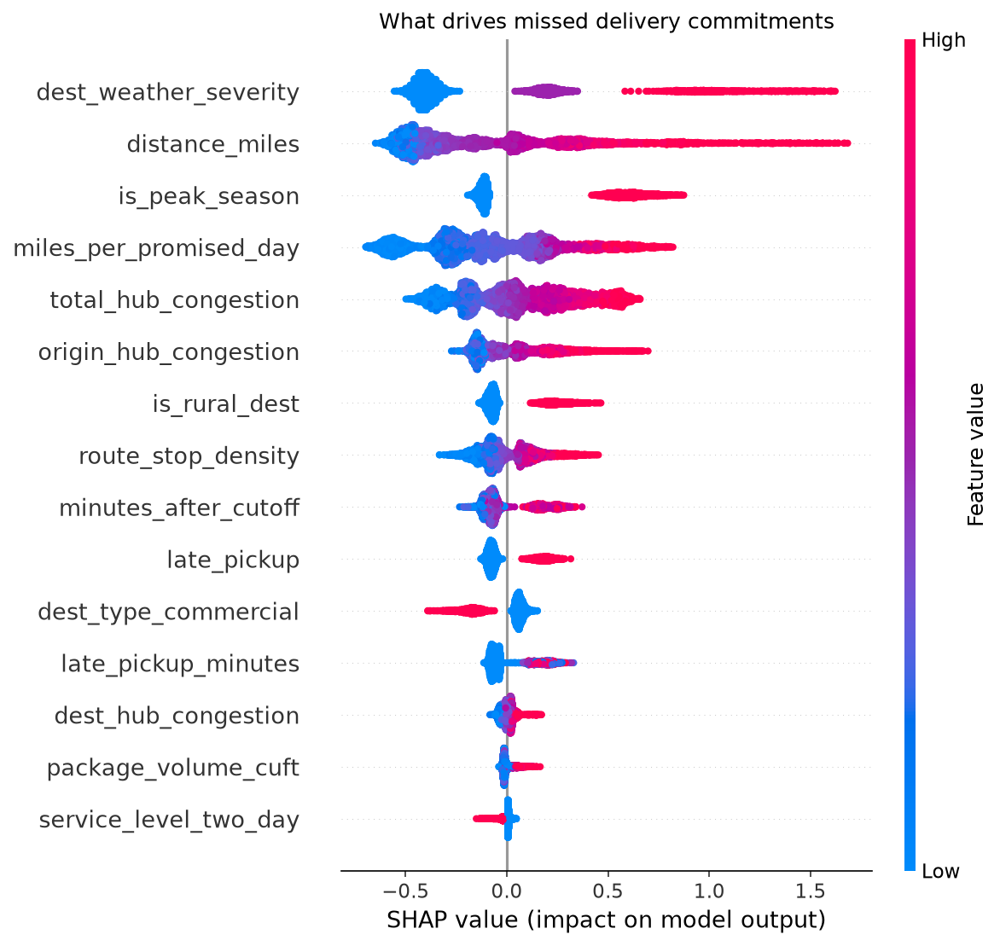

| Riskiest 10% carries 3.6x the misses | Probabilities you can quote to a customer |
|---|---|
| 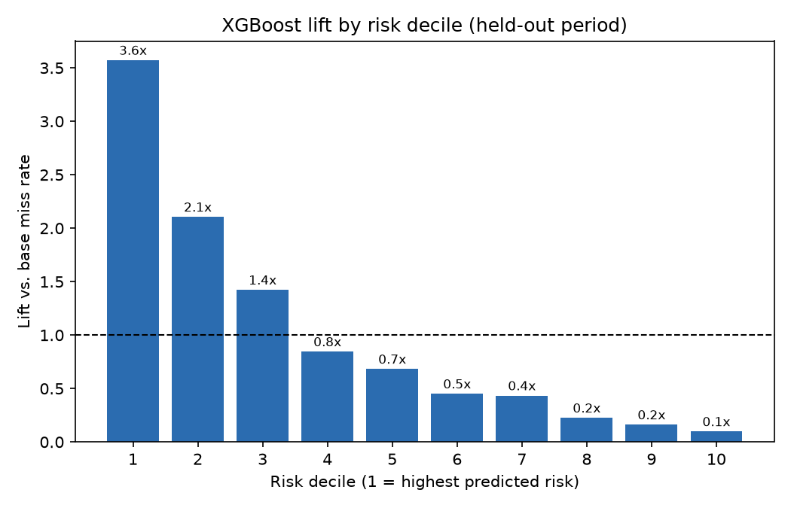 | 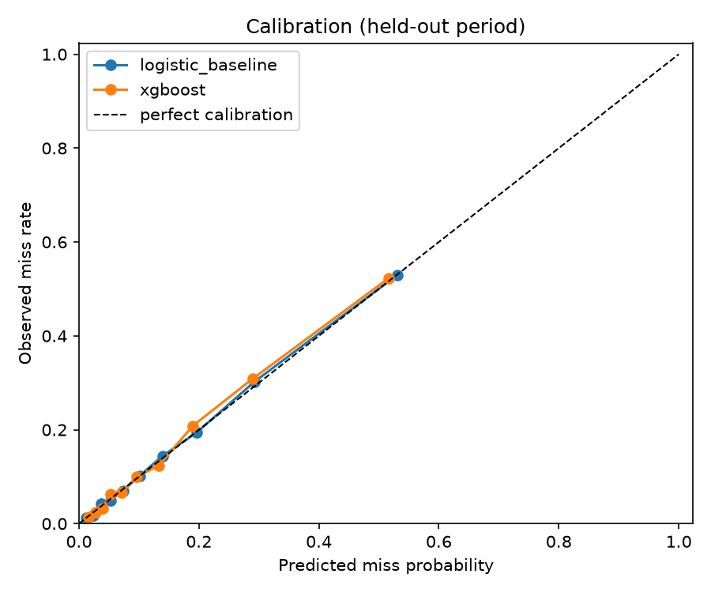 |

Full write-up: [delivery-commit-prediction/README.md](delivery-commit-prediction/README.md)

## ⏱️ ETA regression

A tracking page wants one number; a customer promise needs three. XGBoost quantile
models predict each shipment's transit time as **P10 / P50 / P90** at induction time,
with noise that honestly widens on long congested lanes. Median ETA lands within
**0.44 days** of the truth; the P10–P90 interval covers **78.6%** against an 80% target,
holding across short, medium and long lanes.

The product punchline is the promise table: quote ceil(P50) and the promise breaks one
time in five; quote ceil(P90) and it holds for **97% of shipments** at a cost of just
**0.69 extra quoted days**:

| Median ETA vs actual | The promise curve |
|---|---|
| 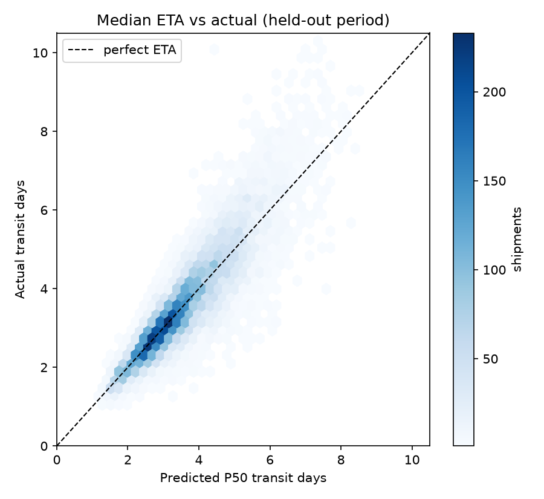 | 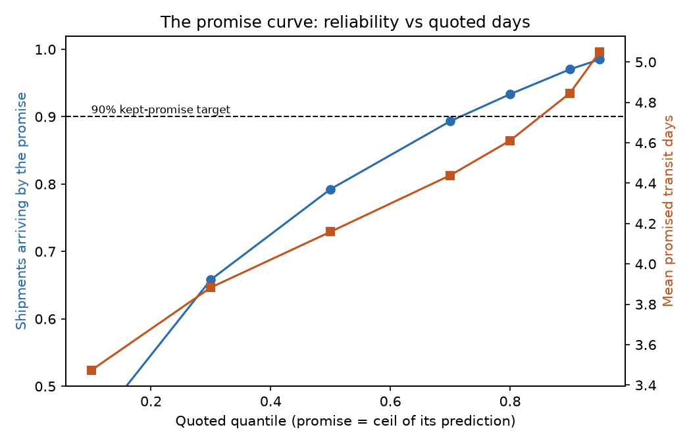 |

Full write-up: [eta-regression/README.md](eta-regression/README.md)

## 🎛️ Intervention optimization

A risk score is not a decision. This use case turns miss probabilities into a
budget-constrained action plan over a priced catalog (notify the customer, reroute,
upgrade the service), allocating by expected savings per dollar and evaluating against
counterfactual ground truth with paired random draws.

At a $6,000 daily budget on 20,000 shipments, expected-value greedy nets **$32,577/day
at 5.4x ROI** and captures **91.5% of the oracle bound**. The classic ops rule — upgrade
the highest-risk shipments until the budget runs out — nets $2,435 (0.4x ROI), because
a 90% risk on a $5 shipment is worth less than a 40% risk on a contract pallet. The
oracle gap (~$3,000/day) literally prices what a better upstream model is worth.

| Policy shoot-out | Diminishing returns by budget |
|---|---|
| 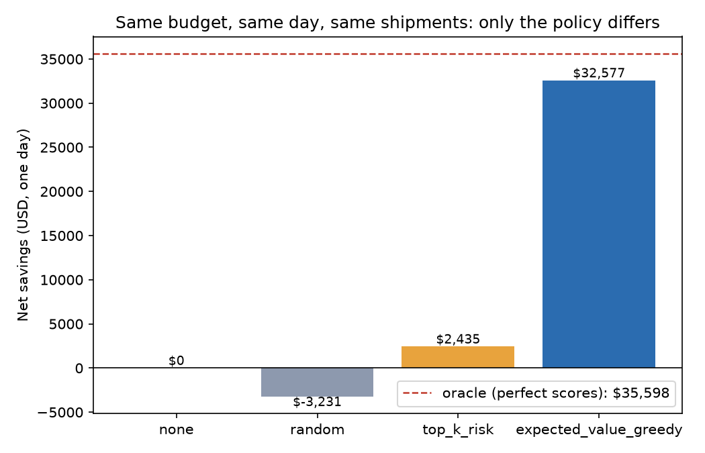 | 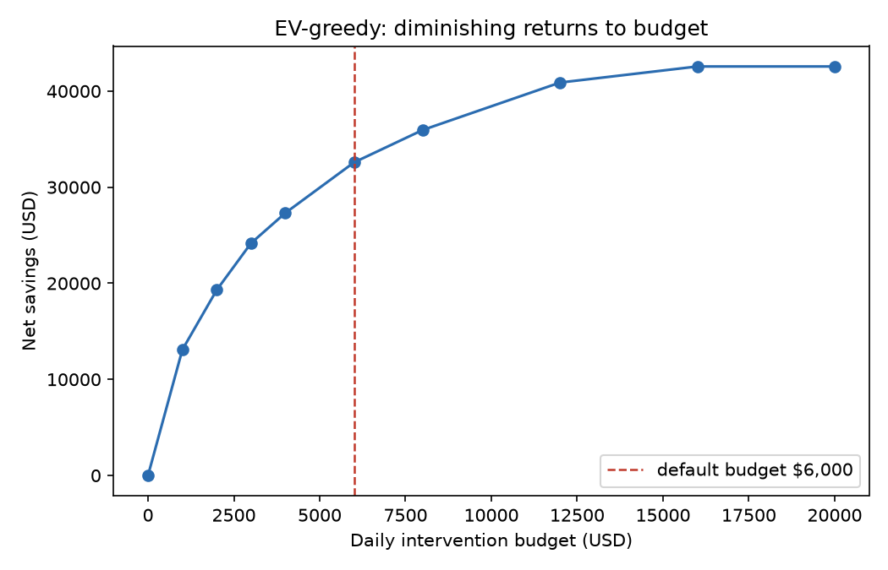 |

Full write-up: [intervention-optimization/README.md](intervention-optimization/README.md)

## 📡 Network anomaly detection

Your monthly OTP report is a rear-view mirror. This use case watches ~120 lanes daily
with empirical-Bayes shrinkage (so 10-shipment/day lanes don't cry wolf), removes
network-wide effects (a stormy Tuesday is not a lane anomaly), and runs a CUSUM that
accumulates small persistent shifts until they're undeniable.

Against injected ground-truth drifts: **100% of step drifts caught in 3.1 days on
average versus 21.9 days** for the monthly report, ramps caught mid-climb, and
**0.47 false alarms per clean-lane-year**. Every alarm ships as a plain-language
incident card with the estimated cost in extra misses per week.

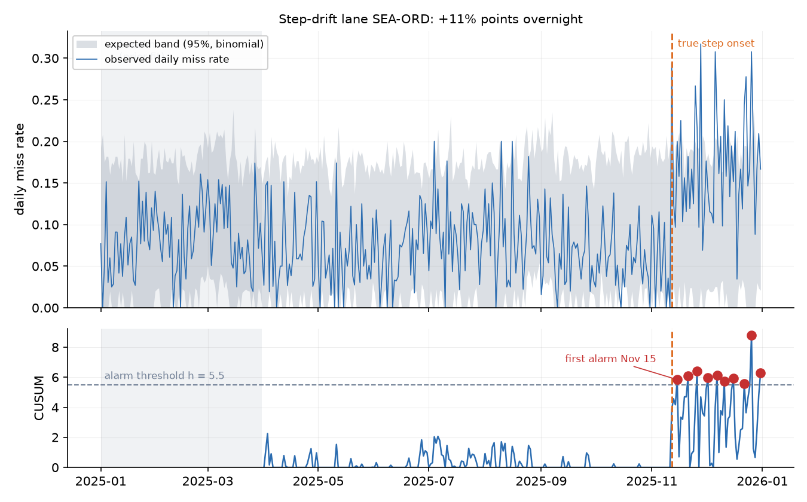

Full write-up: [network-anomaly-detection/README.md](network-anomaly-detection/README.md)

## 📈 Volume forecasting

Modeled on the demand-forecasting programs large carriers and marketplaces run: daily inbound volume for
15 hubs with holidays, promo shocks and a December peak, forecast as P10/P50/P80/P90
quantiles with split-conformal calibration. XGBoost lands at **7.5% WAPE vs 16.2%** for
the same-weekday-last-week rule every ops floor uses, and stays at 7.1% through the peak
where the naive rule runs chronically 9% behind the ramp. Staffing to P80 instead of the
point forecast cuts understaffed days from **54% to 19%**:

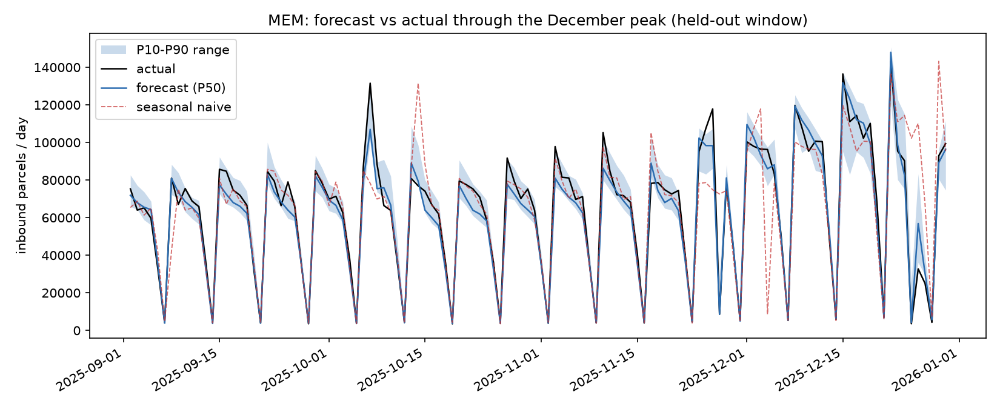

Full write-up: [volume-forecasting/README.md](volume-forecasting/README.md)

## 🗺️ Route optimization

A dependency-free router (inspired by UPS ORION and similar carrier route-optimization
programs) built the way modern heuristic solvers are: Clarke-Wright construction, then a
local-search stack (2-opt, or-opt, inter-route 2-opt*, swap) under deterministic
iterated local search. Against package-balanced fixed zones — the honest comparator,
because it's how depots actually run — same 592 stops, same 7 trucks: **11.6% fewer
miles, about $24,000/year per depot**. Benchmarked on CVRPLIB's proven optima: **2.2%
mean gap, two instances solved to optimality**. Bonus finding: naive global
nearest-neighbor can *lose* to well-balanced zones — greedy isn't optimization.

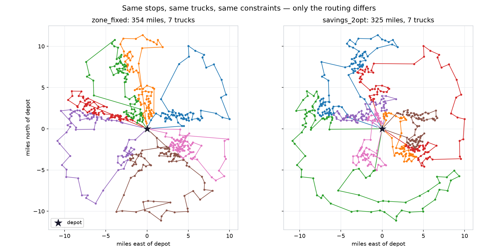

Full write-up: [route-optimization/README.md](route-optimization/README.md)

## 💰 Dynamic pricing

Cost-plus pricing is a subsidy paid to your most price-insensitive customers. A monotone
XGBoost acceptance model learns each segment's demand curve from historical quotes, then
guardrailed price optimization picks the margin-maximizing price per quote. Evaluated
counterfactually against documented ground-truth elasticities: **+32% expected margin
over cost-plus, capturing 97% of the oracle bound**, with the uplift concentrated in the
over-charged elastic spot segment. The learned demand curves are validated against the
generator's true curves in CI:

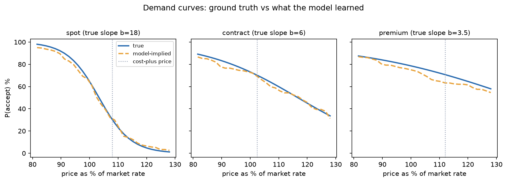

Full write-up: [dynamic-pricing/README.md](dynamic-pricing/README.md)

## 🔧 Predictive maintenance

Modeled on DHL's fleet program (reported 25% fewer unplanned breakdowns) and Maersk's
engine-failure prediction: a 600-vehicle fleet whose hidden component wear emits only
what telematics actually gives you — noisy temperature, vibration, oil pressure, voltage
and fault-code channels. Evaluated the way a workshop lives: at a 3%-of-fleet daily bay
budget, XGBoost flags at **44% precision versus 5%** for the mileage rule, with a
**14-day median warning**, worth about **$207k per quarter** at standard breakdown
economics. SHAP work-order cards name the sensors behind every flag:

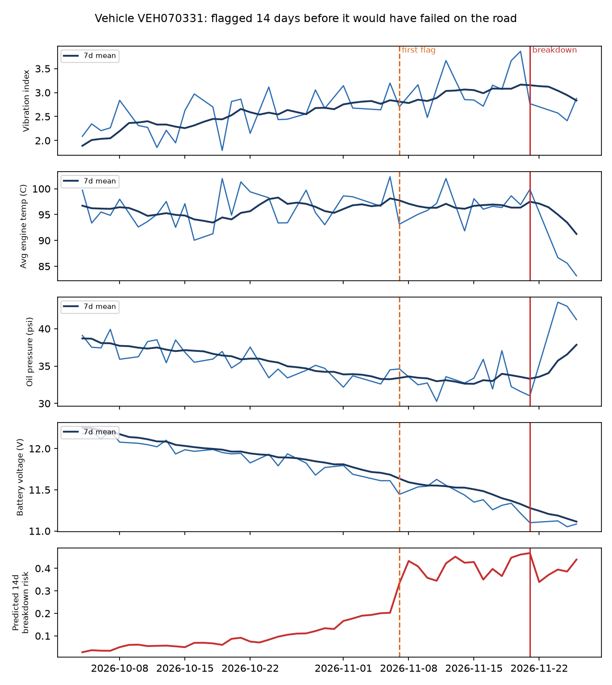

Full write-up: [predictive-maintenance/README.md](predictive-maintenance/README.md)

## 🏠 Address resolution

The most expensive address is the one you deliver to confidently and wrongly. Modeled on
Amazon's delivery-point resolution work: a block → score → accept-or-review pipeline over
a corruption-laddered synthetic city (typos, abbreviation variants, dropped units,
transposed digits). The scorer auto-matches **83.8% of labels at 99.66% precision** and
routes 98.8% of true no-matches to human review; the no-reject fuzzy matcher it replaces
delivers **1,925 wrong doors per 10k**. A logistic scorer on purpose: every match
decision explains itself in the review-queue UI.

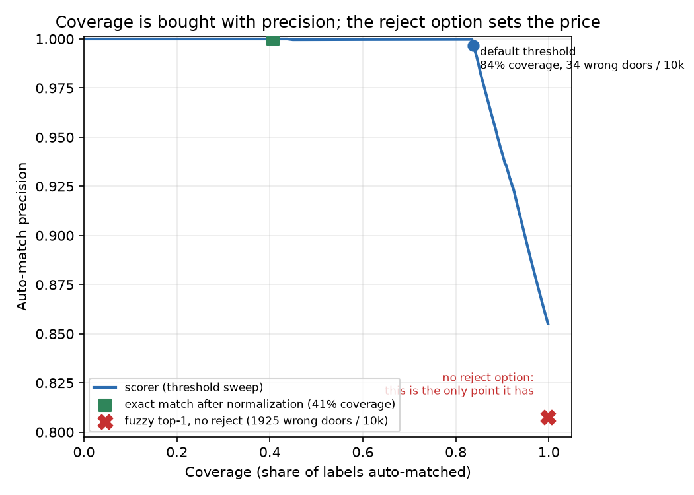

Full write-up: [address-resolution/README.md](address-resolution/README.md)

## ↩️ Returns prediction

A return is a shipment you pay for twice. Order-time-only features (bracket-buying,
discount depth, causal customer history — delivery lateness drives the label but is
post-ship, so it's excluded by whitelist and test), orders ranked by **expected return
cost** rather than raw probability, because a 60% risk on a $200 bracket order outranks
an 80% risk on a $15 tee. The top decile carries 36% of all return spend, and a $0.30
fit-assistant intervention on the flagged apparel orders returns **9.9x ROI**.

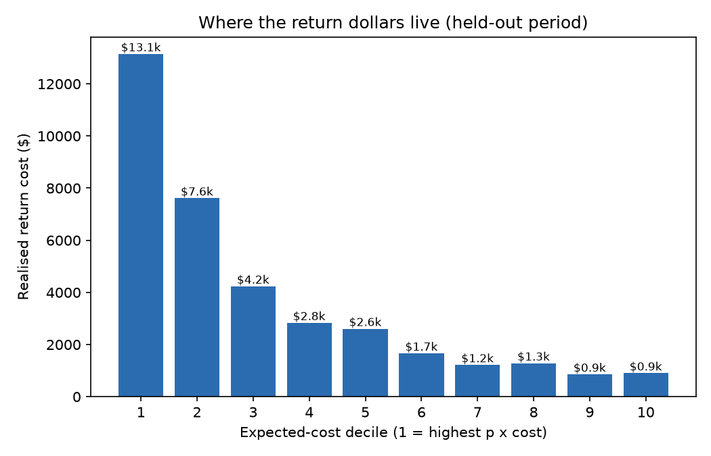

Full write-up: [returns-prediction/README.md](returns-prediction/README.md)

## 🚂 Capacity planning

Every planner books trailers by habit; the newsvendor fractile is the habit, priced.
Quantile demand forecasts feed the critical-fractile decision (q* = Cu/(Cu+Co) ≈ 0.46 at
base costs), evaluated against 200 paired demand replications: **$462k / 2.5% cheaper
than book-last-year over 16 test weeks, within 1.3% of the oracle**. The counterintuitive
part the README derives step by step: the optimal policy books *fewer* trailers than the
mean forecast, because an empty trailer costs more than a spot cover — and when spot
prices spike, the fractile moves and the method adapts where the habit can't.

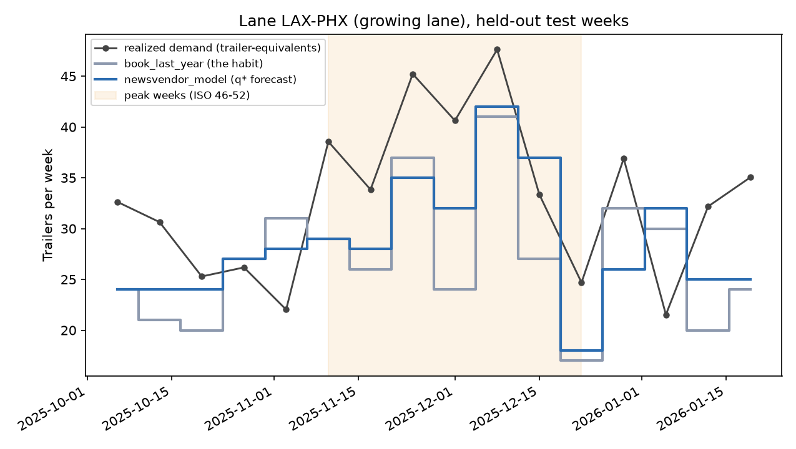

Full write-up: [capacity-planning/README.md](capacity-planning/README.md)

## 🎫 Exception triage

Misrouting a ticket doesn't fail loudly, it just adds three days. A multiclass XGBoost
router versus an honestly-written rules baseline (the comparator earns the model its
job): **78.5% vs 61.8% accuracy**, evaluated in cost-weighted delay-days, where the
logistic model beats the rules on accuracy yet loses on cost. The product is the
confidence gate, not full automation: **auto-route 46.7% of tickets at 97% accuracy**
and reserve humans for the tickets that need them. Modeled on the major carriers' stated
direction of putting AI agents across a large share of operational workflows.


Full write-up: [exception-triage/README.md](exception-triage/README.md)

## 🎛️ Try it live

**▶ [Open the live demo on Hugging Face Spaces](https://huggingface.co/spaces/immu4989/Logistics-UseCases-Demo)**

[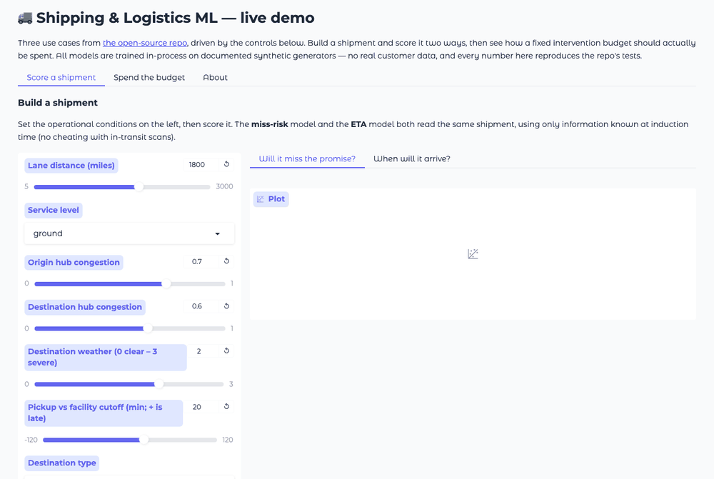](https://huggingface.co/spaces/immu4989/Logistics-UseCases-Demo)

[demo/](demo/) is a Gradio app covering three of the use cases interactively: build a
shipment and watch the miss-risk model score it with a live SHAP breakdown, read its ETA
as a P10/P50/P90 interval with a keepable promise date, and spend an intervention budget
to see expected-value allocation beat flag-the-riskiest. It runs on the packages' own
synthetic generators (no data files), and is ready to deploy to a Hugging Face Space —
`requirements.txt` installs the use-case packages straight from this repo.

```bash
cd demo
python3.12 -m venv .venv
.venv/bin/pip install -e ../delivery-commit-prediction -e ../eta-regression \
                      -e ../intervention-optimization "gradio>=5,<6"
.venv/bin/python app.py
```

## 🔗 The loop, wired together

Twelve use cases are a catalog; [operational-loop/](operational-loop/) is the assembly.
It trains the commit-risk model, scores an unseen batch of 20,000 shipments, hands the
scores to the intervention allocator with a $6,000 budget, and evaluates the decisions
on realized outcomes: **$33,133/day net savings, capturing 98.9% of the true-risk
oracle** and beating classic top-K flagging by $27,882/day. The gap between model
scores and perfect scores comes out to ~$219k/year — the end-to-end price tag on
upstream model accuracy, measured through the decisions it feeds.

Full write-up: [operational-loop/README.md](operational-loop/README.md)

## 🚀 Deploying

[delivery-commit-prediction/serving/](delivery-commit-prediction/serving/) is the
copy-me deployment template: a FastAPI service that reuses the training-time cleaning
and feature code (training/serving skew made impossible rather than tested for), a
Dockerfile with a mounted-artifact pattern so models rotate on your retrain cadence,
a model card with monitoring expectations, and the CLI as the batch path.

## 📊 Real-data validation

Three use cases now carry real-data results sections alongside their synthetic
benchmarks: delivery-commit-prediction and eta-regression on the Olist marketplace data
(96k real orders, including honest analysis of the 2018 truckers'-strike regime shift
that breaks tree models and miscalibrates intervals), predictive-maintenance on the UCI
AI4I 2020 dataset (PR-AUC 0.78 at a 3.4% base rate, with the model recovering the
dataset's documented failure-mode physics), and route-optimization benchmarked against
CVRPLIB's proven optima (**4.7% mean gap** across 8 standard instances).

## 🧬 Uplift modeling

The riskiest shipment is not the one you can save. Use case #13 is the causal-ML
upgrade to everything above: a randomized-pilot generator with documented heterogeneous
treatment effects, S/T/DR-learners scored with exact Qini curves against known ground
truth. At a 10% targeting depth, **uplift-based targeting earns +$643 where risk-based
targeting loses $1,553** — because the highest-risk segment (weather-driven misses) has
*zero* treatable uplift, and the model learns that. Includes an owned upset: the simple
S-learner beats the DR-learner in this RCT regime, with the explanation of what DR's
robustness buys instead on observational data.

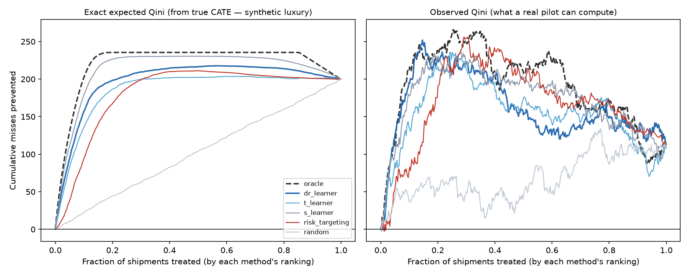

Full write-up: [uplift-modeling/README.md](uplift-modeling/README.md)

## 🔬 State-of-the-art notes

Beyond the thirteen use cases, four modern techniques are wired in where they earn
their keep, each with measured results rather than claims:

- **Conformal risk control** ([delivery-commit-prediction](delivery-commit-prediction/)):
  distribution-free flagging guarantees — a 90%-capture contract realizes 97% on the
  held-out month, and the README is honest that CRC *prices* the promise (77% flag rate)
  rather than improving the model.
- **Foundation-model benchmark** ([volume-forecasting](volume-forecasting/)): zero-shot
  Chronos-Bolt vs the covariate-aware XGBoost under rolling-origin evaluation. XGBoost
  wins 15/15 hubs; bolt-small beats seasonal-naive overall but collapses in peak — the
  zero-shot-vs-covariates tradeoff, measured both ways.
- **Metaheuristic routing** ([route-optimization](route-optimization/)): the local-search
  + ILS stack closes the CVRPLIB gap to 2.2% mean against proven optima, still pure
  numpy, still byte-deterministic.
- **Models as MCP tools** ([demo](demo/)): the live Space doubles as an MCP server, so
  agents can call `score_commit`, `predict_eta`, and `run_budget` as typed tools at
  `https://immu4989-logistics-usecases-demo.hf.space/gradio_api/mcp/`.

## Repository conventions

Every use case keeps two invariants:

1. **No leakage past decision time.** Features must be knowable at the moment the
   prediction would actually be consumed. For commit prediction and ETAs that means
   induction time — no scan events or dwell times accumulated during transit.
2. **No unexplained model.** Explainability output is grounded by tests, on synthetic
   data with known drivers wherever possible, so a refactor that breaks explanations
   fails CI. Where SHAP isn't the right tool (decision optimization, monitoring), the
   explanation is a per-decision rationale or incident card an ops manager can sign off.

Each folder carries its own `pyproject.toml`, tests, and README. The shared CI matrix in
[.github/workflows/ci.yml](.github/workflows/ci.yml) runs every use case on Python 3.10
and 3.12.

## Contributing

Suggestions and contributions are welcome — see [CONTRIBUTING.md](CONTRIBUTING.md) for
the use-case checklist, the real-data adapter rules, and the environment gotchas.
Open an issue describing the operational question, the data you'd model it on (public
or synthetic), and the decision it informs. The repo is citable via
[CITATION.cff](CITATION.cff).

## License

Apache-2.0
