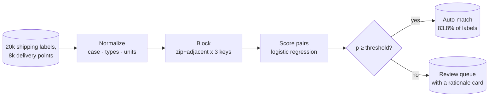
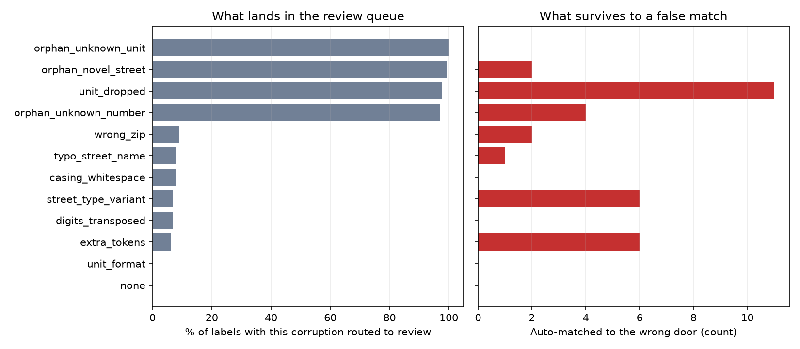
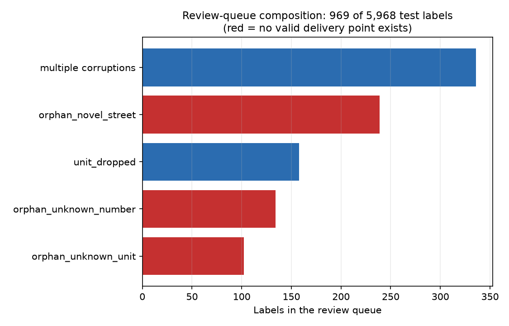

# 🏠 Address Resolution

**The most expensive address is the one you deliver to confidently and wrongly.**


Customers do not type canonical addresses. They type `"Pioneer Supply LLC 3470
Nordale Blvd. Unit 1-F"` when the database says `3470 Nordale Blvd Apt 1F`. They
transpose digits, drop apartment numbers, guess at zips, and sometimes describe a
building that does not exist yet. This project matches each typed shipping label to a
real delivery point, and, just as importantly, knows when NOT to auto-match: a parcel
driven to the wrong door costs a redelivery, a claim, and sometimes the customer,
which is far more than the human review it skipped. Modeled on Amazon's
delivery-point resolution work, which mapped ~2.8 million apartment addresses onto
the correct physical buildings.

One command runs the whole thing, no downloads, a few seconds on a laptop:

```bash
pip install -e .
address-resolve all
```



## 🎯 The headline numbers

Held-out labels (5,968 of 20,000, split by label-id hash), database shared across the
split because that is what production looks like. The threshold was chosen on the
train side to hold 99.5% auto-match precision; everything below is measured after
that choice was frozen.

| System | Coverage | Wrong doors per 10k auto-matches |
|---|---:|---:|
| Exact match after normalization | 40.7% | 0 |
| Fuzzy top-1 by edit distance, no reject | 99.8% | **1,925** |
| **This resolver (default threshold)** | **83.8%** | **34** |

Read the fuzzy row twice. Nearest-edit-distance matching is the tempting default,
and it wrongly delivers almost one parcel in five here, because it has no way to say
"none of these". Every orphan label (8% of traffic is new construction or typos
beyond recovery) gets forcibly delivered to its nearest lookalike. The reject option
is not a refinement of the fuzzy matcher; it is the product.


The operating-point table is how you hand the dial to the business. Coverage is
bought with precision, and this table is the exchange rate:

| Threshold | Coverage | Auto-match precision | Wrong doors / 10k | No-matches caught | Review queue |
|---:|---:|---:|---:|---:|---:|
| 0.90 | 82.0% | 99.98% | 2.0 | 100.0% | 18.0% |
| 0.70 | 83.5% | 99.98% | 2.0 | 100.0% | 16.5% |
| 0.58 | 83.5% | 99.92% | 8.0 | 99.6% | 16.5% |
| 0.50 | 83.6% | 99.84% | 16.0 | 99.0% | 16.4% |
| **0.42 (default)** | **83.8%** | **99.66%** | **34.0** | **98.8%** | **16.2%** |
| 0.30 | 85.4% | 98.21% | 178.6 | 96.5% | 14.6% |

Coverage at 99.5% precision: **83.8%**. At 99.9%: **83.5%**. The last three points of
coverage before the cliff are where all the wrong doors live, and on this dataset
they cost almost nothing to give up. Blocking recall is 100.0% (the corruption ladder
never garbles number, name and zip at once; real mail sometimes does, and then you
widen the blocks and pay the compute).

## 🔍 Which corruptions the system survives, and which it punts

Every synthetic label records the corruptions applied to it, so the error taxonomy
comes free and is asserted in tests rather than eyeballed:



The pattern an operator would predict is the pattern that emerges. Cosmetic damage
(casing, `St` vs `Street`, `#4B` vs `Apt 4B`, business names and c/o riders) is
absorbed by normalization and almost always auto-matches. Street-name typos and
transposed digits survive scoring more than 90% of the time. The one recoverable
corruption the system mostly refuses is a dropped unit on a multi-unit building,
and that refusal is correct: every unit in the building presents identical evidence,
so picking one is a coin flip with a parcel on it. Those labels dominate both the
review queue and, when the threshold is loosened, the residual false matches
(11 of the 17 errors at the default threshold).



The review queue is 16% of traffic: roughly half is orphan labels that have no valid
delivery point (which is exactly where you want them), and the rest is unit-less
apartment labels plus multi-corruption pileups.

## 🧾 Why each decision was made, verbatim

The scorer is a logistic regression, so every match probability decomposes exactly
into per-feature contributions. This is not a demo nicety; it is the review-queue UI.
A card from this run (`artifacts/reports/rationale.md`):

> ## Card 1 — auto-match that survived two corruptions
>
> Label: `"Pioneer Supply LLC 3470 Nordale Blvd. Unit 1-F"`  (zip 46209)
> Recorded corruptions: `street_type_variant|unit_format|extra_tokens`
> Best candidate: 3470 Nordale Blvd Apt 1F, 46209  (`DP002841`)
> Match probability: **0.998** vs threshold 0.423 -> **auto-match (correct)**

| Signal | Value | Pull on match log-odds |
|---|---:|---:|
| Street number matches exactly | 1.00 | +13.95 |
| Unit agrees | 1.00 | +8.39 |
| Street-name character overlap | 1.00 | +2.70 |
| Street type agrees | 1.00 | +2.54 |
| Unit conflicts (both present, different) | 0.00 | +2.20 |
| Unit missing on label, building is multi-unit | 0.00 | -1.57 |
| Zip distance (grid blocks) | 0.00 | +0.57 |
| Street number matches up to transposed digits | 0.00 | -0.18 |
| Typed tokens found in the record | 0.20 | -0.13 |

Two more cards are generated per run: an orphan correctly held back from a seductive
transposed-number lookalike, and a pair where everything agreed except the unit and
that alone stopped it. The test suite asserts all three exist.

## 🧠 Design decisions that make or break address matchers

**The reject option is the product.** Coverage is bought with precision, and the
exchange rate is a business decision, not a modeling one. That is why the deliverable
is an operating-point table rather than a single accuracy number, and why both
baselines are in the same chart: exact match shows what precision costs in coverage,
fuzzy top-1 shows what coverage costs in wrong doors when nobody prices the trade.

**Blocking exists because you cannot score everything, and it taxes recall.** 20k
labels against 8k points is 160M pair evaluations; a national database makes the
naive approach impossible. Candidates are fetched by zip plus adjacent zips, crossed
with three redundant keys: street-name first character, a crude phonetic key, and the
sorted-digit multiset of the street number (invariant to transposition). Redundancy
is the point: one corruption breaks one key and the others hold. The tax is that a
true match falling out of every block is unrecoverable, so blocking recall is
measured and printed on every run, never assumed.

**Logistic regression over a GBM, deliberately.** A boosted model would buy a little
AUC and sell the thing this system actually ships: an exact, testable, per-decision
explanation that a reviewer can act on in seconds. The features were engineered
monotone (agreements up, conflicts down) precisely so a linear scorer leaves little
behind. If you swap in a GBM, you inherit an approximate explainer, and the review
queue inherits arbitration meetings.

**Thresholds must respect tie clusters.** Every unit in an apartment building
presents identical features to a unit-less label, hence identical probabilities. A
threshold admits such a cluster whole or not at all, so both the threshold picker and
the precision-coverage curve evaluate only at tie-group boundaries. The first version
of this pipeline cut mid-cluster and quietly reported a precision no deployable rule
could reach.

**What real systems add on top.** Geocoder ensembles that vote on coordinates,
CASS-certified normalization against the USPS database (or libpostal where CASS does
not reach), and above all a proof-of-delivery feedback loop: the corruptions this
pipeline deliberately excludes as unresolvable (a transposed number where both
addresses genuinely exist) can only be caught by learning from where parcels
physically ended up, which is the engine behind Amazon's apartment-mapping work.

<details>
<summary>📁 Repository layout</summary>

```
src/address_resolution/
  synthetic.py   delivery-point database + labels with a recorded corruption ladder
  resolve.py     normalize -> block -> featurize -> decide, plus both baselines
  train.py       hash split, hard-negative sampling, scorer fit, threshold pick
  evaluate.py    coverage/precision/false-match/orphan metrics, operating table, plots
  explain.py     per-decision rationale cards from the logistic coefficients
  cli.py         address-resolve generate | all
tests/           determinism, ladder integrity, blocking recall, baseline dominance,
                 orphan recall, threshold monotonicity, rationale cards
```

Artifacts land in `artifacts/`: the generated tables, the trained resolver, and
`reports/` with `metrics.json`, `operating_points.csv`, `error_taxonomy.csv`, the
three plots and `rationale.md`.

</details>

## 🤝 Contributing

Issues and PRs welcome, especially adapters for public address data (OpenAddresses
makes a good canonical side), additional corruption rungs observed in real label
streams, and a feedback-loop simulation that closes the proof-of-delivery cycle.
Please keep the two invariants: no feature the resolver could not compute at label
time, and no explanation output without a test that grounds it.

## License

Apache-2.0
