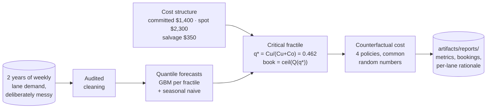
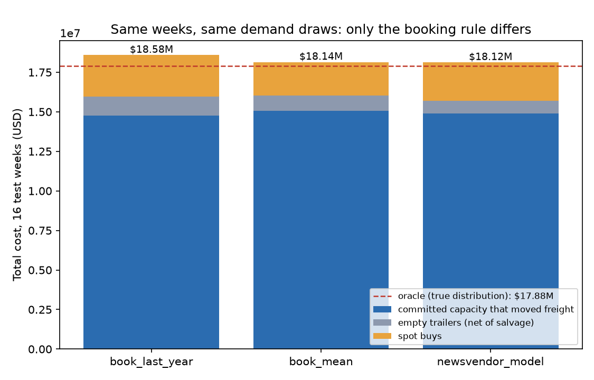
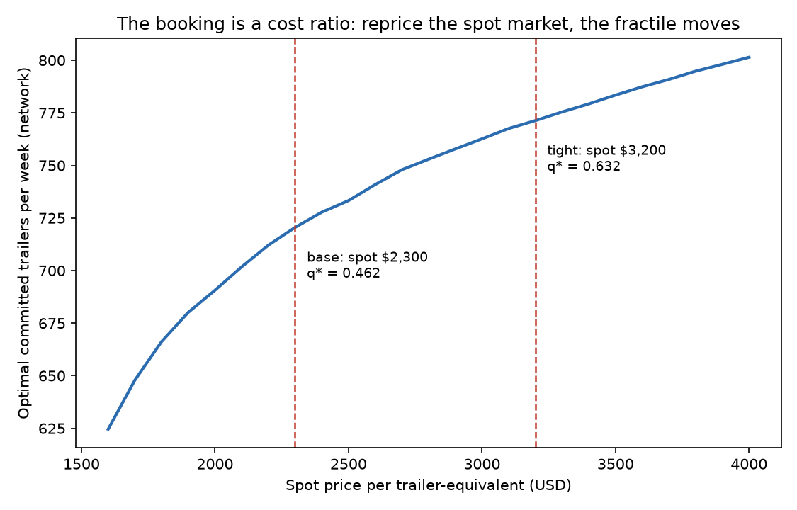

# 🚚 Capacity Planning

**Every planner books trailers by habit. The newsvendor fractile is the habit, priced.**


How many linehaul trailers do you book a week ahead on each lane? Book too few and you
buy spot capacity at a premium; book too many and you pay to move air. Most desks answer
with last year's number. This project answers with the oldest result in operations
research: forecast the demand *distribution*, then let the cost structure pick the
quantile to book. The idea is the newsvendor critical fractile, the same arithmetic
behind ocean-carrier capacity planning at Maersk and linehaul planning at the big parcel
networks, applied here to 30 lanes of weekly trailer demand.

One command runs the entire journey, no data downloads, under a minute on a laptop:

```bash
pip install -e .
capacity-plan all
```



## 🎯 The headline numbers

Held-out final 16 weeks (October through mid-January, so the entire year-end peak is in
the test window). Every policy books the same lanes and weeks and is costed against the
same 200 demand replications from the true distribution; only the booking rule differs.

| Policy | Total cost | Committed/wk | Spot bought | Empty trailers | Service on committed | Savings vs habit | Excess vs oracle |
|---|---:|---:|---:|---:|---:|---:|---:|
| book_last_year (the habit) | $18.58M | 730.5 | 1,139 | 1,145 | 90.3% | — | +3.9% |
| book_mean (P50 forecast) | $18.14M | 729.8 | 919 | 914 | 92.1% | $441.0K (2.4%) | +1.4% |
| **newsvendor_model (q\* forecast)** | **$18.12M** | **713.0** | 1,053 | **779** | 91.0% | **$462.1K (2.5%)** | **+1.3%** |
| oracle (true distribution at q\*) | $17.88M | 720.5 | 867 | 713 | 92.6% | $698.9K (3.8%) | 0% |



Three things worth reading twice in that table:

1. **The newsvendor books FEWER trailers than the mean policy (713/wk vs 730/wk), buys
   MORE spot, and still costs less.** That is the critical fractile doing exactly its
   job: at these prices an empty trailer wastes $1,050 while a spot cover costs a $900
   premium, so the optimal booking sits *below* the median and accepts the occasional
   spot buy on purpose. Cheaper to cover a surge than to haul air.
2. **Most of the money is beaten out of the habit, not out of the forecast.** Moving
   from last-year's-number to a P50 forecast recovers $441K; moving from P50 to the
   right fractile adds another $21K. When you replicate this on your own network, expect
   the same shape: the forecast upgrade pays for the project, the fractile keeps paying
   forever and re-prices itself every time your contracts change.
3. **The remaining gap to the oracle ($237K, 1.3%) prices the forecast's residual
   error.** That number is the entire business case for a better model, and a hard
   ceiling on what one is worth.

## 📈 The money chart: the habit misses the ramp, the model rides it

LAX–PHX is the network's fastest-growing lane (+20%/year) heading into the peak. The
habit re-books last year's realized weeks: a year of growth and one demand ramp out of
date, short all the way up. The newsvendor booking carries the trend and the calendar,
and its misses are the deliberate kind, small shortfalls it planned to cover on spot:


On this one lane in one peak week, re-booking last year's number hands about $5,570 per
week to the spot market (the rationale card below prices it).

## 🧮 The decision is a cost ratio, not a forecast

The entire booking rule is four lines, derived step by step in
[decide.py](src/capacity_planning/decide.py):

```
Cu = spot - committed = $2,300 - $1,400 = $900     the cost of a trailer you needed and didn't book
Co = committed - salvage = $1,400 - $350 = $1,050  the cost of a trailer you booked and didn't need
q* = Cu / (Cu + Co) = 0.462                        the critical fractile
book = ceil( demand quantile at q* )               the booking
```

And because q\* is a ratio of costs, it moves when the market moves. The sensitivity
scenario reprices spot at $3,200 (a tight market): Cu jumps to $1,800, q\* rises to
0.632, and the optimal booking crosses to the *other side* of the median. Same model,
same forecasts, one division re-run:



Costed on the same demand draws at $3,200 spot:

| Policy | Total cost | Committed/wk | Savings vs habit |
|---|---:|---:|---:|
| book_last_year | $19.61M | 730.5 | — |
| newsvendor, stale fractile (still 0.462) | $19.07M | 713.0 | 2.8% |
| **newsvendor, retuned fractile (0.632)** | **$18.95M** | **770.6** | **3.4%** |
| oracle at 0.632 | $18.57M | 771.3 | 5.3% |

The habit cannot adapt because it never knew about prices in the first place. The
method adapts by construction, and even *not* retuning it (the stale row) beats the
habit, because the quantile forecast is still doing the distribution work.

## 🔍 The weeks that hurt: peak breakout

ISO weeks 46–52 are 7 of the 16 test weeks but carry 47% of the total cost. This is
where the habit is most wrong (it re-books last year's ramp at last year's levels) and
where a booking desk actually earns its budget:

| Policy | Peak-weeks cost | Spot bought | Empty trailers | Savings vs habit |
|---|---:|---:|---:|---:|
| book_last_year | $8.79M | 509 | 561 | — |
| book_mean | $8.59M | 409 | 456 | $199.8K (2.3%) |
| **newsvendor_model** | **$8.58M** | 477 | **387** | **$212.5K (2.4%)** |
| oracle | $8.47M | 416 | 329 | $327.0K (3.7%) |

## 🧾 The audit trail: why 55 trailers and not 57

No SHAP in this use case, and that is a design decision rather than a shortcut. The
question a planner asks is not "which feature moved the quantile", it is "why book 23
and not 25", and for a newsvendor policy the honest explanation is the economics
itself. The pipeline writes `rationale.md` with three booking cards a planner can check
by hand. Verbatim from this run:

| Case | Lane | Week | Q(q\*) fcst | P50 fcst | Booked | Habit booked | E[spot teq] | E[empty teq] | E[cost] | Habit E[cost] | Habit penalty/wk | Why |
|---|---|---|---:|---:|---:|---:|---:|---:|---:|---:|---:|---|
| big stable corridor | MEM-ORD | 2025-12-29 | 54.2 | 56.0 | 55 | 56 | 3.4 | 3.1 | $83,739 | $83,915 | $176 | booking P46 not P50: an empty trailer costs $1,050 and a spot cover $900 this quarter, so the right seat is just below the median — one trailer of restraint on a lane this size. |
| growing lane at peak | LAX-PHX | 2025-12-01 | 31.7 | 32.0 | 32 | 24 | 5.05 | 0.87 | $56,111 | $61,682 | $5,570 | last year's number (24 trailers) is a year of growth and a peak ramp out of date; the quantile forecast carries both, and the habit hands ~$5,570/week to the spot market here. |
| declining lane | MSP-FAR | 2025-12-29 | 6.7 | 7.0 | 7 | 8 | 0.19 | 1.18 | $9,824 | $10,632 | $808 | the habit re-books a lane that shrank; ~$808/week of that booking now moves air, and the model steps the commitment down instead. |

Three archetypes on purpose: the big corridor where the fractile (not the forecast)
does the work, the grower where the habit is expensively stale in both directions of
time, and the decliner where the habit quietly pays to move air every single week.

## 🧠 Design decisions that make or break capacity models

**The booking quantile is a cost ratio, never an accuracy choice.** Teams tune "which
quantile should we book?" like a hyperparameter, chasing service-level targets. That
inverts the logic. The forecast's only job is to be right about the distribution; the
fractile is fully determined by Cu and Co, and it changes when contracts are
renegotiated, not when the model is retrained. Encoding this split keeps the model
team and the procurement team owning separate, testable artifacts. It is also why
[forecast.py](src/capacity_planning/forecast.py) asks decide.py which fractiles to
train, not the other way round.

**Common random numbers, or the comparison is noise.** The margins that matter here are
a few percent, and week-to-week demand luck is far larger than that. Every policy (and
both spot scenarios) is costed against the same matrix of demand replications, so
policy differences are paired and the ranking cannot flip run to run for no reason.
The same pattern carries this repo's
[intervention-optimization](../intervention-optimization/) use case; the test suite
asserts reproducibility.

**The test window must contain the peak.** A random split, or a test window ending in
October, would grade the booking desk on the easy weeks and certify a policy that falls
over exactly when capacity is scarce and spot is expensive. The final-16-weeks split is
pinned so ISO weeks 46–52 are always held out, and a test fails if they are not.

**Plain sklearn, no gradient-boosting exotica.** `GradientBoostingRegressor(loss="quantile")`
carries the distribution well enough that the remaining oracle gap is 1.3%. The
explainability budget went into the economics (the derivation, the rationale cards,
the sensitivity chart) because that is what a planner will actually interrogate.
Dependencies stay at numpy, pandas, scikit-learn, matplotlib, joblib.

**What real systems add on top.** This pipeline prices one lane-week at a time. A
production planner also faces network effects (an empty trailer on MEM–ORD is cheap if
ORD–MEM needs the equipment back), driver hours-of-service coupling bookings across
days, cancellation ladders (salvage value decays as the week approaches, which turns
one booking into a sequence of options), and demand correlation across lanes in a
shock. All of them change Cu and Co per lane; none of them change where the answer
comes from.

## 🏭 Adapting to your own network

1. Produce a weekly feed with the three canonical columns in
   [synthetic.py](src/capacity_planning/synthetic.py): `lane_id`, `week_start`,
   `demand_teq`. Trailer-equivalents should be continuous (the last trailer is rarely
   full); the pipeline books discrete trailers.
2. Replace the cost constants in [decide.py](src/capacity_planning/decide.py) with your
   contract rate, your lane-level spot benchmark, and an honest salvage value. If your
   spot price varies by lane or by week, q\* does too; the code is one `groupby` away.
3. Keep the oracle harness. On real data you cannot know the true distribution, but a
   long backtest of the realized-cost gap between your bookings and hindsight-optimal
   bookings is the same report, and it is the number your CFO will ask for.

## 🧪 Tests

```bash
pip install -e ".[dev]"
pytest -q
```

The suite runs the full pipeline on two seeds and asserts, among other things: cleaning
handles every planted mess class; the peak is in the test window; the quantile model
beats the seasonal naive on pinball loss at q\*; the newsvendor policy beats both the
habit and the mean policy with the oracle as floor; service level stays in a sane band
(the savings must not come from quietly overbooking); the tight-market fractile and
bookings both rise; and the paired evaluation is bit-for-bit reproducible.

<details>
<summary>📁 Repository layout</summary>

```
src/capacity_planning/
  synthetic.py   messy weekly lane-demand generator with exposed ground truth
  cleaning.py    audited cleaning: duplicate lane-weeks, negatives, gap census
  forecast.py    lag/calendar features, seasonal naive, GBM quantile models
  decide.py      the newsvendor economics: Cu, Co, q*, bookings, cost model
  evaluate.py    paired counterfactual costing, peak breakout, sensitivity, plots
  explain.py     per-lane booking rationale cards (rationale.md)
  cli.py         capacity-plan generate | all
tests/           end-to-end tests incl. the policy cost ordering on two seeds
```

</details>

## 🤝 Contributing

Issues and PRs welcome, especially lane-correlated demand models, per-lane spot price
curves, cancellation-ladder salvage schedules, and adapters for public freight datasets.
Please keep the two invariants: no feature the desk could not know a week ahead of the
booking, and no policy claim without a paired counterfactual test behind it.

## License

Apache-2.0
