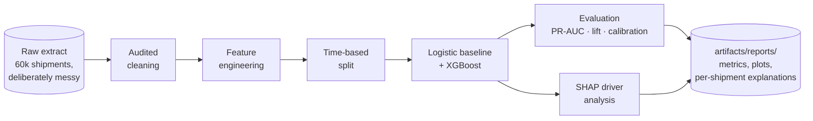
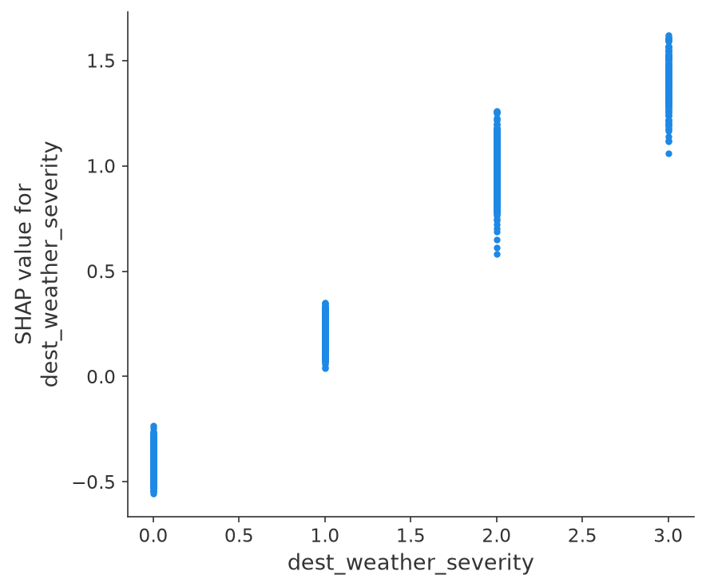
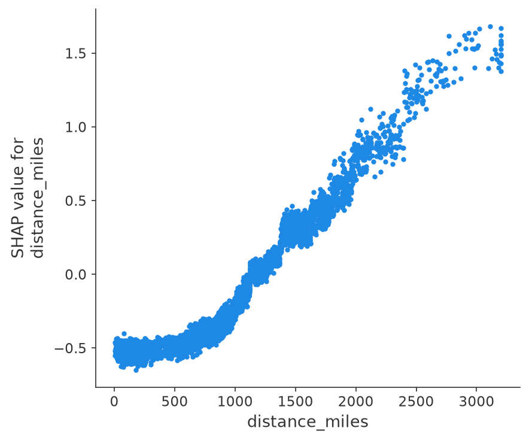
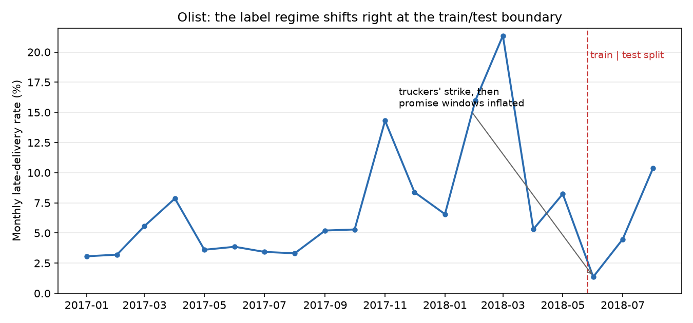

# 📦 Delivery Commit Prediction

**Know which parcels will break their delivery promise — while there's still time to save them.**


Every parcel network fights the same fire: a small fraction of shipments miss their
committed delivery date, and by the time anyone knows which ones, it's too late to act.
This project turns that around. It ranks tomorrow's shipments by miss risk **at induction
time** (the moment a package enters the network), so operations can reroute, upgrade the
service, or warn the customer before the promise breaks.

One command runs the entire journey, no data downloads, ~1 minute on a laptop:

```bash
pip install -e .
delivery-commit all
```



## 🎯 The headline numbers

Held-out final month, ~14% base miss rate. Nothing here was tuned on the test period.

| | Logistic baseline | XGBoost |
|---|---:|---:|
| PR-AUC | **0.466** | 0.456 |
| ROC-AUC | **0.814** | 0.811 |
| Top-decile lift | 3.6x | 3.6x |
| Recall @ 10% flagged | 36.2% | 35.7% |

Read that top row twice: the linear baseline *wins*. That's not a bug, it's the point —
see [Why the baseline is load-bearing](#-design-decisions-that-make-or-break-otp-models).

The decile chart is the one that decides whether a proactive-intervention program pays
for itself. The riskiest 10% of shipments miss at **52%** (3.6x the base rate), and the
top three deciles together capture **71% of all misses**:


And when the model says 30%, it means 30%. Probabilities are honest out of the box
because we refuse to reweight classes (details below):


## 🔍 What actually drives missed commitments

This is the money chart for the morning ops call. Each dot is a shipment; red means the
feature value was high. Bad destination weather, long lanes, peak surges and congested
hubs push shipments right (toward missing); short lanes and clear skies pull them left:


Grouped back to operational levers (one-hot columns re-aggregated), the global ranking:

| Rank | Driver | Share of model explanation | |
|---:|---|---:|---|
| 1 | Destination weather severity | 17.3% | `█████████████████` |
| 2 | Lane distance | 14.8% | `███████████████` |
| 3 | Peak-season surge | 12.7% | `█████████████` |
| 4 | Miles per promised day (slack) | 10.9% | `███████████` |
| 5 | Total hub congestion | 8.9% | `█████████` |
| 6 | Origin hub congestion | 5.5% | `██████` |
| 7 | Rural destination | 4.5% | `████` |
| 8 | Route stop density | 4.3% | `████` |
| 9 | Pickup minutes after cutoff | 4.3% | `████` |
| 10 | Destination type | 4.0% | `████` |

And the sanity check that makes this ranking trustworthy: the generator plants known
noise features, and the model correctly buries them.

| Planted noise feature | Share of model explanation |
|---|---:|
| Declared value | 0.4% |
| Package weight | 0.3% |
| Signature required | 0.06% |

### Dependence plots: the shape of each risk factor

SHAP doesn't just rank drivers, it shows their functional form. Weather risk climbs
step-by-step with severity; distance risk is flat until ~800 miles and then climbs
steadily — exactly the "more legs, more chances to slip" behavior a network operator
would predict:

| Weather severity | Lane distance |
|---|---|
|  |  |

### From global drivers to one flagged package

The pipeline also writes the explanation an ops screen would show next to a flagged
shipment (`artifacts/reports/example_shipment.md`). A real example from this run,
predicted miss probability **90%**:

| Driver | Value | Contribution to risk (log-odds) |
|---|---:|---:|
| Destination weather severity | 3 (severe) | +1.06 |
| Lane distance | 2,150 mi | +0.66 |
| Peak season | yes | +0.56 |
| Miles per promised day | 2,150 | +0.47 |
| Total hub congestion | 1.27 / 2.0 | +0.43 |
| Pickup after cutoff | +15.8 min | +0.26 |

A severe-weather destination, 2,150 miles away, during peak, through congested hubs,
picked up late. Nobody needs a data science degree to believe this flag — which is
precisely what makes the score actionable.

### The trick that makes the SHAP report testable

Most explainability demos ask you to admire a chart. Here, the synthetic generator
([synthetic.py](src/delivery_commit/synthetic.py)) has a *documented causal process* —
the true coefficients for congestion, weather, late pickup, peak and distance are right
there in the code, alongside deliberately planted noise (declared value, weight,
signature flags). The test suite asserts SHAP recovers the real drivers and buries the
noise. If a refactor silently breaks explanations, **CI fails**. When you adapt this to
your own data, keep the synthetic harness: it's your regression test for the whole
explanation stack.

## 🚚 Run it on real data (Olist)

The repo includes an adapter for the public
[Olist Brazilian e-commerce dataset](https://www.kaggle.com/datasets/olistbr/brazilian-ecommerce):
~100k real orders with both a promised and an actual delivery date, so the miss label is
real, not simulated.

```bash
kaggle datasets download -d olistbr/brazilian-ecommerce -p data/olist --unzip
delivery-commit all --source olist --olist-dir data/olist
```

[olist.py](src/delivery_commit/olist.py) is intentionally the template to copy when you
write the adapter for your own company's data: it maps what Olist has onto the canonical
schema, fills what it lacks (hub telemetry, weather) with neutral constants, and the rest
of the pipeline runs unchanged.

### Olist results: 96k real orders, and a regime shift with a lesson in it

On the held-out final period (base late rate 5.3%), the logistic baseline delivers a
usable ranking from purchase-time features alone:

| Logistic baseline on Olist | Value |
|---|---:|
| ROC-AUC | 0.746 |
| PR-AUC | 0.220 |
| Top-decile lift | 3.9x |
| Top-2-decile miss capture | 58% |
| Recall @ 10% flagged | 39% |

XGBoost, which ties the baseline on synthetic data, **collapses to near-chance here**
(ROC-AUC 0.54 as shipped; heavier regularization drives it *below* chance). The reason
is visible in one chart:



Brazil's May 2018 truckers' strike sits right at the train/test boundary, and Olist
responded by inflating its promised delivery windows: the monthly late rate crashes from
21% (March) to 1.4% (June). Feature-label relationships literally inverted — before the
strike a long promised window marked a risky long-haul order; after it, a long window
meant a padded, safe promise. A linear model extrapolates its directional coefficients
through that shift and keeps ranking usefully. Trees cannot rank beyond their fitted
split boundaries, and their memorized rate levels were not just stale but backwards.

Three takeaways worth more than the metrics themselves: the boring baseline is what
saves you in a regime change (this is why it's load-bearing in this pipeline); a model
this exposed needs a frequent retrain cadence and drift monitoring (the
[network-anomaly-detection](../network-anomaly-detection/) use case exists to catch
exactly this); and ignore the SHAP report whenever the model underneath it ranks at
chance — explanations of a broken model explain the breakage, not the operation.

## 🏭 Adapting to your own shipment data

1. Produce a DataFrame with the canonical columns in
   [schema.py](src/delivery_commit/schema.py). Only three are truly required to be
   meaningful: a shipment id, a ship date, and the `missed_commit` label. Every feature
   you can populate improves the model; anything you can't, fill with a neutral constant.
2. **Respect induction time.** Every feature must be knowable when the package enters
   your network. Scan counts, dwell times and exception codes accumulated *during*
   transit predict lateness brilliantly and uselessly; they are how OTP models leak.
3. Run `delivery-commit all`, read `artifacts/reports/`, then score new shipments:

```bash
delivery-commit score --input tomorrow.csv
```

## 🧠 Design decisions that make or break OTP models

These four choices are where delivery-prediction projects quietly die. Each one here is
encoded in the pipeline, not just documented.

**Time-based split, never random.** Shipments from the same lane and day are heavily
correlated. A random split leaks future operating conditions into training and inflates
offline metrics that then evaporate in deployment. Training uses the first ~80% of ship
dates; everything after the cutoff is held out.

**No class reweighting at ~10% positives.** `scale_pos_weight` and friends buy nothing
for ranking at this imbalance, and they wreck calibration. An early version of this
pipeline told ops "80% risk" for shipments that missed 30% of the time. If your miss
rate is far rarer (<1–2%), reweight for trainability and recalibrate on a held-out slice
before anyone consumes the probabilities.

**The baseline is load-bearing.** On this dataset logistic regression edges out XGBoost,
because once the features are engineered well the synthetic process is nearly additive.
That's the honest general lesson: gradient boosting earns its keep on the messy
interactions of real operational data, and if it can't beat your linear baseline, ship
the linear model. The baseline exists to force that conversation.

**Missingness is signal, and cleaning is audited.** Imputation keeps `__was_missing`
flags (a hub too overwhelmed to report congestion is probably congested — the weather
missingness flag shows up in the SHAP beeswarm exactly as designed). Every cleaning step
logs how many rows it touched (`cleaning_report.csv`); in production, alert when a
step's touch-count jumps, because upstream schema drift is the number-one silent model
killer.

<details>
<summary>📁 Repository layout</summary>

```
src/delivery_commit/
  schema.py      canonical shipment schema + validation
  synthetic.py   messy synthetic generator with documented ground-truth drivers
  cleaning.py    audited cleaning: duplicates, sentinels, bounds, imputation
  features.py    feature engineering, time-based split, model matrix
  train.py       logistic baseline + XGBoost with early stopping
  evaluate.py    PR-AUC, calibration, decile lift, capacity-threshold metrics
  explain.py     SHAP global + local reports, driver ranking vs ground truth
  olist.py       adapter: public Olist dataset -> canonical schema
  cli.py         delivery-commit generate | all | score
tests/           end-to-end tests incl. "SHAP recovers the true drivers"
```

</details>

## 🤝 Contributing

Issues and PRs welcome, especially adapters for other public logistics datasets,
alternative model families, and intervention-cost analysis (turning risk scores into
reroute/upgrade decisions). Please keep the two invariants: no feature that isn't
knowable at induction time, and no explanation output without a test that grounds it.

## License

Apache-2.0
