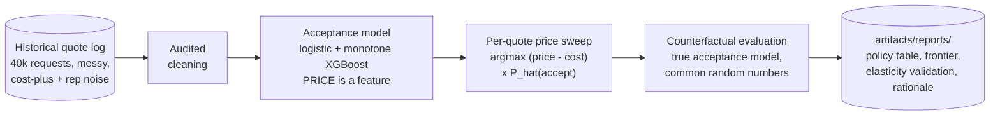
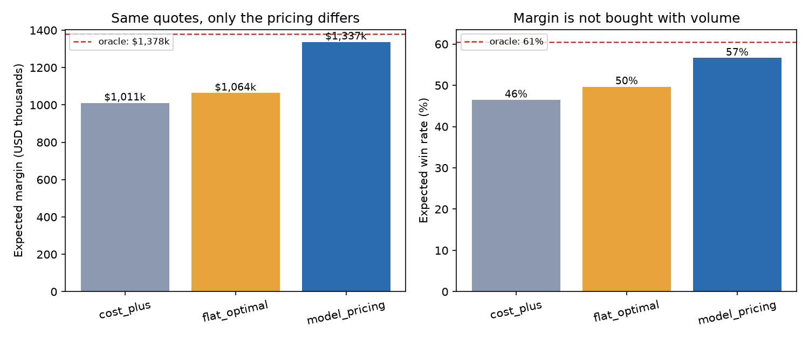
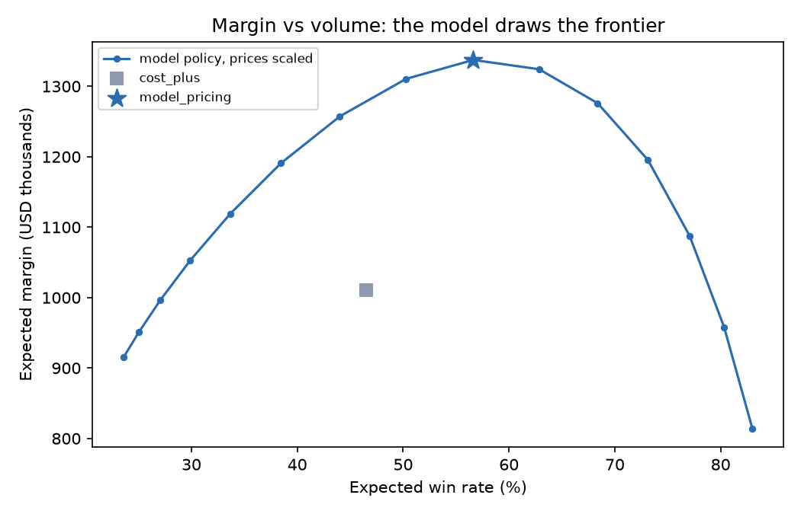

# 🏷️ Dynamic Pricing

**Cost-plus pricing is a subsidy you pay to your most price-insensitive customers.**


Every freight desk quotes the same way: cost times a markup, tweaked by segment, rounded
by the rep. That rule charges a one-off spot shipper — who is holding three rival quotes
and will walk over 5% — the *highest* markup on the sheet, while an express premium
customer who needs the freight moved today gets a discount they never asked for. This
use case learns P(accept | price) from a historical quote log, prices every lane by its
own elasticity, and measures exactly how much margin the cost-plus rule leaves on the
table. On this dataset: **32% of it**. (The approach is modeled on the AI-based quote
pricing programs Maersk and DHL have described publicly.)

One command runs the entire comparison, no data downloads, under a minute on a laptop:

```bash
pip install -e .
freight-price all
```



## 🎯 The headline numbers

Held-out final quarter: 7,946 quote requests the models never saw, priced under four
policies and scored against the generator's true acceptance probabilities. Every policy
sees the same quotes and the same random outcomes, so the differences are pure pricing:

| Policy | Expected margin | Per quote | Win rate | Avg price | vs cost-plus | % of oracle |
|---|---:|---:|---:|---:|---:|---:|
| cost-plus (status quo) | $1,010,759 | $127.20 | 46.5% | 1.33x cost | — | 73.3% |
| flat optimal markup | $1,064,051 | $133.91 | 49.7% | 1.32x cost | +5.3% | 77.2% |
| **model pricing** | **$1,337,426** | **$168.31** | **56.6%** | 1.37x cost | **+32.3%** | **97.0%** |
| oracle (true elasticities) | $1,378,489 | $173.48 | 60.5% | 1.35x cost | +36.4% | 100.0% |



Three findings worth reading twice:

1. **Tuning the markup buys 5%; differentiating it buys 32%.** The flat-optimal policy
   picks the single best markup (1.32x) with the same model and the same data, and
   captures barely a sixth of the available uplift. The money is not in the *level* of
   the markup, it is in charging different customers differently.
2. **The model policy wins more freight AND more margin.** 56.6% win rate versus 46.5%,
   at a *higher* average price level. That is not a paradox: it prices down where volume
   is cheap to buy (spot) and up where it isn't (premium), so both dials move the right
   way at once.
3. **An imperfect model captures 97% of the oracle.** The trained model never sees the
   shipper's latent willingness to pay, yet the pricing decisions it drives are nearly
   as good as perfect information. Decent pricing tolerates a noisy demand model, for
   the same reason decent intervention triage tolerates noisy risk scores: the argmax
   mostly needs the curve's slope roughly right near the optimum.

## 💸 Where the money was hiding

The segment table is the audit of the cost-plus rule, and the correction runs in *both
directions*. The desk charged spot — the most price-elastic segment — the highest markup
on the sheet, and the model unwinds that mistake first:

| Segment | Quotes | Cost-plus rule | Model avg price | Margin/quote (rule) | Margin/quote (model) | Uplift | Share of total uplift |
|---|---:|---:|---:|---:|---:|---:|---:|
| spot | 3,913 | 1.35x cost | **1.22x** (down) | $71.11 | $118.19 | **+66.2%** | **56.4%** |
| contract | 2,825 | 1.28x cost | 1.48x (up) | $160.02 | $187.78 | +17.3% | 24.0% |
| premium | 1,208 | 1.40x cost | 1.59x (up) | $232.17 | $285.16 | +22.8% | 19.6% |

Over half the uplift comes from *cutting* spot prices: at a 1.35x markup the true win
probability on a typical spot lane is around 30%, and a modest cut buys disproportionate
volume. Meanwhile contract and premium freight were underpriced relative to their
elasticity, and 12.8% of model quotes end up pinned at the 1.6x guardrail cap — nearly
all of them premium.

## ⚖️ Margin vs volume: a business choice, drawn as a curve

Scale the model policy's prices up or down and you trace the frontier a pricing desk
actually negotiates over. Sales wants win rate, finance wants margin, and the model's
contribution is that the argument becomes *where on the curve to sit* instead of whose
spreadsheet is right. The chart's real punchline is the gray square: cost-plus is not at
the wrong point on the frontier, it is **below** it — you can beat its margin and its
win rate simultaneously:



## 📉 The validation money chart: did the model learn the right demand curves?

Every price the optimizer picks is only as good as the demand curve underneath it. The
synthetic generator writes the true curves down (`TRUE_ELASTICITY` in
[synthetic.py](src/freight_pricing/synthetic.py)), so the model-implied curves can be
checked against reality on a representative lane — and asserted in CI, not eyeballed.
Spot falls off a cliff past the market rate (true slope b=18), contract declines
politely (b=6), premium barely notices (b=3.5), and the model recovers all three shapes
from a year of Bernoulli accept/reject outcomes:


The test suite asserts the model-implied win probability is non-increasing in price for
every quote (a monotone constraint guarantees it, see below) and that the implied spot
curve drops more steeply than the contract curve. If a refactor breaks the economics of
the model, CI fails before a chart can lie about it.

## 🧾 The audit trail: why the model quoted these prices

No SHAP in this use case, on purpose. A pricing manager doesn't ask which feature moved
a score; they ask "why did we quote THIS number", and for an expected-margin policy the
honest answer is the sweep itself. The pipeline writes `rationale.md` with
representative quotes an analyst can recompute by hand. Verbatim from this run:

| Case | Quote | Segment | Urgency | Cost | Cost-plus price | Model price | Win prob (cost-plus) | Win prob (model) | Exp. margin (cost-plus) | Exp. margin (model) | Why |
|---|---|---|---|---:|---:|---:|---:|---:|---:|---:|---|
| elastic spot, priced down to win | QTE0700008397 | spot | standard | $3,203 | $4,325 | $3,972 | 19% | 58% | $212 | $446 | spot shippers walk over small premiums: cutting the quote 8% lifts the win odds from 19% to 58%, and the extra volume more than pays for the thinner markup. |
| inelastic premium express, priced up | QTE0700001101 | premium | express | $2,816 | $3,942 | $4,505 | 80% | 74% | $896 | $1,244 | an express premium shipper needs the freight moved, not shopped: 14% more price costs only 6% of win probability. |
| pinned at the guardrail cap | QTE0700022605 | premium | standard | $2,978 | $4,169 | $4,765 | 72% | 68% | $860 | $1,223 | the sweep still slopes upward at 1.6x cost, so the optimizer would quote higher — but the model is least trustworthy at prices it never saw in training, and the 1.6x cap is doing exactly its job. |

The third row is the one audits ask about. It is also the honest disclosure of where
this policy's remaining oracle gap lives.

## 🧠 Design decisions that make or break pricing models

**You cannot learn elasticity from a disciplined cost-plus log.** A desk that applies
its markup rule perfectly quotes identical lanes identically, and a log with no price
variation identifies no demand curve, however many rows it has. The generator's
historical prices carry deliberate rep-level noise (sd 0.12 in log space) standing in
for what a real desk gets from rep discretion or buys with a randomized-pricing pilot.
This is not a modeling nicety; an early version of this generator used tighter noise
and the model, never having seen a quote near 1.6x cost, extrapolated a flat demand
curve out there — and the optimizer chased phantom margin straight into the cap. Check
your own log's price coverage before trusting any demand model fitted to it, and run
the experiment if the coverage isn't there.

**Common random numbers, or your policy A/B is noise.** Realized outcomes draw ONE
uniform per quote and reuse it across every policy: a quote is won iff
`u < P_true(accept | that policy's price)`. Comparisons become paired (the same
hard-to-win shippers are hard to win everywhere) and monotone (any quote won at a high
price is won at any lower one). The same trick prices the intervention policies in
[intervention-optimization](../intervention-optimization/); here it is the difference
between measuring a pricing policy and measuring the weather.

**Demand curves slope down, so make that a constraint, not a hope.** The XGBoost
acceptance model carries a monotone-decreasing constraint on its price features. An
unconstrained tree model fits small upward-sloping pockets from noise, and a revenue
optimizer will find every one of them ("quote $80 more here, the model says they accept
more"). Real pricing desks bake the economics in; so does this pipeline, and it is what
makes the elasticity-sign test in CI meaningful.

**Guardrails are part of the policy, not an apology for it.** Every optimized quote is
clamped to [1.02x, 1.60x] cost. Unconstrained margin maximization against an imperfect
model produces absurd quotes precisely where the model is least trustworthy — far from
the training data. The floor also bans loss-leaders outright: pricing below cost to buy
share is a commercial strategy someone signs off on, never an optimization output.

**Margin versus volume is a business decision; the model just draws the frontier.** The
pipeline reports the maximum-margin point because that is the well-defined optimum, but
the deliverable a desk actually uses is the frontier chart. A carrier defending share in
a soft market may deliberately price left of the peak; the model's job is to make the
cost of that choice a number instead of an argument.

**Counterfactual ground truth is the whole point of synthetic data here.** A real quote
log never says what would have happened at a different price, which is why pricing
programs get judged on survivorship and anecdote. The generator exposes the true
acceptance model, so policies are scored exactly; the oracle-minus-model gap (3% here)
prices what a better acceptance model is worth. When you adapt this to a real desk, that
exactness is replaced by holdout pricing experiments; keep the synthetic harness as the
regression test for the optimizer itself.

<details>
<summary>📁 Repository layout</summary>

```
src/freight_pricing/
  synthetic.py   a year of quote requests: documented cost + market structure,
                 TRUE_ELASTICITY acceptance model, messy extract injection
  cleaning.py    audited cleaning: duplicate ids, negative weights, zero prices,
                 casing, bounds -> NaN -> impute with flags
  train.py       P(accept | features, price): logistic baseline + monotone XGBoost,
                 time-based split, joblib save/load
  price.py       cost_plus / flat_optimal / model_pricing / oracle, all guardrailed
  evaluate.py    exact counterfactual scoring, paired simulation, frontier,
                 segment uplift, elasticity-validation chart
  explain.py     per-quote rationale: the sweep arithmetic, in plain English
  cli.py         freight-price generate | all
tests/           policy ordering on two seeds, guardrails, elasticity signs,
                 cleaning per mess class, paired-evaluation reproducibility
```

</details>

## 🤝 Contributing

Issues and PRs welcome, especially capacity-aware pricing (winning every spot quote is
a problem when the network is full), customer-lifetime-value terms for contract freight
(today's optimal quote is not always the relationship's), and calibration-aware
acceptance models. Please keep the two invariants: no optimized quote outside the
guardrails, and no pricing output without a rationale a human can check by hand.

## License

Apache-2.0
