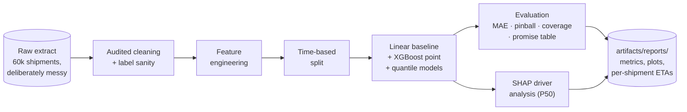
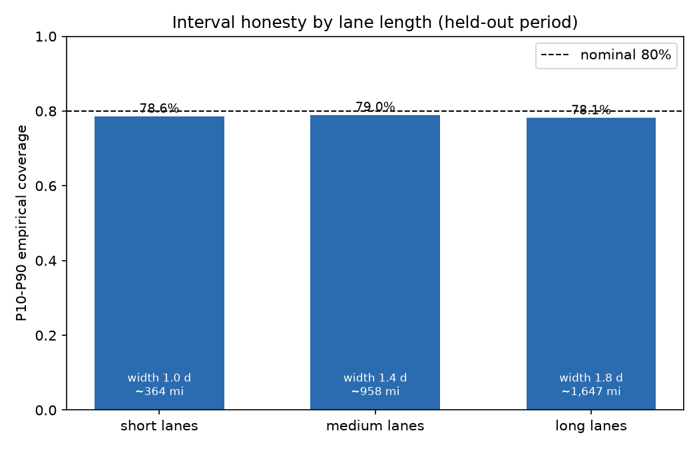
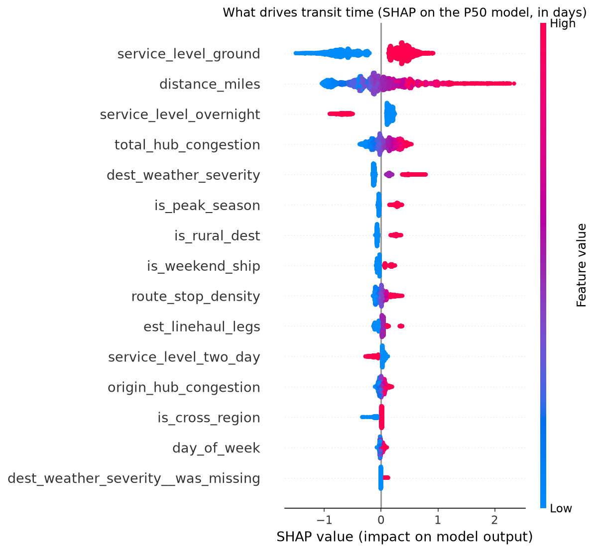
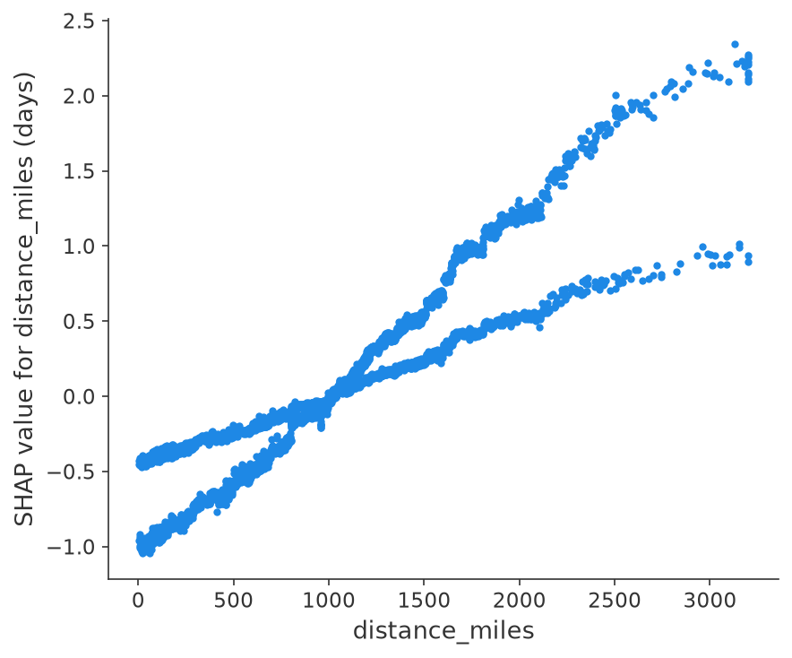
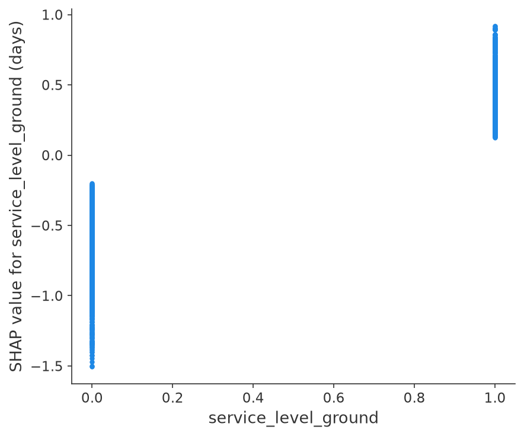

# ⏱️ ETA Regression

**When will each package actually arrive — and what transit time can you promise a customer and keep 9 times out of 10?**


A tracking page wants one number; a customer promise needs three. This project predicts
transit time **at induction time** (the moment a package enters the network) as a full
quantile set: P50 is the ETA you display, P10–P90 is the honest range, and ceil(P90) is
the transit time you can commit to. The distinction matters because transit-time
variance is not constant — a 3,000-mile ground lane through congested hubs is roughly
three times noisier than a short intra-region hop, so any single-number ETA is precise
exactly where it's safe and vague exactly where it's expensive.

One command runs the entire journey, no data downloads, ~2 minutes on a laptop:

```bash
pip install -e .
eta-regression all
```



## 🎯 The headline numbers

Held-out final month, ~11.7k shipments, mean actual transit 3.69 days. Nothing here was
tuned on the test period.

| | Linear baseline | XGBoost point | XGBoost P50 |
|---|---:|---:|---:|
| MAE | 0.601 d | **0.439 d** | 0.441 d |
| RMSE | 0.776 d | **0.610 d** | 0.612 d |
| Median APE | 14.1% | **9.3%** | 9.3% |

The point ETA is the easy part: the gradient-boosted model lands within about
**10.5 hours** of the truth on average. The product, though, is the interval:

| P10–P90 interval | Value |
|---|---:|
| Empirical coverage (nominal 80%) | **78.6%** |
| Mean width | 1.38 days |
| Pinball loss q10 / q50 / q90 | 0.098 / 0.220 / 0.099 |


## 🤝 The promise table

This is the trade the revenue and ops teams argue over. Quote ceil(P50) and the site
shows fast delivery dates that break one time in five. Quote ceil(P90) and the promise
holds for **97% of shipments** at a cost of **0.69 extra quoted days** per shipment:

| Quoting policy | Promise kept | Mean promised days |
|---|---:|---:|
| ceil(P50) | 79.3% | 4.16 d |
| ceil(P90) | **97.0%** | 4.85 d |

The full curve, from real quantile models trained at seven alphas, shows the whole
frontier — the elbow between 0.7 and 0.9 is where an extra tenth of a quoted day buys
the most reliability:


Note the ceiling effect: quoting ceil(P90) keeps 97% of promises, not 90%, because
rounding a 4.2-day P90 up to 5 whole days adds cushion. If 97% is more reliability than
you want to pay for, the curve says quoting the 0.7 or 0.8 quantile already clears a
90% kept-promise bar on this network.

## 📏 Intervals that stay honest where the noise lives

The generator's noise grows with distance and congestion by design. A model that only
matched the *average* spread would over-cover short lanes and under-cover long ones —
the failure mode that gets interval models quietly turned off after the first quarter.
Segmented coverage is the check: all three lane groups sit near the nominal 80%, and the
model pays for it with wider intervals on long lanes (1.76 d) than short ones (1.00 d),
which is exactly the honest behavior:

| Lane group | Mean distance | Coverage | Mean width |
|---|---:|---:|---:|
| Short | 364 mi | 78.6% | 1.00 d |
| Medium | 958 mi | 79.0% | 1.38 d |
| Long | 1,647 mi | 78.1% | 1.76 d |



## 🔍 What actually drives transit time

SHAP on the P50 model, where every value reads directly in days. Ground service and
lane distance dominate (as any dispatcher would tell you), with congestion, weather and
peak surges layered on top:



Grouped back to operational levers (one-hot columns re-aggregated), the global ranking:

| Rank | Driver | Share of model explanation | |
|---:|---|---:|---|
| 1 | Service level | 36.8% | `██████████████████` |
| 2 | Lane distance | 19.6% | `██████████` |
| 3 | Total hub congestion | 8.2% | `████` |
| 4 | Destination weather severity | 8.1% | `████` |
| 5 | Peak-season surge | 6.6% | `███` |
| 6 | Rural destination | 5.2% | `███` |
| 7 | Weekend induction | 3.5% | `██` |
| 8 | Route stop density | 3.2% | `██` |
| 9 | Estimated linehaul legs | 2.8% | `█` |
| 10 | Origin hub congestion | 1.8% | `█` |

And the sanity check that makes this ranking trustworthy: the generator plants known
noise features, and the model correctly buries them.

| Planted noise feature | Share of model explanation |
|---|---:|
| Package weight | 0.29% |
| Package volume | 0.25% |
| Declared value | 0.20% |
| Signature required | 0.07% |

### Dependence plots: the shape of each driver

Distance contributes time smoothly and then steepens past ~2,000 miles, where extra
sort legs stack up; the ground-service dummy is a clean two-level split worth roughly a
day and a half against the express services:

| Lane distance | Ground service |
|---|---|
|  |  |

### From global drivers to one quoted window

The pipeline also writes the explanation a customer-service screen would show next to a
quoted window (`artifacts/reports/example_shipment.md`). A real example from this run,
a 2,970-mile ground shipment to a rural destination during peak — quoted **P50 8.6 days,
P90 10.3 days, promise 11 days**:

| Driver | Value | Contribution to P50 ETA |
|---|---:|---:|
| Lane distance | 2,970 mi | +2.15 d |
| Ground service | yes | +0.92 d |
| Estimated linehaul legs | 4 | +0.35 d |
| Rural destination | yes | +0.30 d |
| Total hub congestion | 1.14 / 2.0 | +0.27 d |
| Route stop density | 7.51 | +0.19 d |
| Peak season | yes | +0.19 d |

Nobody needs a data science degree to believe this window, which is precisely what
makes it quotable.

### The trick that makes the SHAP report testable

The synthetic generator ([synthetic.py](src/eta_regression/synthetic.py)) has a
*documented causal process*: the per-service speeds, congestion and weather delay
coefficients, and — critically — the heteroscedastic noise formula are right there in
the code, alongside deliberately planted noise features. The test suite asserts that
SHAP recovers the real drivers, that the planted noise stays buried, and that P10–P90
coverage on held-out data lands in [0.70, 0.90]. If a refactor silently breaks the
intervals or the explanations, **CI fails**. Keep this harness when you adapt the
pipeline to your own data.

## 🏭 Adapting to your own shipment data

1. Produce a DataFrame with the canonical columns in
   [schema.py](src/eta_regression/schema.py). Only three are truly required to be
   meaningful: a shipment id, a ship date, and the `actual_transit_days` label. Every
   feature you can populate improves the model; anything you can't, fill with a neutral
   constant.
2. **Respect induction time.** Every feature must be knowable when the package enters
   your network. Scan counts and dwell times accumulated during transit predict arrival
   brilliantly and uselessly; they are how ETA models leak.
3. Run `eta-regression all`, read `artifacts/reports/`, then quote new shipments:

```bash
eta-regression score --input tomorrow.csv
# shipment_id, eta_p10, eta_p50, eta_p90, promised_days (= ceil of P90)
```

## 🧠 Design decisions that make or break ETA models

**Time-based split, never random.** Shipments from the same lane and day are heavily
correlated. A random split leaks future operating conditions into training and inflates
offline metrics that then evaporate in deployment. Training uses the first ~80% of ship
dates; everything after the cutoff is held out, and early stopping validates on the
last slice of *training* time only.

**Quantiles, not a point ETA.** Transit-time noise grows with distance and congestion,
so one number is simultaneously too cautious for the short-haul overnight and a lie for
the 3,000-mile ground lane. Quantile regression prices the uncertainty per shipment;
the promise table then turns that into a business decision instead of a modeling one.
The three product quantiles are monotone-rearranged at prediction time (sorted per
row), because independently trained quantile models can cross, and one crossed pair on
an ops screen discredits all three numbers.

**Coverage is segmented, not just averaged.** Aggregate 80% coverage can hide 90% on
short lanes and 65% on long ones — honest on average, wrong for every promise that
matters. The evaluation breaks coverage out by distance tercile and the test suite
checks the aggregate; when you adapt this, segment by whatever your quoting surface is
(lane, service, region).

**Label sanity is part of cleaning, and it is audited.** A classifier shrugs off a few
mislabeled rows; a regressor pulls its fit toward them. The raw extract contains
impossible zero/negative transit times (a delivery scan mis-keyed before induction),
and cleaning drops them — never clips, never imputes — and logs the count in
`cleaning_report.csv` alongside every other step, so upstream schema drift shows up as
a touch-count spike instead of a silent metric slide.

<details>
<summary>📁 Repository layout</summary>

```
src/eta_regression/
  schema.py      canonical shipment schema + validation
  synthetic.py   messy synthetic generator with documented transit process
                 and heteroscedastic noise (the reason quantiles exist)
  cleaning.py    audited cleaning: duplicates, sentinels, bounds, label sanity
  features.py    feature engineering, time-based split, model matrix
  train.py       linear baseline + XGBoost point + quantile models (0.1..0.95)
  evaluate.py    MAE/pinball/coverage, segmented coverage, promise table + curve
  explain.py     SHAP on the P50 model: global + local reports, driver ranking
  cli.py         eta-regression generate | all | score
tests/           end-to-end tests incl. coverage honesty and
                 "SHAP recovers the true drivers"
```

</details>

## 🤝 Contributing

Issues and PRs welcome, especially adapters for public datasets with real transit
times, conformal-calibration layers on top of the quantile models, and promise-policy
cost analysis (turning the promise curve into revenue impact). Please keep the two
invariants: no feature that isn't knowable at induction time, and no explanation or
interval output without a test that grounds it.

## License

Apache-2.0
