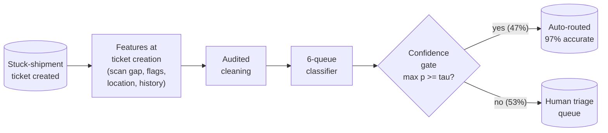
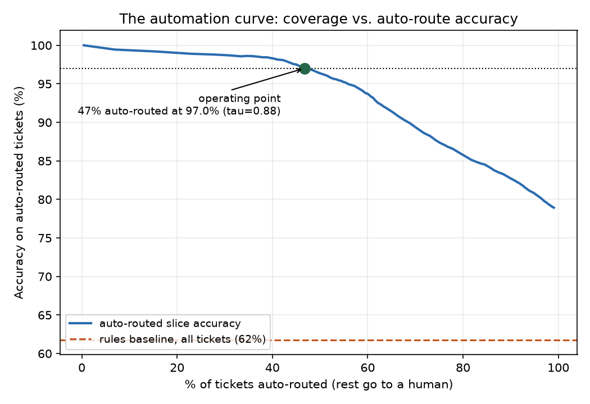
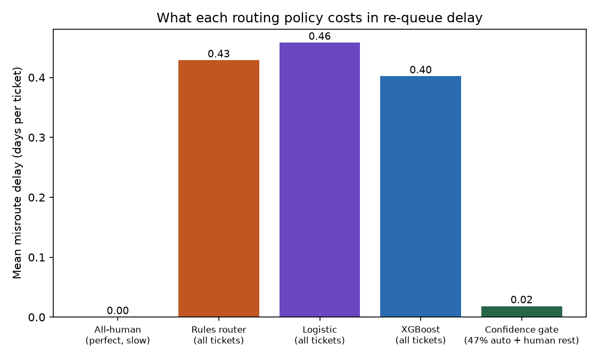
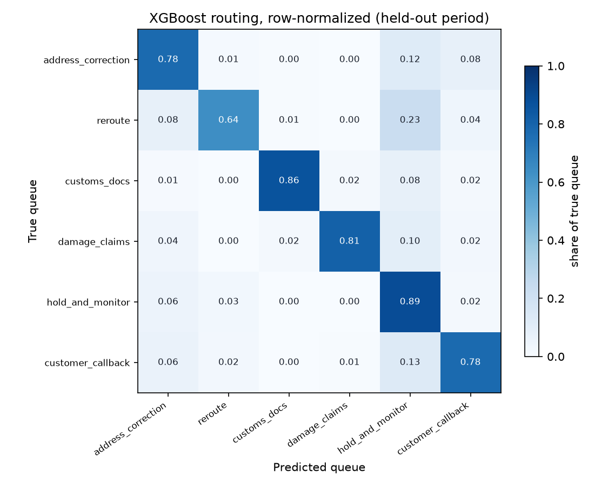
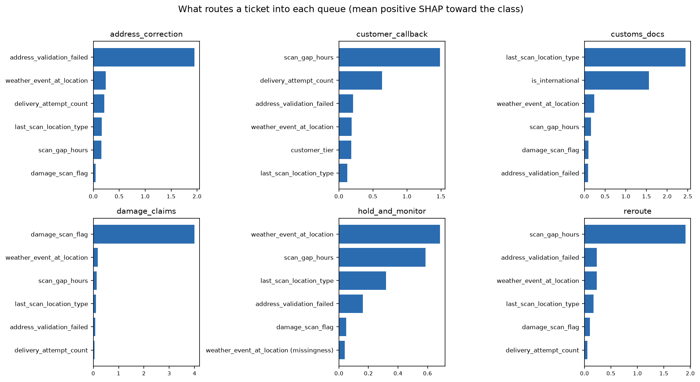

# 🚦 Exception Triage

**Misrouting a ticket doesn't fail loudly. It just adds three days.**


Every stuck shipment lands in an exception queue: no scan for a day, a failed
address validation, a damage report, a customs hold. Someone (or something) has
to read each ticket and decide which resolution team owns it. Route it right
and the fix starts immediately. Route it wrong and the ticket quietly waits in
the wrong queue, gets bounced, and re-enters the back of the right one.

This project routes tickets to six resolution queues with a classifier, then
does the part that actually matters: a **confidence gate** that auto-routes
only the tickets the model is sure about and reserves humans for the ones that
need them. It is modeled on the direction the industry has publicly committed
to; FedEx, for one, has stated it expects AI agents to handle exception
management and shipment monitoring across more than half of its operational
workflows by 2028. This repo is an independent, synthetic-data study of that
idea, affiliated with nobody.

One command runs the entire journey, no data downloads, about a minute on a laptop:

```bash
pip install -e .
exception-triage all
```



## 🎯 The headline numbers

Held-out final five weeks, 7,961 tickets, six queues with realistic imbalance
(hold 26%, address 24%, reroute 20%, callback 15%, customs 8%, damage 7%).
Nothing was tuned on the test period.

| Policy | Accuracy | Macro-F1 | Misroute delay (days/ticket) |
|---|---:|---:|---:|
| Rules router (ops SOP) | 0.618 | 0.669 | 0.429 |
| Multinomial logistic | 0.727 | 0.756 | **0.458** |
| XGBoost | **0.785** | **0.805** | 0.402 |
| Confidence gate (XGBoost @ tau=0.88) | 0.970 on the 47% it routes | n/a | **0.018** |

Two things worth a second look. The logistic model beats the rules router by
eleven accuracy points and still *costs more* in delay, because its extra wins
are cheap hold-and-monitor tickets while its extra losses are expensive damage
and customs tickets. Accuracy and cost disagree, and cost is the one the
network feels. Second: no policy on this table gets anywhere near 99%, and none
should. The generator plants genuinely ambiguous tickets (details below), so
the honest ceiling sits in the mid-80s, which is what real triage data looks
like.

## 🚪 The confidence gate is the product

Sweep the threshold tau and you trade coverage for auto-route accuracy. The
green dot is the shipped operating point: demand 97% accuracy on whatever the
model routes by itself, and it takes **46.7% of all tickets** off the human
queue (3,718 of 7,961), at a misroute cost of 0.018 days/ticket versus 0.429
for the all-rules desk:



Full automation is the wrong goal. Forcing the model to route everything drops
it to 78.5% accuracy and 0.40 delay-days; letting it choose its battles keeps
quality above what any human desk sustains at 2 a.m. The dashed line is the
rules router, for scale.



### What a misroute costs (the documented matrix)

Queues are not symmetric, so evaluation shouldn't be either. Each misroute is
priced in re-queue delay days (`evaluate.COST_MATRIX`):

| True queue sent elsewhere | Delay | Why |
|---|---:|---|
| damage_claims → anywhere | 4.0 | evidence window closes, claim disputed |
| customs_docs → anywhere | 3.0 | bonded storage and demurrage while it bounces |
| address_correction → most | 2.0 | relabel waits a full cycle |
| address_correction → callback | 1.0 | the call usually surfaces the address anyway |
| reroute → hold_and_monitor | 2.5 | a real misroute "monitored" keeps driving the wrong way |
| reroute → others | 1.5 | dispatcher gets it a bounce later |
| customer_callback → hold | 2.0 | nobody calls; the customer escalates |
| customer_callback → others | 1.0 | |
| hold_and_monitor → anywhere | 0.5 | it self-resolves regardless; you wasted a touch |

## 🔀 Where the model is confused, and why that's correct

Row-normalized confusion on the held-out period. The two visible smudges are
the two ambiguities the generator plants on purpose: reroute vs. hold (a long
scan gap during a weather event is usually congestion, sometimes a genuine
misroute) and callback vs. hold on quiet last-mile tickets:



| Queue | Precision | Recall | F1 | Support |
|---|---:|---:|---:|---:|
| address_correction | 0.811 | 0.776 | 0.793 | 1,954 |
| reroute | 0.895 | 0.637 | 0.744 | 1,623 |
| customs_docs | 0.927 | 0.864 | 0.895 | 604 |
| damage_claims | 0.928 | 0.809 | 0.865 | 576 |
| hold_and_monitor | 0.667 | 0.890 | 0.763 | 1,974 |
| customer_callback | 0.770 | 0.776 | 0.773 | 1,230 |

Reroute recall (0.637) is the number a strong triage desk argues about: the
model refuses to send a dispatcher unless it is fairly sure, and parks the
ambiguous long-gap tickets in hold. Given hold misroutes cost 0.5 days and
false dispatches waste a person, that asymmetry is what the cost matrix asked
for.

## 🔍 What routes a ticket into each queue

Per-queue SHAP, computed on the tickets the model actually routed into each
queue and keeping only positive (into-the-queue) contributions:



| Queue | Top driver | Second |
|---|---|---|
| address_correction | address_validation_failed | weather_event_at_location |
| reroute | scan_gap_hours | address_validation_failed |
| customs_docs | last_scan_location_type | is_international |
| damage_claims | damage_scan_flag | weather_event_at_location |
| hold_and_monitor | weather_event_at_location | scan_gap_hours |
| customer_callback | scan_gap_hours | delivery_attempt_count |

This table is asserted in CI against the generator's documented routing
process (`synthetic.TRUE_RULES`). The generator also plants two noise features
every real extract has, the CSR id who keyed the ticket and the hour of day it
was created, and the tests require both to stay buried in every queue. If a
refactor silently breaks the explanation stack, CI fails.

### The two ticket cards an ops screen would show

Written by the pipeline (`artifacts/reports/ticket_card_*.md`), verbatim from
this run. First, a ticket the gate routes with no human involved.

**Ticket card: auto-routed** (ticket `EXC0700012860`)

| Queue | Probability |
|---|---:|
| address_correction | 99.7% |
| hold_and_monitor | 0.1% |
| customer_callback | 0.1% |

Routing decision: **auto-route (confidence clears the gate)**

| Driver | Value | SHAP (log-odds) |
|---|---:|---:|
| address_validation_failed | 1 | +2.37 |
| delivery_attempt_count | 1 | +0.52 |
| return_to_sender_flag | 1 | +0.46 |
| weather_event_at_location | 0 | +0.31 |
| scan_gap_hours | 19.6 | +0.19 |

_In plain language: a failed address validation and 1 delivery attempt so far point this ticket at address_correction._

And one the gate refuses to touch.

**Ticket card: escalated to a human** (ticket `EXC0700026948`)

| Queue | Probability |
|---|---:|
| address_correction | 25.1% |
| hold_and_monitor | 23.5% |
| customer_callback | 21.5% |

Routing decision: **escalate to the human triage queue (confidence below the gate)**

| Driver | Value | SHAP (log-odds) |
|---|---:|---:|
| address_validation_failed | 0 | -0.76 |
| return_to_sender_flag | 1 | +0.72 |
| delivery_attempt_count | 0 | -0.21 |
| is_international | 1 | -0.19 |
| weather_event_at_location | 0 | +0.18 |

_In plain language: a label already marked return-to-sender point this ticket at address_correction._

An international shipment, RTS-marked but never attempted, address technically
valid. Three queues at roughly 25% each. This is precisely the ticket you want
a human to read, and the gate knows it.

## 🧠 Design decisions that make or break triage models

**The rules baseline must be strong.** `train.rules_route` is the router an
exception desk actually deploys: damage flag beats everything, then customs,
then the address validator, then weather, then a 24-hour scan-gap cutoff. Each
rule is individually sensible, and the whole thing scores 62%. Beating a
strawman proves nothing; beating the real SOP by 17 points of accuracy and
0.14 of macro-F1 is the case for changing how a desk works. Where the rules
die is visible in their errors: one global scan-gap threshold cannot separate
"weather congestion, leave it" from "misroute, chase it", and a router without
probabilities cannot tell you which decisions to trust.

**Cost-weighted evaluation, because queues are not symmetric.** The logistic
row on the headline table is the argument: eleven accuracy points better than
the rules and still more expensive per ticket. Any triage metric that treats a
misrouted damage claim (4 delay-days) like a misrouted hold ticket (0.5) will
happily ship that model. The cost matrix is small, documented, and wrong in
the ways your own numbers will also initially be wrong; arguing about its
entries with the claims and customs teams is a feature, not a chore.

**Calibrated escalation beats full automation.** The gate's contract, "97%
accurate on whatever it auto-routes", survives conversations with operations
leaders in a way "78.5% accurate overall" never will. It also degrades safely:
if the network drifts and confidence drops, the gate automatically sends more
tickets to humans instead of silently misrouting them.

**Time-based split, never random.** Tickets from the same weather event or hub
meltdown are heavily correlated. A random split would leak those episodes into
training; this pipeline trains on the first ~80% of ticket dates and reports
on the rest.

**The labels needed cleaning before anything else.** The historical queue
labels arrive in three casings from three generations of CRM ("Address
Correction", "REROUTE", padded whitespace), and the training labels are only
as good as their normalization. `cleaning.py` canonicalizes them and logs
every step to `cleaning_report.csv`, alongside duplicate ticket ids, negative
scan gaps from clock skew, and NULL flags from upstream feed timeouts.

**What a production system adds.** Free-text NLP on the ticket notes (the
driver's "gate code invalid" beats every structured flag here), feedback loops
that retrain on the queue that finally resolved each ticket rather than the
one it was first sent to, per-queue capacity awareness so the router degrades
gracefully when claims is understaffed, and drift monitoring on the gate's
escalation rate.

<details>
<summary>📁 Repository layout</summary>

```
src/exception_triage/
  schema.py      canonical ticket schema + validation
  synthetic.py   messy synthetic generator with documented routing process
  cleaning.py    audited cleaning: dupes, label casing, impossible values, NULL flags
  features.py    model matrix, time-based split
  train.py       rules router + multinomial logistic + XGBoost (multi:softprob)
  evaluate.py    accuracy/macro-F1, cost matrix, automation curve, operating point
  explain.py     per-queue SHAP drivers, auto-route + escalation ticket cards
  cli.py         exception-triage generate | all
tests/           end-to-end tests incl. "SHAP recovers the true queue mapping"
```

</details>

## 🤝 Contributing

Issues and PRs welcome, especially adapters for public ticket-like datasets,
cost matrices calibrated from real re-queue measurements, and free-text
feature extraction. Please keep the two invariants: no feature that isn't
knowable at ticket creation, and no explanation output without a test that
grounds it against the generator's documented process.

## License

Apache-2.0
