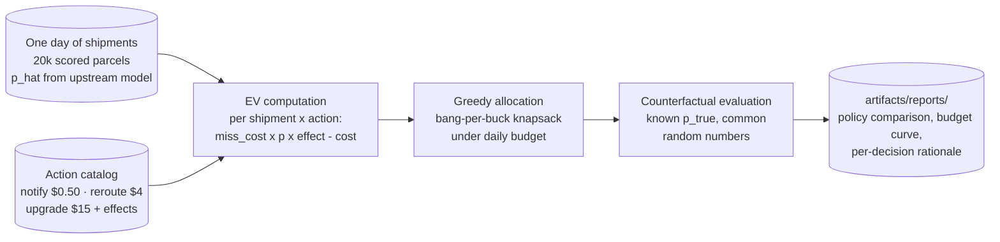
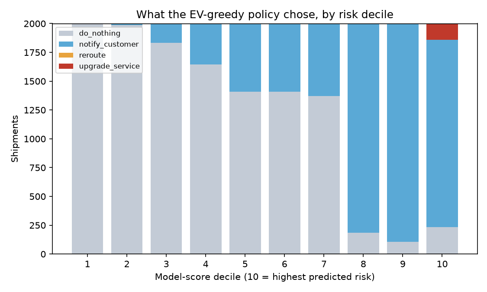

# 🎛️ Intervention Optimization

**A risk score is not a decision. This is the layer that turns scores into money, under a budget.**


Use case 1 in this repo ends with a calibrated miss probability on every shipment. Then
what? The ops desk has a finite daily budget and three levers: reroute the parcel,
upgrade the service, or warn the customer. Most networks answer with the same rule:
sort by risk, expedite from the top until the money runs out. That rule optimizes the
wrong thing, and on this dataset it captures **7% of the value that the same budget,
same scores and same actions can deliver**.

One command runs the entire comparison, no data downloads, a few seconds on a laptop:

```bash
pip install -e .
intervention-opt all
```



## 🎯 The headline numbers

One simulated day: 20,000 shipments, ~10% true miss risk, a $6,000 intervention budget,
and an upstream risk model that is deliberately imperfect (rank correlation ~0.88 with
the truth). Every policy sees the same day, the same noisy scores, and the same random
outcomes, so the differences below are pure policy:

| Policy | Spend | Misses prevented | Miss cost avoided | Net savings | ROI | % of oracle |
|---|---:|---:|---:|---:|---:|---:|
| none | $0 | 0 | $0 | $0 | n/a | 0% |
| random spend | $6,000 | 46 | $2,769 | **-$3,231** | -0.5x | -9.1% |
| top-K risk flagging | $6,000 | 172 | $8,435 | $2,435 | 0.4x | 6.8% |
| **expected-value greedy** | $6,000 | 57 | $38,577 | **$32,577** | **5.4x** | **91.5%** |
| oracle (perfect scores) | $6,000 | 54 | $41,598 | $35,598 | 5.9x | 100% |


Three findings worth reading twice:

1. **Untargeted spend loses money.** Random upgrades return 46 cents on the dollar.
   "The supervisor expedites whatever lands on their desk" is not a neutral default,
   it is a negative-ROI program.
2. **The EV policy prevents FEWER misses than top-K (57 vs 172) and still saves 13x
   more money.** Counting prevented misses is the wrong KPI. Most of the EV policy's
   value comes from making unavoidable failures cheap (a fifty-cent heads-up cuts the
   refund/WISMO cost of a miss by 40%) and from reserving the expensive lever for
   shipments where risk multiplied by cost justifies it.
3. **A perfect risk model is worth $3,021/day here** (oracle $35,598 minus greedy
   $32,577), about $1.1M a year. That single number is the business case, and the
   budget ceiling, for improving the upstream model. Most teams have never priced it.

## 💸 How the policy spends the money

The decision mix by model-score decile is the policy's logic made visible. Safe
deciles get nothing. Middle risk gets blanketed with fifty-cent notifications. The
$15 upgrades (red) concentrate in the top decile, and only where the shipment is
worth protecting; 144 upgrades out of 20,000 shipments:



Note what's missing: **the $4 reroute never wins.** At these prices it beats a
notification only when expected miss cost exceeds $70, but the upgrade already
dominates it from $31 upward, so reroute is strictly dominated as a standalone
choice. The EV framework surfaced a dead lever in the action catalog before anyone
built a workflow for it. Reroute earns its place back when express capacity is capped
or when you allocate incrementally; both are the natural next constraint to add.

The budget sweep answers the CFO question ("what is the RIGHT budget?") rather than
the ops question ("was today's budget well spent?"). The first $1,000 returns $13,080;
by $16,000 every positive-EV action is funded and the curve is flat. The default
$6,000 sits where the marginal dollar still returns roughly $2:


## 🧾 The audit trail: why each dollar moved

No SHAP in this use case, on purpose. The upstream model owns "why is this shipment
risky" (use case 1 ships that). What this layer must explain is "why did we spend
here and not there", and for an expected-value policy the honest explanation is the
arithmetic itself: `expected savings = miss_cost x p_hat x effect - action_cost`.
The pipeline writes `rationale.md` with representative decisions an ops manager can
check by hand. Verbatim from this run:

| Case | Shipment | p_hat | Tier | Value | Miss cost | Action | Exp. cost reduction | Action cost | Exp. net savings | Why |
|---|---|---:|---|---:|---:|---|---:|---:|---:|---|
| highest-stakes upgrade | SHP0700012119 | 85% | contract | $396 | $188 | upgrade_service | $127.70 | $15.00 | $112.70 | 85% risk on a contract shipment with a $188 miss cost: the strongest lever pays for itself many times over. |
| notify-only | SHP0700018448 | 20% | contract | $86 | $182 | notify_customer | $14.49 | $0.50 | $13.99 | physical intervention is not worth it here, but fifty cents to make the likely miss a cheap, warned one is. |
| high risk, deliberately not upgraded | SHP0700017665 | 62% | standard | $7 | $30 | notify_customer | $7.43 | $0.50 | $6.93 | 62% risk looks scary, but the miss only costs $30: a $15 upgrade would destroy money (EV $-0.14). |

The third row is the one audits always ask about, and the one top-K flagging gets
wrong every single day. The full EV matrix for these shipments (every candidate
action priced, so a reviewer can verify no better option existed) lands in
`decision_policy.csv`.

## 🧠 Design decisions that make or break intervention programs

**Expected value, not risk, is the sort key.** A 90% miss risk on a $5 envelope is
worth less attention than a 40% risk on a $2,000 contract pallet: $27 of expected
loss versus $152. Top-K flagging cannot see this because risk and value-at-risk are
nearly independent in a real network (and are exactly independent in this generator,
by design). The moment you multiply probability by consequence, the ranking reshuffles
top to bottom, and a cheaper action frequently beats the flagship expedite.

**Common random numbers, or your A/B is noise.** Evaluation draws ONE uniform per
shipment and reuses it for every policy: a shipment misses under an action iff
`u < p_true * (1 - p_reduction)`. Comparisons become paired (the same unlucky parcels
are unlucky under every policy), which removes between-run luck that would otherwise
swamp real policy differences, and effects are monotone: any miss a weak action
prevents, a stronger action also prevents. Evaluate each policy on fresh draws and
the ranking can flip run to run for no reason at all.

**The oracle gap is the model team's budget.** The oracle runs the exact same greedy
allocator fed `p_true` instead of `p_hat`, so the gap isolates score quality from
everything else. Here the imperfect model already captures 91.5% of oracle value:
decent decisions tolerate noisy scores, because the EV math mostly needs risk ranked
roughly right where it is expensive. Widen `--score-noise` and watch that percentage
fall; that curve is what "should we invest in the model or the process" looks like
as a number.

**Every dollar constant is a business input, not a modeling choice.** The miss-cost
model ($30 base, x3 premium, x6 contract, plus 2% of declared value capped at $200)
and every action's cost and effect live in one place,
[interventions.py](src/intervention_opt/interventions.py), each with a comment saying
what to recalibrate it from. Run this with YOUR claims, refund, WISMO-call and SLA
data before believing any of the dollar figures; the optimizer is exactly as honest
as that file.

**Counterfactual ground truth is the whole point of synthetic data here.** Real logs
never record what would have happened without the intervention, which is why
intervention programs get judged on vibes and survivorship. The generator exposes
`p_true` and fixed action effects, so policies are evaluated exactly. When you adapt
this, that exactness is replaced by uplift estimates from holdout experiments; keep
the synthetic harness as the regression test for the allocator itself.

<details>
<summary>📁 Repository layout</summary>

```
src/intervention_opt/
  synthetic.py      one day of scored shipments: p_true + noisy p_hat, tier, value
  interventions.py  action catalog + miss-cost model (every $ constant lives here)
  policy.py         none / random / top-K / EV-greedy / oracle, all budget-constrained
  evaluate.py       paired counterfactual simulation, budget sweep, plots
  explain.py        per-decision rationale + full EV matrix for audit
  cli.py            intervention-opt generate | all
tests/              policy ordering, budget discipline, no negative-EV spend,
                    oracle bound, paired-evaluation reproducibility
```

</details>

## 🤝 Contributing

Issues and PRs welcome, especially per-action capacity constraints (express-network
caps make reroute relevant again), an incremental multiple-choice-knapsack allocator
to compare against the greedy, and uplift-based evaluation recipes for real data.
Please keep the two invariants: every policy respects the budget, and no decision
output without a rationale a human can check by hand.

## License

Apache-2.0
