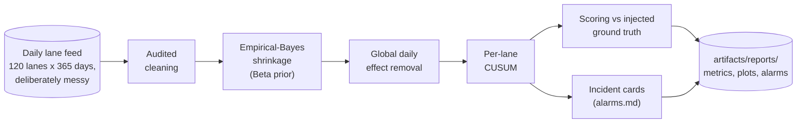
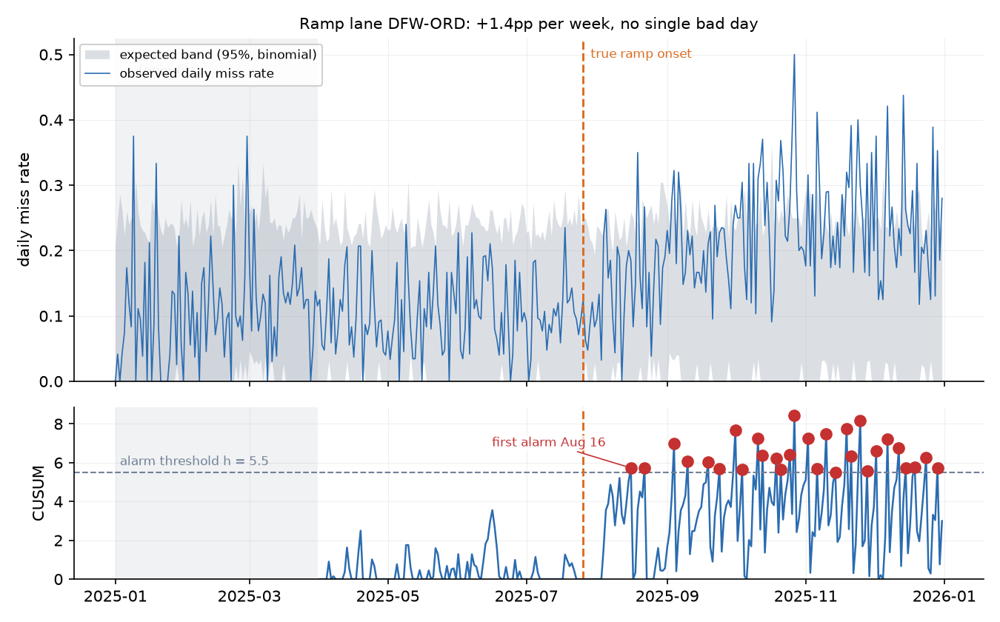
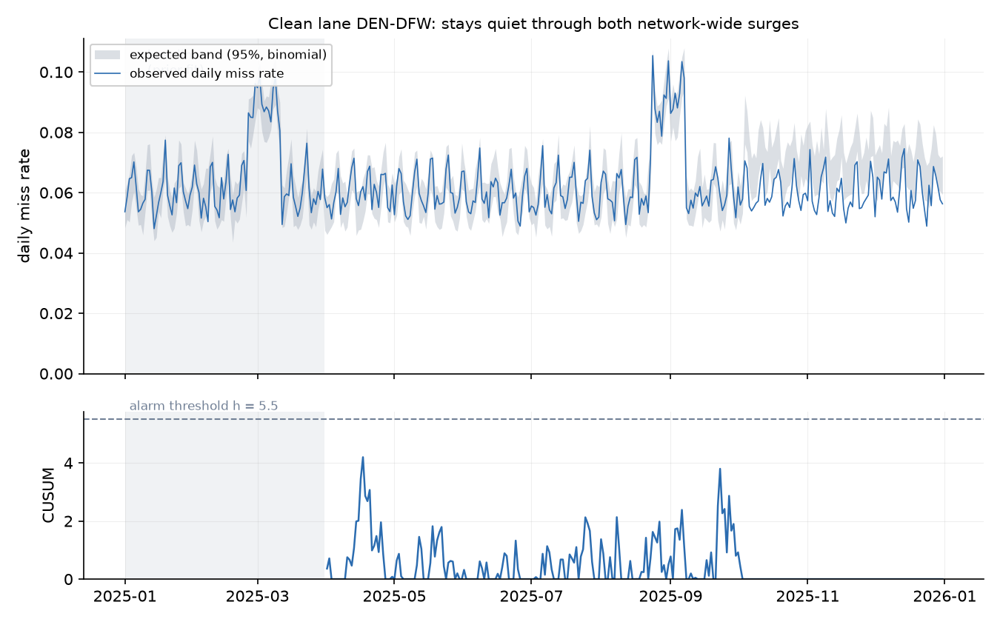
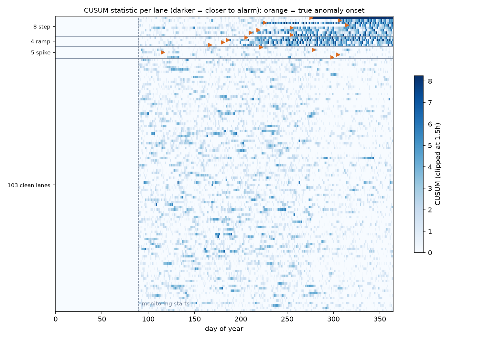
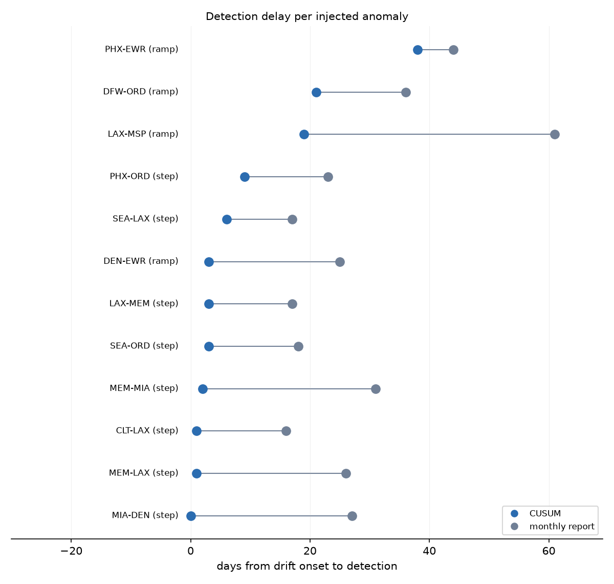

# 📡 Network Anomaly Detection

**Your monthly OTP report is a rear-view mirror. This catches lane drift while it's still a cheap problem.**


Every network review has the same scene: the monthly on-time report lands, one lane is
suddenly four points worse, and the room spends an hour reconstructing when it actually
broke. The answer is usually "three to five weeks ago." This project monitors miss rate
per lane per day and pages when a specific lane starts drifting, while staying silent
through network-wide weather and peak surges, and while treating a 10-shipment-per-day
lane with the statistical humility it deserves.

No model training, no GPU, no downloads. One command, seconds on a laptop:

```bash
pip install -e .
network-anomaly all
```



## 🎯 The headline numbers

Scored against the generator's documented ground truth: 8 step drifts (+7 to +15
points), 4 gradual ramps (+1 to +1.5 points per week), 5 one-day spikes, and 103 clean
lanes as the false-alarm denominator. The reference detector is the status quo: a
month-end report flagging lanes above expected + 2 sigma, with the same seasonal
adjustment this detector gets.

| | CUSUM (this project) | Monthly OTP report |
|---|---:|---:|
| Step drifts detected | 8/8 | 8/8 |
| Mean delay, steps | **3.1 days** | 21.9 days |
| Gradual ramps detected | 4/4 | 4/4 |
| Mean delay, ramps | **20.2 days** | 41.5 days |
| False alarms per clean-lane-year | 0.47 | 0.29 |
| Clean lanes paged during a network-wide surge | 2 of 103 | n/a |

The monthly report does detect everything eventually; large steps are not subtle in a
30-day aggregate. What it cannot do is detect them *early*: it hands you the same
incidents 19 days later on average, which at trunk-lane volume is thousands of missed
commitments that were preventable. Its slightly lower false-alarm count is the other
side of the same coin: it buys quiet by being late.

## 🔍 What a catch looks like

A +11-point step on a 40-shipment/day lane. Daily rates (top) are noisy enough that
eyeballing the break is hard, but the CUSUM (bottom) accumulates the shift and alarms
**3 days** after onset. The month-end report flags this lane 18 days after onset:


The slow-rot case: +1.4 points per week, so there is never a single bad day to notice.
The CUSUM catches it **21 days** in, about 4 points into a 14-point climb; the monthly
report needs 36 days. On the worst ramp for the status quo, the gap is 19 vs 61 days:



And the shot that earns ops trust: a clean trunk lane riding through both network-wide
surge windows (the two plateaus in the observed rate). The expected band lifts with the
network, the residual stays flat, the CUSUM never gets near the threshold:



The whole network on one screen. Anomalous lanes light up after their onset (orange
markers); the 103 clean lanes below stay pale all year, including through both surges:



Per-anomaly detection delay, paired: every blue dot (CUSUM) sits left of its gray dot
(monthly report), on every one of the 12 drifts:



## 🧾 The incident card

Each alarm becomes the message you'd paste into the ops channel, with the drift priced
in misses per week rather than z-scores. From `artifacts/reports/alarms.md`, verbatim:

> ### MIA-DEN: alarm 2025-10-04
>
> - Miss rate over the 1 day(s) the statistic accumulated: **22.8%** vs expected **14.5%** (CUSUM 11.6 at h=5.5)
> - At ~4,710 shipments/day, this drift costs **~2,752 extra misses/week** if left alone
> - Still firing: re-alarmed 88 more time(s) since, not yet fixed
> - Ground truth: injected step drift, caught **0 days** after onset
>
> *(On synthetic data every card ends with its ground-truth label. Keep that habit on
> real data: label every alarm in the retro, and you accumulate the tuning set for k
> and h.)*

## 🧠 Design decisions that make or break lane monitoring

**Empirical-Bayes shrinkage, because small lanes lie.** A 10-shipment/day lane's
90-day observed rate carries an error of several points, and standardizing against a
wrong expectation gives you a detector that is either hair-triggered or blind. Fitting
a Beta prior across all lanes (method of moments, here Beta(4.3, 45.2), prior mean
8.7%) and using each lane's posterior mean pulls thin lanes toward the network norm in
proportion to how little evidence they have. Trunk lanes keep their own history almost
untouched. This single step is what makes the bottom half of the volume distribution
monitorable at all.

**Subtract the network-wide daily effect, because weather is not a lane anomaly.** A
bad Tuesday moves every lane at once; that is a capacity conversation, not 120
incidents. Each day the volume-weighted network deviation is removed before any lane is
judged. Two guards keep this honest: lanes whose CUSUM is already elevated lose their
vote on what "network normal" is (a broken trunk lane must not launder its own step
into global weather and hide), and per-lane deviations are clipped before entering the
estimate. Result above: 2 of 103 clean lanes paged during a 15-day, +3-point,
network-wide surge.

**CUSUM, because memory beats snapshots.** A threshold on the daily rate only sees one
day of evidence at a time, so it must be set loose enough to survive thin-lane noise,
which makes it deaf to small persistent shifts. The CUSUM adds up standardized
residuals (minus a slack k), so a persistent +1 sigma drift accumulates roughly half a
point per day and crosses any reasonable threshold within two weeks, while isolated bad
days decay back to zero. That is the entire reason the ramp column in the table above
exists.

**The one-day-spike tradeoff, documented rather than hidden.** A storm day that
self-recovers should not page anyone, and mostly it doesn't: 2 of the 5 injected spike
lanes produced an alarm within a week of the spike. Those alarms are tracked in a
separate bucket, not counted as detections or as false alarms. If your network wants
zero spike alarms, raise k; you will pay for it in ramp delay. There is no setting that
makes this tradeoff disappear, only settings that hide it.

**k and h are the alarm budget, not math constants.** k = 0.5 ignores drift smaller
than half a standard error per day; h = 5.5 sets how much accumulated evidence buys a
page. Across seeds, h = 5 gives ~0.7 to 1.0 false alarms per clean-lane-year, h = 6
gives ~0.3 to 0.5 but adds nearly a week of ramp delay. Bring that curve to the ops
team and let them pick the point; a detector tuned without the people who get paged is
a detector that gets muted.

## 🏭 Adapting to your own network

1. Produce one row per (lane, day) with the four columns in
   [schema.py](src/network_anomaly/schema.py): lane, date, volume, misses. Lane can be
   any stable operational unit: hub pair, terminal, route, service region.
2. Pick a baseline window that contains your seasonality (the synthetic setup
   deliberately places a surge inside the 90-day baseline; if your baseline is all
   calm days, the first peak will look like 120 simultaneous anomalies).
3. Run it, read `artifacts/reports/alarms.md`, and label every alarm in the retro.
   Tune k and h against your own labeled history, not against defaults from a README.

The cleaning stage logs every touch (`cleaning_report.csv`). Watch those counts in
production: a feed that suddenly needs more repair is drifting upstream of your
detector, and that failure mode looks exactly like a network incident until you check.

<details>
<summary>📁 Repository layout</summary>

```
src/network_anomaly/
  schema.py      canonical daily lane table + validation
  synthetic.py   one year of lane data, documented injected anomalies (INJECTED_ANOMALIES)
  cleaning.py    audited cleaning: duplicate days, impossible counts, gap census
  detect.py      EB shrinkage, global-effect removal, CUSUM, monthly-report baseline
  evaluate.py    detection rate/delay vs ground truth, false-alarm accounting, plots
  explain.py     incident cards (alarms.md), re-alarms collapsed into episodes
  cli.py         network-anomaly generate | all
tests/           end-to-end tests incl. delay-beats-monthly and surge-stays-quiet
```

</details>

## 🤝 Contributing

Issues and PRs welcome, especially adapters for public logistics feeds, alternative
change detectors under the same scoring harness (Bayesian online changepoint detection
is the obvious candidate), and hub-level rollups of lane alarms. Please keep the two
repo invariants: nothing the detector uses may postdate the day being scored, and no
detector output without a test that grounds it against known injected anomalies.

## License

Apache-2.0
