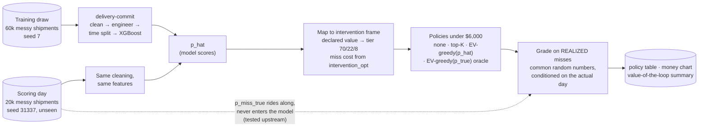
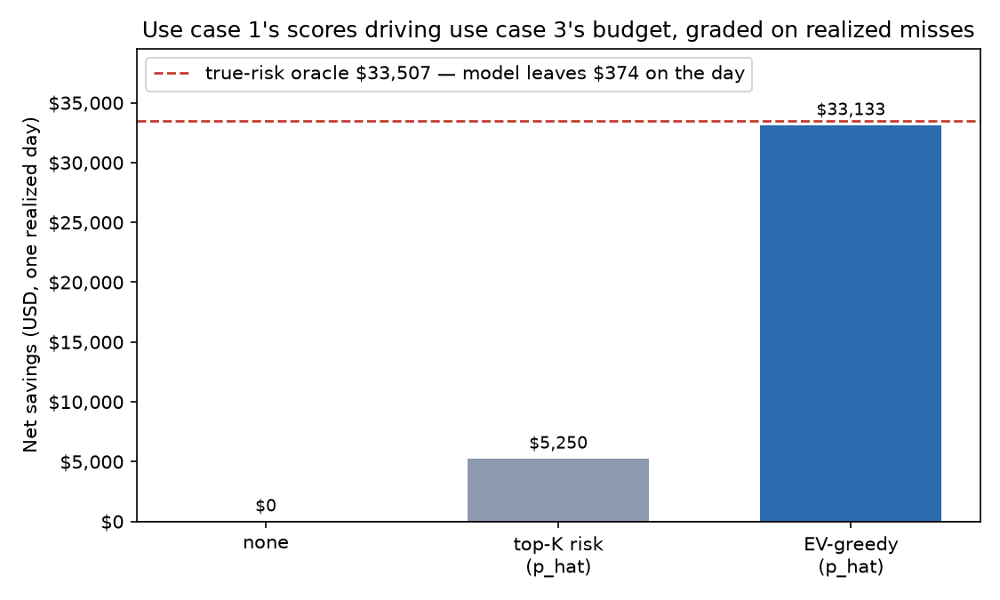

# 🔁 The Operational Loop

**Twelve use cases are a catalog. This is the assembly.**


The root README claims the projects cover the operational loop end to end: predict which
shipments are at risk, then act on them within a real budget. Every use case proves its
own link. This folder proves the chain: the risk scores that
[delivery-commit-prediction](../delivery-commit-prediction/) actually produces drive the
budget that [intervention-optimization](../intervention-optimization/) actually
allocates, and the whole loop is graded on the day's realized missed commitments — not
on the model's opinion of itself.

```bash
bash setup.sh                 # venv + both use cases installed editable
.venv/bin/python run_loop.py  # train, score, allocate, grade (~2 min)
.venv/bin/pytest -q tests/    # smoke test of the wired pipeline
```



## 🎯 What the wired loop delivered

One realized day: 20,000 shipments, 2,228 actual missed commitments (11.1% — the day is
a fresh draw the model never trained on), a $6,000 budget, and the commit model scoring
every parcel at induction time. This table is `run_loop.py` output verbatim, and two
runs produce it byte-identically:

| Policy | Spend | Misses prevented | Miss cost avoided | Net savings | ROI | % of oracle |
|---|---:|---:|---:|---:|---:|---:|
| none | $0 | 0 | $0 | $0 | n/a | 0% |
| top-K risk (p_hat) | $6,000 | 212 | $11,250 | $5,250 | 0.9x | 15.7% |
| **EV-greedy (p_hat)** | $6,000 | 57 | $39,133 | **$33,133** | **5.5x** | **98.9%** |
| EV-greedy (p_true, oracle) | $6,000 | 70 | $39,507 | $33,507 | 5.6x | 100% |



Two numbers carry the story:

1. **Wiring the loop is worth $27,882/day over the classic ops rule.** Top-K flagging
   with the same scores and the same budget nets $5,250; feeding those scores into the
   expected-value allocator nets $33,133. The policy switch, not the model, is the big
   money — exactly what intervention-optimization's own README argues with simulated
   scores, now confirmed with real ones.
2. **A perfect model is worth about $600/day more — and that's the interesting part.**
   The oracle runs the identical allocator fed the generator's true miss probability.
   On this day it beat the model by $374 realized; luck-free (differencing
   p_true-weighted expectations over the same decisions) the gap is $600/day, about
   $219k/year. Compare intervention-optimization's own oracle-gap framing: its
   *simulated* upstream model (rank correlation 0.88 with truth) left $3,021/day and
   captured 91.5% of the oracle. The real trained model ranks at 0.93 and captures
   **98.9%** — the actual pipeline beats the placeholder assumption, and the remaining
   gap prices the entire upstream roadmap at a couple hundred thousand a year, not
   millions. That is a number a data-science budget meeting can use in both directions.

## 🔬 What makes the grading honest

**The true risk rides along but can never leak.** The scoring day is generated with
`make_dataset(..., return_true_risk=True)`, which attaches `p_miss_true` — the
generator's sigmoid *before* the Bernoulli draw. It exists only for the oracle and the
counterfactual grading. delivery-commit's feature matrix is whitelist-based, and its
test suite now asserts the model matrix is byte-identical with and without the column
present.

**Policies are graded on the day that actually happened.** Each shipment gets one
uniform `u`, drawn *conditional on its realized outcome*: a parcel that missed gets
`u ~ U(0, p_true)`, one that arrived gets `u ~ U(p_true, 1)`. Under do-nothing the
simulation then reproduces the day's `missed_commit` column exactly, and intervention
effects apply through `intervention_opt.evaluate.simulate` with the same paired,
monotone semantics that use case documents: an action with a 45% risk reduction saves a
realized miss with 45% probability, and any miss a weak action prevents, a stronger one
also prevents.

**The tier mapping is synthetic, and it taught us something.** delivery-commit has no
customer tier, so the loop assigns one from declared value (the exact variable that
separates tiers in intervention-optimization's own generator) at that generator's
documented 70/22/8 mix. We tried equal terciles first and hit a genuine finding: with a
third of parcels branded "contract" (a 6x miss-cost multiplier starting at a ~$48 value
boundary), the allocator's pick-best-action-then-rank-per-dollar heuristic drowns in
$15 upgrades it can't fund, those shipments lose their fifty-cent notify option too,
and *more accurate scores allocate worse* — the oracle stops being an upper bound.
Allocation heuristics have operating regimes just like models do; the loop is where you
find out.

**Everything is deterministic.** Fixed seeds for training, the day, and the outcome
draws; no clocks, no environment reads. Run it twice and diff the artifacts.

## ⚠️ Honest limitations

- **One synthetic day, one seed.** The realized oracle gap ($374) includes that day's
  Bernoulli luck, which is why the luck-free expected gap ($600/day) is reported next
  to it. A production version would average over weeks.
- **The "day" is a scoring batch, not a calendar date.** The generator places seasonal
  surges by position inside its date window, so a literal single-date batch would be
  all-peak by construction; the batch instead spans the generator's operating
  conditions at the documented ~11% risk mix.
- **Tier is imputed from declared value.** Real networks know who their contract
  customers are; the 70/22/8 rank mapping is a stand-in, and every dollar downstream
  inherits it.
- **Train and score share a generator family.** No regime shift between them —
  delivery-commit's Olist study shows what happens when reality drifts mid-test.
- **Next wirings, in order:** eta-regression's P90 quantiles → promise-date setting
  (quote commitments the commit model then defends), and volume-forecasting →
  capacity-planning (staff the wave the forecast sees coming).

<details>
<summary>📁 Folder layout</summary>

```
setup.sh          venv with ../delivery-commit-prediction and ../intervention-optimization
run_loop.py       train → score → map → allocate → grade; writes artifacts/ + docs/img/
tests/            smoke test at n=4,000: budget respected, EV-greedy(p_hat) >
                  top-K(p_hat) > none, oracle(p_true) >= EV-greedy(p_hat), and the
                  scores are model output, not leaked truth
artifacts/        policy_comparison.csv, loop_summary.json (gitignored)
docs/img/         the money chart
```

</details>

## License

Apache-2.0
