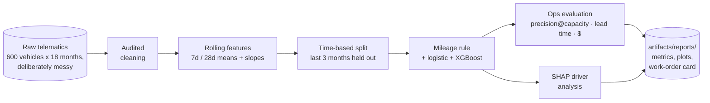
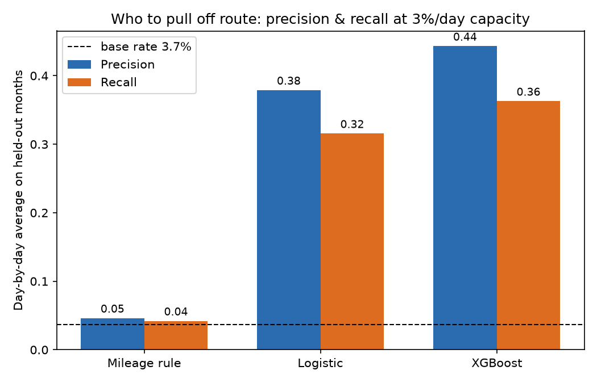
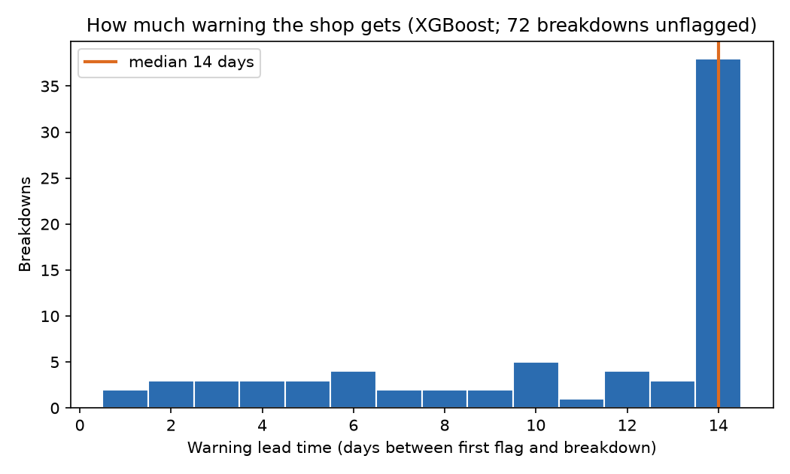
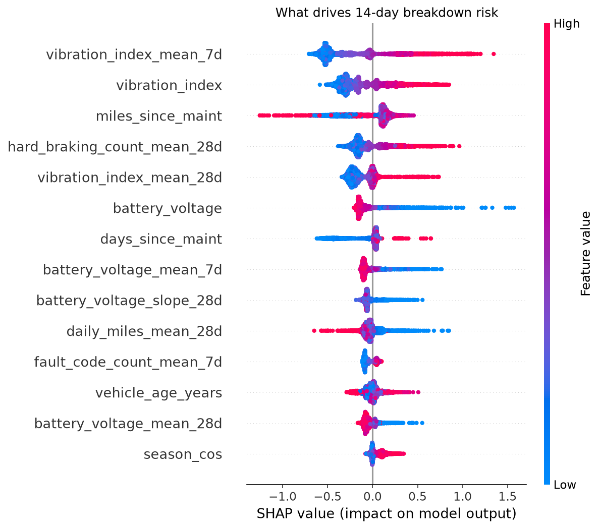
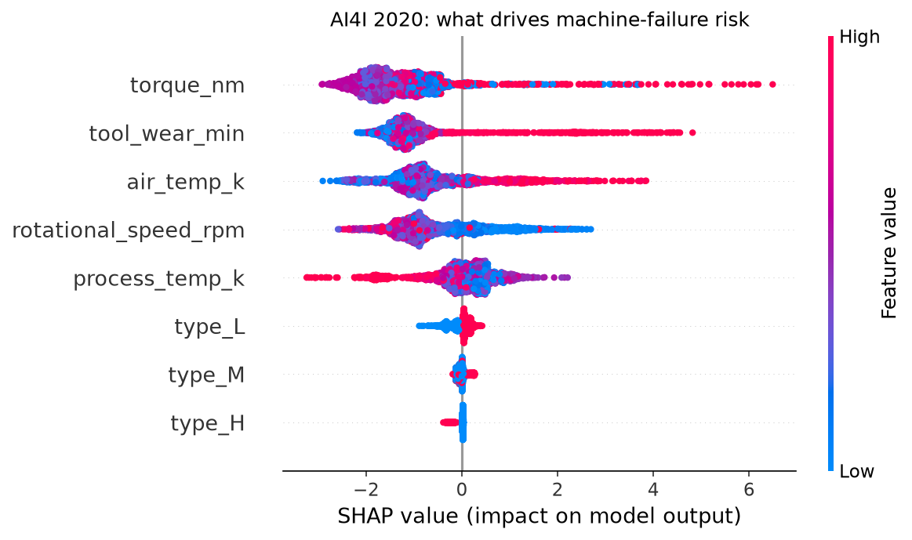

# 🔧 Predictive Maintenance

**Know which delivery vehicles will break down in the next two weeks, with enough warning to fix them on a schedule instead of on a shoulder.**


A breakdown on route costs a tow, roadside labor, and every missed stop on the
manifest. The same repair in a scheduled bay costs a fraction of that. Fleet
programs built on this idea are among the best-documented wins in logistics ML:
DHL has reported roughly 25% fewer unplanned breakdowns and 15% less downtime
from its fleet predictive-maintenance program, and Maersk has published work on
predicting engine failures from onboard sensor data. Both inspired this
project. It watches daily telematics from ~600 delivery vehicles and answers
one question every morning: given that the workshop can only pull about 3% of
the fleet off route today, which vehicles should get those bays?

One command runs the entire journey, no data downloads, well under a minute on
a laptop:

```bash
pip install -e .
fleet-maint all
```



## 🎯 The headline numbers

Held-out final 90 days: 54,000 vehicle-days, 147 breakdowns, 3.7% base rate
(share of vehicle-days within 14 days of a failure). Nothing was tuned on the
test period.

| | Mileage rule | Logistic | XGBoost |
|---|---:|---:|---:|
| PR-AUC | 0.067 | 0.321 | **0.393** |
| ROC-AUC | 0.723 | 0.885 | **0.900** |
| Precision @ 3%/day capacity | 4.6% | 37.9% | **44.3%** |
| Recall @ 3%/day capacity | 4.2% | 31.6% | **36.3%** |
| Median warning lead time | 3.5 days | 13 days | **14 days** |
| Breakdowns caught | 9.5% | 46% | **51%** |

The first column is the policy most fleets actually run: service whatever has
gone longest since its last service. It is not a straw man; it catches the
slow, even wear that mileage genuinely causes. What it cannot see is *which*
vehicles wear fast: the aggressive brakers, the overloaded units, the batteries
about to meet their first cold snap. At the same daily capacity, the model
flags a vehicle that really is about to fail 44% of the time; the mileage rule,
4.6%.



### The money table

An unplanned breakdown costs ~$2,800 (tow, roadside labor, missed routes). A
planned service slot costs ~$600. Each policy gets the same daily capacity, is
charged $600 per vehicle it pulls in, and is credited $2,800 for every
breakdown its action preceded. Over the 90-day test period, for this 600-vehicle
fleet:

| Policy | Service actions | Breakdowns averted | Net value | vs. mileage rule |
|---|---:|---:|---:|---:|
| Mileage rule | 252 | 14 | −$112,000 | — |
| Logistic | 199 | 62 | +$54,200 | +$166,200 |
| XGBoost | 197 | 76 | **+$94,600** | **+$206,600** |

That last cell is the number a fleet manager takes to finance: switching the
same 18 bays from the mileage rule to the model is worth about **$69,000 a
month**. (Offline replay assumes servicing a flagged vehicle does not change
the logged future; every predictive-maintenance backtest shares that
assumption, and the code says so out loud.)

### The chart that sells it: one vehicle walking into a breakdown

Vibration climbing, oil pressure sagging, battery voltage sliding. The risk
score crosses the daily flag threshold a full two weeks before the failure
date, and the sensors visibly recover after the repair:


The warning is rarely a single dramatic day. It is three noisy gauges drifting
in the same direction at once, which is exactly what rolling means and slopes
exist to catch (and what a human staring at 600 dashboards cannot):



## 🔍 What actually drives breakdown risk

Each dot is a vehicle-day; red means the reading was high. Rising vibration,
falling battery voltage, heavy braking habits and a long gap since service push
risk up; a fresh service pulls it hard down:



Rolling-window features grouped back to the physical sensor they came from
(`vibration_index_mean_7d` and `vibration_index_slope_28d` both roll up to
"vibration", because a mechanic reasons about sensors, not window statistics):

| Rank | Driver | Share of model explanation | |
|---:|---|---:|---|
| 1 | Vibration | 34.6% | `███████████████████████` |
| 2 | Battery voltage | 16.1% | `███████████` |
| 3 | Service interval | 13.4% | `█████████` |
| 4 | Hard braking | 10.0% | `███████` |
| 5 | Daily mileage | 5.0% | `███` |
| 6 | Fault codes | 4.7% | `███` |
| 7 | Oil pressure | 4.7% | `███` |
| 8 | Season | 3.6% | `██` |
| 9 | Engine temp | 3.3% | `██` |
| 10 | Vehicle age | 2.6% | `██` |

And the control rows that make the ranking trustworthy. The generator plants
two channels with zero causal connection to failure, and the model buries them:

| Planted noise channel | Share of model explanation |
|---|---:|
| Cabin temperature setting | 1.0% |
| Radio volume | 0.7% |

The test suite asserts this: real sensor groups must rank in the top six,
planted noise must sit in the bottom half with trivial share. If a refactor
silently breaks the explanation stack, CI fails.

### From global drivers to a work order

For the highest-risk vehicle in the test period the pipeline writes
`artifacts/reports/work_order_card.md`, the note a shop foreman would actually
read. From this run (predicted 14-day breakdown risk **85%**, 13,081 miles
since service):

| Sensor group | Contribution (log-odds) | Recent trend (7d vs 28d) |
|---|---:|---:|
| vibration | +2.81 | +13% |
| oil pressure | +1.94 | −13% |
| fault codes | +0.25 | +0% |

> vibration rising (+13% over 28d); oil pressure falling (−13% over 28d):
> consistent with driveline or brake wear. Schedule bay time within the next
> few days rather than waiting for the service interval.

Nobody needs a data science degree to act on that, which is precisely what
makes the score usable.

## 🧪 The synthetic fleet, and why it makes the demo testable

Fleet maintenance logs are proprietary, so the generator
([synthetic.py](src/fleet_maintenance/synthetic.py)) simulates the *causal
process* instead: hidden per-vehicle wear states for brakes, engine and
battery that accumulate with mileage, load and age, jump on shocks (potholes,
part defects), and reset when maintenance happens. Failure hazard is an
exponential function of wear. Every constant lives in a documented
`TRUE_PROCESS` dict.

Crucially, the model never sees wear. It sees what a telematics unit actually
reports: engine temperature (which also rises in summer), battery voltage
(which also dips in winter), vibration, oil pressure, fault-code counts, hard
braking. Noisy proxies of hidden state, entangled with season and driver
behavior. That gap is the realism, and it is why the PR-AUC is 0.39 rather
than 0.99: a large share of failures come from shocks and hazard randomness
that no sensor can foresee. Two planted interactions reward a model that can
learn structure: worn brakes fail sooner under an aggressive driver, and a
worn battery survives mild days then dies on the first cold snap.

The raw feed also ships with the defects every real telematics integration
has, injected on purpose so [cleaning.py](src/fleet_maintenance/cleaning.py)
has real work to do: duplicated (vehicle, day) rows, sensor-dropout days,
frozen-sensor stretches (a stuck transmitter repeating the same value for
days), and negative odometer glitches.

## 🏭 Real data: AI4I 2020

The synthetic fleet proves the pipeline's discipline; this section proves the
modelling stack on real-schema public data. The repo commits the
[UCI AI4I 2020 Predictive Maintenance dataset](https://archive.ics.uci.edu/dataset/601/ai4i+2020+predictive+maintenance+dataset)
(S. Matzka, "Explainable Artificial Intelligence for Predictive Maintenance
Applications", AI4I 2020; CC BY 4.0, attribution in
[public_data/README.md](public_data/README.md)): 10,000 machine records, five
process features plus a machine-quality type, and a binary failure label at a
**3.4% base rate**. One command, no download:

```bash
fleet-maint ai4i          # uses public_data/ai4i2020.csv, writes artifacts-ai4i/
```

### ⚠️ The trap that invalidates most public AI4I results

> **The five failure-mode columns — `TWF`, `HDF`, `PWF`, `OSF`, `RNF` — are
> COMPONENTS of the label, not features.** `Machine failure` is set exactly
> when one of them fires. Feed them to a model and it "achieves" ~99% accuracy
> by reading the answer key, which is precisely what countless public
> notebooks on this dataset report. [ai4i.py](src/fleet_maintenance/ai4i.py)
> drops them at load time, `to_xy` refuses to emit them even if they are
> concatenated back on, and a CI test asserts the model matrix never contains
> them.
>
> The second trap is quieter: `RNF` marks a 0.1% *random* failure draw that no
> feature can explain, so ~19 rows are label noise by construction — and the
> published file's own bookkeeping is inconsistent about it (18 of the 19 RNF
> rows have `Machine failure = 0`, while 9 positives carry no mode flag at
> all). Any AI4I result claiming near-perfect scores has stepped on at least
> one of these rakes.

### Results on the honest features

Held-out 2,500 records (stratified 25%), six features only — air temperature,
process temperature, rotational speed, torque, tool wear, machine type:

| | Logistic | XGBoost |
|---|---:|---:|
| PR-AUC (base rate 3.4%) | 0.462 | **0.782** |
| ROC-AUC | 0.892 | **0.975** |
| Precision @ 3% flagged | 49.3% | **84.0%** |
| Recall @ 3% flagged | 43.5% | **74.1%** |

The 3%-flagged row is the same budget the fleet pipeline gives the workshop:
flag the riskiest 3% of records and 84% of them are genuine failures, versus
the 3.4% a random pull would catch. XGBoost's wide margin over the logistic
baseline is the mirror image of the Olist story in
[delivery-commit-prediction](../delivery-commit-prediction/): AI4I's failure
modes are genuinely conditional (thresholds and products of features), which
is the regime where trees earn their keep.

### SHAP recovers the documented physics

AI4I is unusual among public datasets: its author *published the failure
equations*, so the explanation layer can be audited against ground truth
instead of eyeballed — the real-data analogue of the synthetic suite's
"SHAP buries the planted noise" test.



The beeswarm reads like the paper. High torque pushes risk up (power and
overstrain failures), high tool wear pushes risk up (tool-wear and overstrain
failures), and the temperature pair splits in *opposite* directions — high air
temperature raises risk while high process temperature lowers it, which is the
model reconstructing the heat-dissipation criterion (failure when process
minus air temperature is *small*) from two raw columns. Scoring the held-out
records that fall inside each documented failure condition:

| Documented mode (published equation) | Rows in zone | Failure rate in zone | Model risk in vs out of zone |
|---|---:|---:|---:|
| HDF: process − air temp < 8.6 K and speed < 1380 rpm | 29 | 100% | 73% vs 2.2% (**33x**) |
| PWF: power = torque × speed outside 3,500–9,000 W | 28 | 100% | 60% vs 2.4% (**25x**) |
| OSF: tool wear × torque > 11–13 kminNm (by type) | 23 | 100% | 70% vs 2.4% (**29x**) |
| TWF: tool wear in the 200–240 min window | 195 | 13.8% | 13% vs 2.2% (**6x**) |

All four recovered, and the ordering is honest too: the three deterministic
modes get 25–33x risk ratios, while TWF — random *within* its wear window by
construction — gets a proportionally hedged 6x. Grouped SHAP shares: torque
27%, tool wear 24%, air temperature 19%, rotational speed 17%, process
temperature 9%, machine type 5%.

### What this dataset cannot test

AI4I has **no timestamps**, so the house rule — time-based splits only — has
nothing to split on, and `ai4i.py` uses a stratified random split instead.
That is a real concession, stated in the code as well: AI4I is a
components-bench dataset of independent records from a documented generator,
not an operations log. It validates the modelling stack (rare-label ranking,
top-k ops metrics, explanation audit) but says nothing about the temporal
leakage discipline that the synthetic fleet and its 90-day holdout exist to
enforce.

Reproduce: `fleet-maint ai4i` (metrics, PR curves, beeswarm, driver ranking
and the physics audit land in `artifacts-ai4i/`); the AI4I tests in
[tests/test_pipeline.py](tests/test_pipeline.py) run in CI on the committed
CSV.

## 🧠 Design decisions that make or break fleet models

**Precision at capacity, day by day, never pooled.** The shop has 18 bays, not
a probability threshold. So evaluation flags the top 3% *within each test day*
and averages daily precision/recall across days. Pooling the whole test period
under one global threshold looks better on paper because the model spends its
entire budget on a few catastrophic days, which a real shop cannot do: bays
do not roll over to next week.

**The status-quo baseline is load-bearing.** The mileage rule is what the
model must beat at equal capacity, and the margin (44% vs 4.6% precision) is
the business case. A model that only beats random has proven nothing to a
fleet manager who already runs a sensible rule.

**Missingness is signal.** In this generator, as in real fleets, dropout
probability rises with hidden wear: a vehicle shaking itself apart also shakes
its transmitter loose. In the raw feed, a vehicle-day that fails to report is
**1.8x** as likely to precede a breakdown (5.4% vs 3.0%). Cleaning therefore
imputes with `__was_missing` flags and the feature step adds a 7-day dropout
rate, rather than silently interpolating the evidence away. In this run the
model leans on the direct sensor readings instead of the flags, and that is
fine: the flags are cheap insurance that matters more as real feeds get
gappier.

**Time-based split, features strictly past-only.** Every rolling feature at
day *t* uses days ≤ *t*; the label looks forward 14 days. That combination
makes a random split radioactive: day *t* in test with days *t−3* and *t+2*
of the same vehicle in train would show the model the failure it is asked to
predict. Training uses everything up to the cutoff; the final ~3 months are
untouched.

**The 14-day label horizon is a tradeoff, chosen on purpose.** A shorter
horizon (say 3 days) makes positives sharper and precision higher, but leaves
no time to schedule the bay, order parts, or swap the route: the warning
arrives as a slightly earlier tow truck. A longer horizon (30 days) buys
planning time but dilutes the label until half the fleet is "at risk".
Fourteen days matches how far ahead a real shop plans, and the lead-time
metric keeps the choice honest: the median first flag lands the full 14 days
ahead, and 51% of test-period breakdowns got at least one day of warning.

**Frozen sensors are absent data, not calm data.** A stuck transmitter reads
as a perfectly stable vehicle to a naive pipeline. The cleaner scans each
continuous channel per vehicle for zero-variance runs (5+ identical days),
NaNs them, logs them in the cleaning report, and lets imputation handle the
gap like any other outage.

<details>
<summary>📁 Repository layout</summary>

```
src/fleet_maintenance/
  synthetic.py   fleet simulator: hidden wear, documented TRUE_PROCESS, messy feed
  cleaning.py    audited cleaning: dupes, negative miles, frozen sensors, imputation
  features.py    per-vehicle rolling means/slopes, service clock, time-based split
  train.py       mileage rule + logistic + XGBoost (early stopping, then refit)
  evaluate.py    capacity-constrained precision/recall, lead time, money table
  explain.py     SHAP beeswarm, sensor-grouped ranking, work-order card
  ai4i.py        real-data validation: UCI AI4I 2020 adapter, leakage guard, physics audit
  cli.py         fleet-maint generate | all | ai4i
public_data/     committed AI4I 2020 CSV (CC BY 4.0) + attribution
tests/           end-to-end tests incl. "SHAP buries the planted noise"
```

</details>

<details>
<summary>🏭 Adapting to your own fleet</summary>

1. Produce a daily vehicle panel with the columns the generator emits (see
   `synthetic.py`): one row per vehicle per day, sensor readings, the service
   clock (`days_since_maint`, `miles_since_maint`), and a
   `failure_within_14d` label built from your work-order history. Unplanned
   repairs and roadside events are your failure events; scheduled services
   are not.
2. Keep the ground-truth bookkeeping columns (`failure_event`,
   `failed_component`) out of the feature matrix; they exist for evaluation
   and lead-time measurement only. `features.FORBIDDEN` enforces this.
3. Set the capacity to your real one: `evaluate.CAPACITY_FRAC` is the share
   of the fleet your workshop can absorb per day, and every headline metric
   moves with it.
4. Keep the synthetic harness after you adapt: it is the regression test for
   the whole explanation stack.

</details>

## 🤝 Contributing

Issues and PRs welcome, especially adapters for public fleet datasets,
survival-analysis model families (the hazard framing is a natural fit), and
per-component labels (predicting *which* system fails, not just when). Please
keep the two invariants: no feature that peeks past day *t*, and no
explanation output without a test that grounds it.

## License

Apache-2.0
