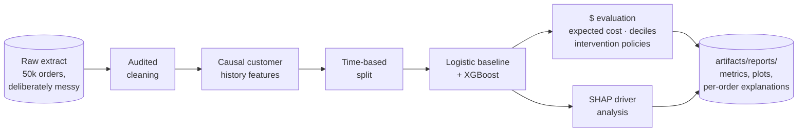
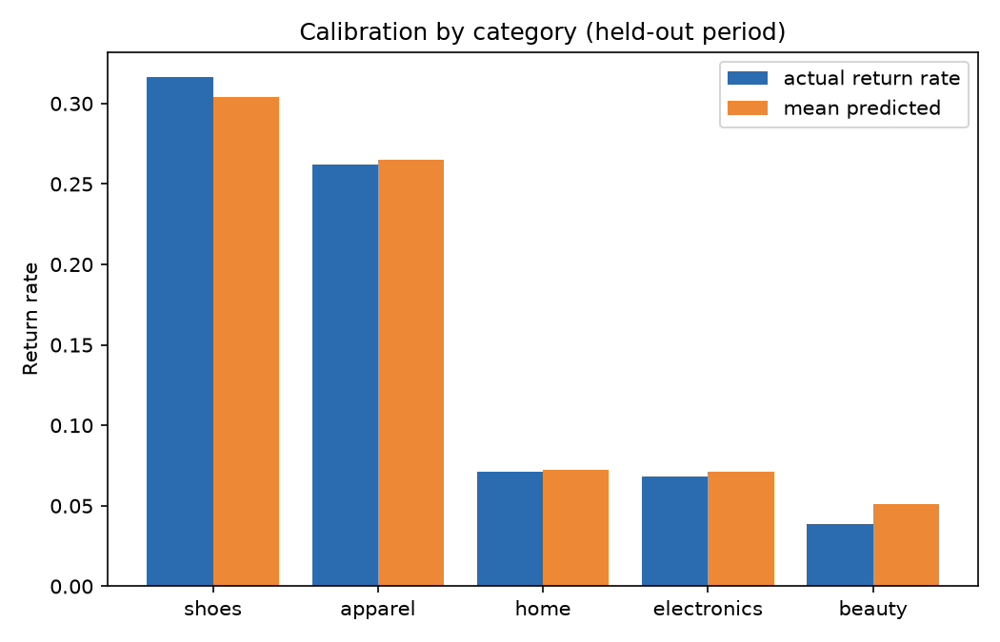
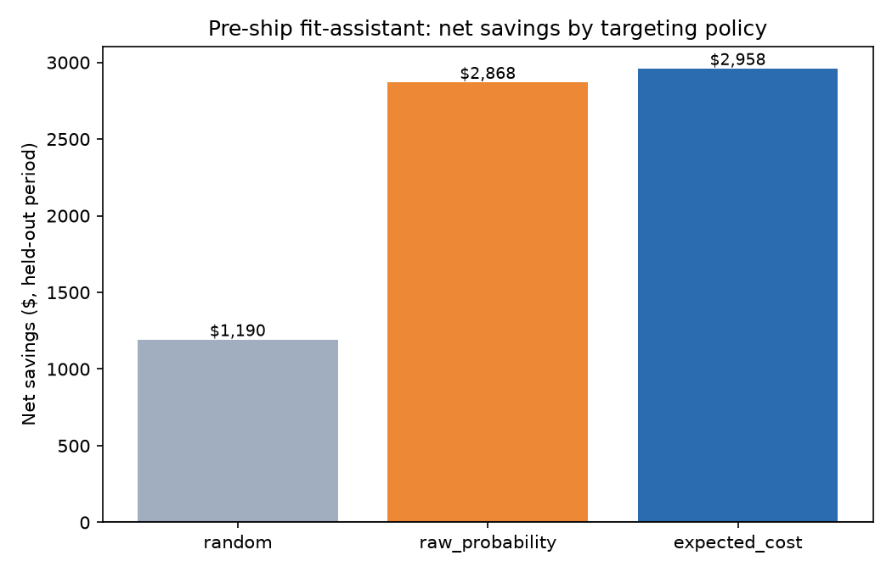
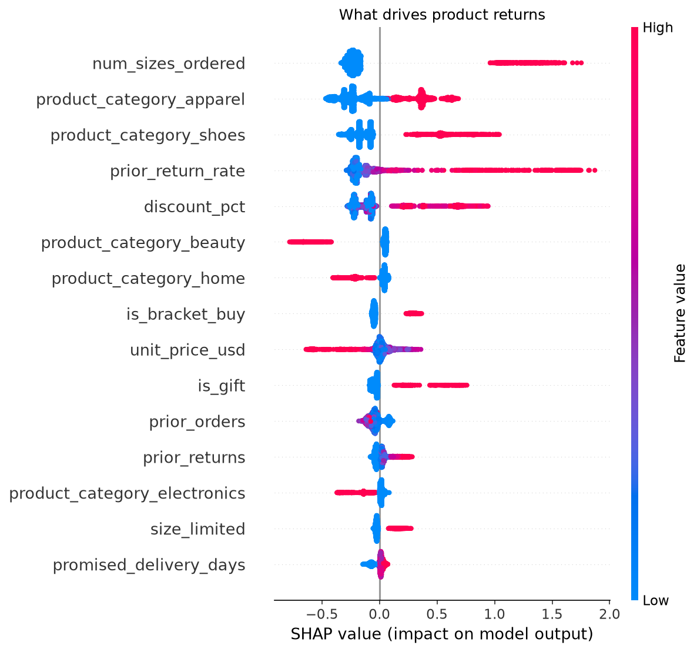
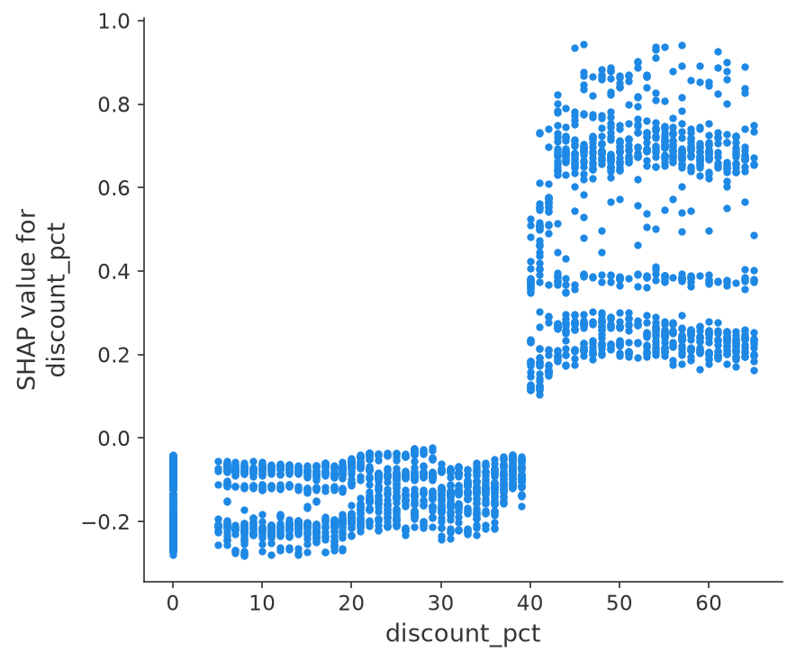
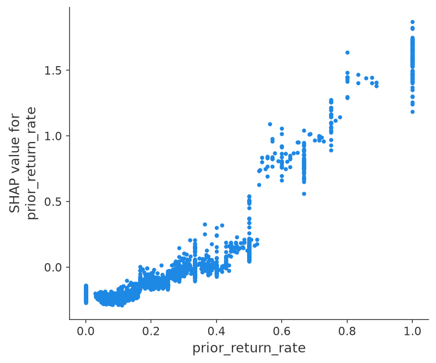

# 🔁 Returns Prediction

**A return is a shipment you pay for twice. This model finds the expensive ones before the parcel ships.**


In apparel e-commerce, 15-30% of everything sold comes back, and for large retailers
reverse logistics is a nine-figure annual cost center. Yet most returns programs only
react: the parcel comes back, gets graded, and the money is already gone. The window
where a return is still preventable closes at the ship scan. This project works that
window. It scores every order at checkout for return risk, prices that risk in reverse-
logistics dollars, and simulates the pre-ship intervention (a fit assistant / size
nudge) that decides whether the whole thing pays for itself.

One command runs the entire journey, no data downloads, ~1 minute on a laptop:

```bash
pip install -e .
returns-predict all
```



## 🎯 The headline numbers

Held-out final ~2 months, 9,915 orders, ~17% base return rate. Nothing here was tuned
on the test period.

| | Logistic baseline | XGBoost |
|---|---:|---:|
| PR-AUC | 0.483 | **0.509** |
| ROC-AUC | 0.783 | **0.799** |
| Brier | 0.116 | **0.112** |

The gradient-boosted model wins here, and it's worth saying why, because in the
[delivery-commit-prediction](../delivery-commit-prediction/) use case next door the
linear baseline ties it. Returns behaviour is made of thresholds and interactions:
a deep discount means opposite things on a dress and on a laptop, return history only
matters once it crosses into habit, and price runs in opposite directions in fashion
versus electronics. None of that is expressible as a sum of per-feature slopes. When
your problem looks like this, the GBM earns its keep; when it doesn't, ship the
baseline.

Ranking metrics don't get a returns program funded, though. Dollars do. Sorted by
**expected return cost** (probability times what the return would cost), the top decile
of orders carries **36% of all return dollars**, and the top three deciles carry 69%:


And the probabilities feeding that arithmetic are honest per segment, because we refuse
to reweight classes (details below). Predicted and actual return rates by category,
held-out period:



## 💸 Probability is the wrong sort key

The cost of a return is roughly fixed logistics (reverse shipping $8, processing $4)
plus a category-dependent slice of the price that never comes back: ~15% markdown loss
on apparel and shoes, ~8% on electronics, and **100% on beauty**, because an opened
hygiene product legally cannot be restocked. Every one of those constants lives in
[evaluate.py](src/returns_prediction/evaluate.py) with a note on what to recalibrate it
from; the dollar figures below are exactly as honest as that file.

Multiply risk by cost and the queue reshuffles top to bottom: a 60% risk on a $200
bracket order ($34 expected loss) outranks an 80% risk on a $15 tee ($12). On the
held-out period, flagging the top 10% of orders by expected cost captures **$13,147**
of return spend, versus $12,721 for the same 10% ranked by raw probability and $3,764
at random.

That margin looks modest until you attach an intervention to it. The pipeline
simulates a pre-ship fit-assistant / size-nudge flow: $0.30 per targeted order, cuts
return probability by 25%, works only on apparel and shoes (a size nudge means nothing
on a blender). Same budget for every policy, top 10% of the day's orders:

| Targeting policy | Orders targeted | Spend | Savings | Net savings | ROI |
|---|---:|---:|---:|---:|---:|
| random | 992 | $298 | $1,487 | $1,190 | 4.0x |
| raw probability | 992 | $298 | $3,166 | $2,868 | 9.6x |
| **expected cost** | 992 | $298 | $3,255 | **$2,958** | **9.9x** |



Even the random program is profitable, which is the quiet trap: a team running
untargeted nudges would see positive ROI and stop asking questions, while leaving
60% of the achievable savings on the table. The test suite pins the ordering
(expected cost > raw probability > random) on two seeds.

## 🔍 What actually drives returns

The beeswarm is the merchandising meeting in one chart. Each dot is an order; red
means the feature value was high. Multiple sizes of the same item, a heavy return
history, deep discounts and fashion categories push orders right (toward returning);
electronics, home and beauty pull left:



Grouped back to merchandising levers (one-hot columns re-aggregated, the bracket pair
merged), the global ranking:

| Rank | Driver | Share of model explanation | |
|---:|---|---:|---|
| 1 | Product category | 38.2% | `███████████████████` |
| 2 | Bracket buying (multi-size) | 20.1% | `██████████` |
| 3 | Prior return rate | 14.0% | `███████` |
| 4 | Discount depth | 10.7% | `█████` |
| 5 | Unit price | 3.3% | `██` |
| 6 | Gift flag | 3.1% | `██` |
| 7 | Prior order count | 3.0% | `██` |
| 8 | Size availability | 2.0% | `█` |

And the sanity check that makes this ranking trustworthy: the generator plants known
noise features, and the model correctly buries them.

| Planted noise feature | Share of model explanation |
|---|---:|
| Page dwell seconds | 1.1% |
| Ad campaign id | 0.6% |

### Dependence plots: the shape of each risk factor

Discount risk is not a slope. It is flat (mildly protective, even) up to 40% off and
then jumps, with the vertical spread past the jump showing the category interaction:
the same markdown is far riskier on fashion than on electronics. Return history is a
regime, not a gradient; customers below a ~40% historical return rate look ordinary,
and above it the risk climbs steeply:

| Discount depth | Prior return rate |
|---|---|
|  |  |

### From global drivers to one flagged order

The pipeline also writes the card a CX or returns desk would see next to a flagged
order (`artifacts/reports/example_order.md`). Verbatim from this run:

> Order `ORD0700046255` — apparel, $70.44, predicted return probability **90%**
>
> | Driver | Value | Contribution to risk (log-odds) |
> |---|---|---|
> | prior_return_rate | 1 | +1.24 (raises risk) |
> | num_sizes_ordered | 2 | +1.11 (raises risk) |
> | discount_pct | 57 | +0.60 (raises risk) |
> | is_bracket_buy | 1 | +0.29 (raises risk) |
> | product_category_apparel | 1 | +0.26 (raises risk) |
> | size_limited | 1 | +0.10 (raises risk) |
> | product_category_shoes | 0 | -0.08 (lowers risk) |
> | promised_delivery_days | 2 | -0.06 (lowers risk) |
>
> **Suggested action:** 2 sizes of the same item in one order and a 100% historical
> return rate over 3 prior orders. Offer the fit assistant before the parcel ships,
> and hold the bonus sample until the keep is confirmed.

Two sizes of the same item, ordered by someone who has returned everything they ever
bought, at 57% off. Nobody needs a data science degree to believe this flag, which is
precisely what makes it actionable.

### The trick that makes the SHAP report testable

The synthetic generator ([synthetic.py](src/returns_prediction/synthetic.py)) has a
*documented causal process*: the true coefficients for bracket buying, category,
discount, history and gifts are right there in the code, alongside deliberately
planted noise (page dwell time, ad campaign id). The test suite asserts SHAP surfaces
the real drivers and buries the noise. If a refactor silently breaks explanations,
**CI fails**. When you adapt this to your own order data, keep the synthetic harness:
it is your regression test for the whole explanation stack.

## 🧠 Design decisions that make or break returns models

**Order-time features only.** Post-delivery signals (delivery photos, wear-and-return
timing, the customer opening a return page) predict returns brilliantly and uselessly:
by the time you observe them, the pre-ship intervention window is gone. The feature
whitelist in [schema.py](src/returns_prediction/schema.py) is the decision point made
executable, and a test asserts the post-ship columns never enter the model matrix.
The one genuinely painful exclusion is delivery lateness. Late delivery really does
elevate returns (it drives the label in the generator), but at order time it hasn't
happened yet. The pre-ship version of that signal is a *predicted* lateness, which is
exactly what the [delivery-commit-prediction](../delivery-commit-prediction/) use case
produces; chaining its score into this model is the natural next feature.

**Expected cost, not probability.** Returns programs that rank by raw risk spend
their budget on cheap, near-certain returns and feel productive doing it. The sort
key everywhere in this pipeline is p times cost, and the intervention table above is
the receipt.

**Customer history must be causal.** `prior_return_rate` at order *t* is computed
from that customer's orders strictly before *t*, generated sequentially in date
order. Compute it globally (the classic one-liner: group by customer, take the mean)
and the feature contains the label's own future; offline metrics soar and deployment
disappoints. A test verifies the causality on a constructed example where the leaky
version gives a different answer, and the time-based split respects the same arrow of
time: the test period sits strictly after training.

**Category economics are not symmetric.** A returned $28 lipstick costs more than a
returned $28 t-shirt, because the lipstick is a total write-off. Encoding
disposition reality (restock fractions, hygiene write-offs) is what makes beauty
orders surface in the expected-cost queue at all; a probability-only view would
never look at them.

**No class reweighting at ~17% positives.** Reweighting buys nothing for ranking at
this imbalance and it wrecks calibration, and this pipeline's entire product surface
is p * cost arithmetic that consumes calibrated probabilities. If your return rate is
far rarer, reweight for trainability and recalibrate on a held-out slice before
anyone multiplies probabilities by dollars.

<details>
<summary>📁 Repository layout</summary>

```
src/returns_prediction/
  schema.py      canonical order schema + the order-time feature whitelist
  synthetic.py   messy synthetic generator with documented ground-truth drivers
  cleaning.py    audited cleaning: duplicates, impossible values, casing, imputation
  features.py    feature engineering, time-based split, model matrix
  train.py       logistic baseline + XGBoost (early-stopped probe, full-window refit)
  evaluate.py    PR-AUC, expected-cost deciles, category calibration, intervention sim
  explain.py     SHAP global + local reports, driver ranking vs ground truth
  cli.py         returns-predict generate | all
tests/           end-to-end tests incl. causal-history and "SHAP recovers the truth"
```

</details>

## 🤝 Contributing

Issues and PRs welcome, especially adapters for public e-commerce datasets with real
return labels, chaining the delivery-commit model's lateness score in as a feature,
and richer intervention catalogs (keep-it refunds, exchange-first flows, deposit
holds for serial bracketers). Please keep the two invariants: no feature that isn't
knowable at order time, and no explanation output without a test that grounds it.

## License

Apache-2.0
