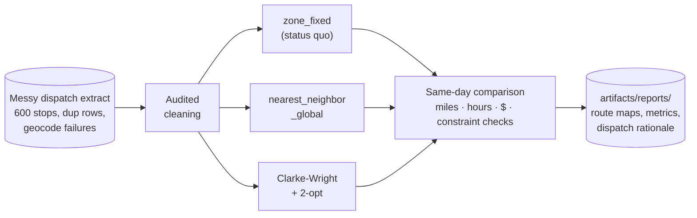
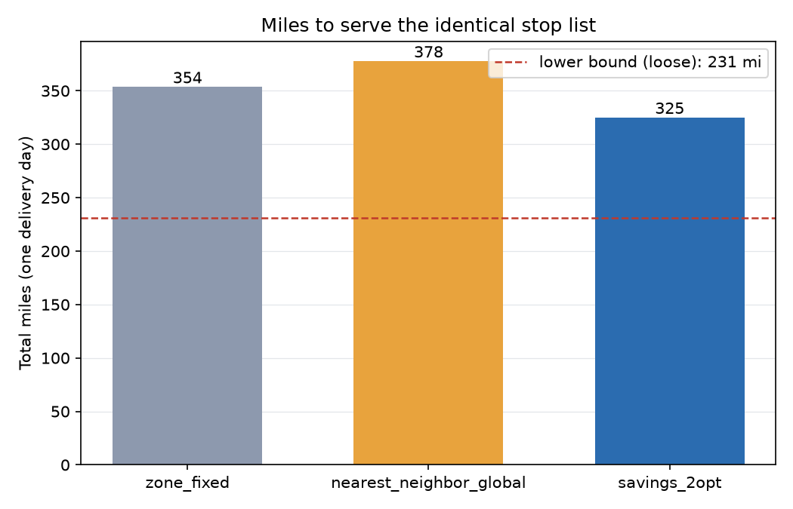
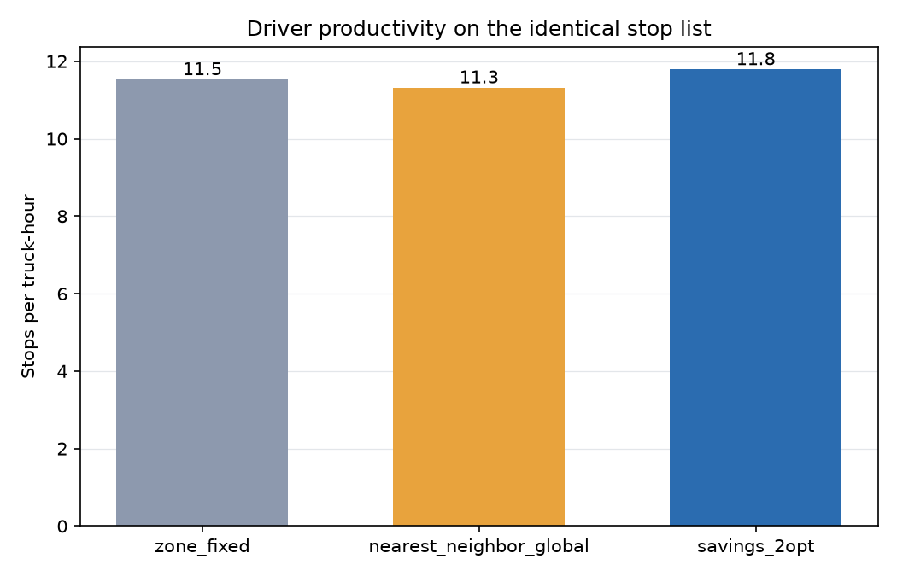

# 🚚 Route Optimization

**Every dispatcher already has routes. The question is what the extra miles cost.**


UPS built ORION and reports saving on the order of 100 million miles a year with it;
FedEx runs its own dynamic route optimization. Both projects are the inspiration here,
and both answer the same deceptively simple question this use case makes measurable:
your depot already delivers every package every day, so how many of today's miles are
the routing rather than the geography? This project routes one identical delivery day
three ways under identical fleet constraints, prices the difference in dollars, and
writes a dispatch sheet a driver could actually run.

Pure-python optimization is a feature, not a compromise. There is no OR-Tools, no MIP
solver, no sklearn; the entire optimizer is numpy you can read in one sitting
([solve.py](src/route_opt/solve.py)), which means you can audit every decision it makes
and port it anywhere python runs.

One command runs everything, no data downloads, a couple of seconds on a laptop:

```bash
pip install -e .
route-opt all
```



## 🎯 The headline numbers

One delivery day: 592 routable stops, 1,147 packages, trucks that hold 180 packages,
9-hour driver shifts, 25 mph between stops. Every policy serves the identical cleaned
stop list, so the differences below are pure routing:

| Policy | Miles | Trucks | Route hours | Max route | $/day | Saved vs zones/yr |
|---|---:|---:|---:|---:|---:|---:|
| zone_fixed (status quo) | 354 | 7 | 51.4 | 8.03h | $2,252 | — |
| nearest_neighbor_global | 378 | 7 | 52.3 | 8.95h | $2,309 | **-$14,288** |
| **savings_2opt** | **325** | 7 | 50.2 | 8.92h | **$2,184** | **+$16,965** |

Loose lower bound: 231 miles. No plan can beat that number, so the optimizer's 325 is
in the right neighborhood, not just better than the alternatives it was compared to.

Two findings worth reading twice:

1. **The obvious greedy upgrade is a downgrade.** Global nearest-neighbor, the first
   thing every team tries, drives 7% MORE miles than the dispatchers' fixed zones.
   Early trucks cherry-pick the close stops and the last trucks inherit leftovers
   scattered across the whole metro. If your pitch to a depot is "we replaced your
   zones with a greedy algorithm", the depot was right to say no.
2. **The optimizer wins on miles, not on hours worked.** All three plans use 7 trucks
   and finish inside shift. The saving is 29 miles and 1.2 route-hours a day, 8.1% of
   miles on this day (8 to 23% across generator seeds; this one is the zone plan's
   best showing). At $0.85/mile plus $38/driver-hour that is $68/day, about **$17k a
   year for a single 7-truck depot**, and route optimization is a per-depot multiplier:
   a 500-depot network at this rate clears $8M/yr. That arithmetic is why ORION was
   worth a decade of UPS's attention. Scale check: ORION reported roughly 6-8 miles
   saved per route per day; this synthetic depot yields ~4 per truck against an
   honest, workload-balanced baseline.

## 🗺️ The money chart

Same metro, same 592 stops, same star of a depot. Left: fixed zones, each truck sweeping
its wedge. Right: what Clarke-Wright and 2-opt do with the same day:


Look at what the optimizer chose to do differently. The zone plan chains rural
stragglers to whatever wedge they happen to fall in, so several trucks each make their
own long excursion to the metro's edge. The optimizer instead dedicates one truck
(green, right panel) to a single perimeter loop through the rural ring and lets the
other six work compact cluster territory. No rule told it to do that; it falls out of
the savings arithmetic.

| Fewer miles | More stops per hour |
|---|---|
|  |  |

## 🧾 The audit trail: a sheet a driver could run

No SHAP in this use case; there is no model to attribute. What a routing recommendation
must survive instead is the dispatcher's question: "can my driver actually run this
sheet?" So the pipeline writes `rationale.md` with full manifests for two example
trucks, cumulative load and clock time checked line by line. Verbatim from this run,
the fullest truck (105 stops, 180 of 180 packages, back at 16:15):

| # | Stop | Type | Leg mi | Cum mi | Pkgs | Load | Arrive |
|---:|---|---|---:|---:|---:|---:|---|
| 1 | STP0700063 | residential | 4.20 | 4.2 | 2 | 2 | 08:10 |
| 2 | STP0700328 | residential | 0.57 | 4.8 | 1 | 3 | 08:14 |
| ... | _101 more stops_ | | | | | | |
| 104 | STP0700359 | commercial | 1.12 | 53.2 | 4 | 179 | 15:52 |
| 105 | STP0700056 | commercial | 0.32 | 53.5 | 1 | 180 | 15:58 |
| 106 | DEPOT | return | 4.43 | 58.0 | 0 | 180 | 16:15 |

The rationale also attributes the savings between the two algorithm stages, so nobody
takes "the optimizer did it" on faith:

| Stage | Total miles | Saved at this stage |
|---|---:|---:|
| zone_fixed (status quo) | 353.5 | — |
| after Clarke-Wright construction | 332.6 | 20.9 |
| after per-route 2-opt | 324.9 | 7.8 |

Construction does the heavy lifting because it decides WHICH stops share a truck;
2-opt then uncrosses each route's path. That 73/27 split is typical, and it tells you
where to invest if you extend this: better assignment beats better sequencing.

## 🧠 Design decisions that make or break routing projects

**Why Clarke-Wright + 2-opt and not a MIP solver.** An exact CVRP formulation at 600
stops needs a commercial solver, hours of tuning, and still gets solved heuristically
under the hood. Clarke-Wright (1964) plus 2-opt lands within a few percent of solver
results at this scale, runs in under a second, is deterministic, and fits in a page of
commented numpy that an ops engineer can audit line by line. When a routing decision
gets challenged (and it will be), "here is the savings formula and the merge that fired"
beats "the solver said so". If you outgrow it, the evaluation harness here doesn't
change; only `solve.py` does.

**Why fixed zones are the right comparator.** Benchmarks love comparing against random
or nothing. Depots run zones: fixed territories keep drivers on familiar streets, make
dispatch trivial, and survive because they are genuinely decent. This baseline is
deliberately strong; zone boundaries are balanced on package volume, not naive equal
angles (an equal-angle strawman loses by 41% and proves nothing). What stays fixed is
what stays fixed in real depots: the lines never move when today's demand shifts, and
that is precisely the slack the optimizer collects. Beating a strawman by a lot is
easy; beating the real thing by 8% is worth money.

**Euclidean distance, stated plainly.** Travel here is straight-line miles at a blended
25 mph. Real deployments use road-network distances and time-of-day speeds, and the
difference is not cosmetic: one-way streets, rivers and highway access change which
merges are profitable. What survives the swap is everything structural: the savings
construction, 2-opt, the constraint checks and the evaluation harness all operate on a
distance matrix and never assume geometry. Plug a routing engine (OSRM, Valhalla) into
`distance_matrix()` and the rest of the pipeline runs unchanged. Expect the optimizer's
edge to grow, not shrink, on road networks; fixed zones cope even worse with bridges
than with clusters.

**Where time windows would slot in.** Real days have "business closes at 17:00" and
"apartment building, morning only". Both constraints belong in exactly two places: the
feasibility check that guards each Clarke-Wright merge, and the 2-opt acceptance test
(a reversal that shortens miles can still violate a window). The dispatch sheet already
computes per-stop arrival clocks, so the reporting side is ready today. That is also
the honest reason commercial tools are big: windows, driver breaks and packing rules
multiply, and each one lands in those same two functions.

**The lower bound keeps everyone honest.** Every stop must be reached and left, and
each truck must leave and re-enter the depot, so half the sum of each node's two
cheapest links bounds any feasible plan from below. It is a LOOSE bound (it ignores
tour consistency and the shift clock entirely) and the README says so rather than
implying near-optimality. Its job is context: 325 heuristic miles against a 231-mile
bound says the remaining headroom is at most ~29%, and in practice far less.

**Cleaning is audited because routing is literal.** One stop geocoded to (0, 0) drags
a truck to null island; a duplicated stop gets two visits; a negative package count
quietly inflates capacity. The generator plants all three faults, and
[cleaning.py](src/route_opt/cleaning.py) logs every fix into `cleaning_report.csv`.
Geocode failures are dropped to a re-geocode worklist rather than imputed, since an
invented coordinate is worse than a missing one.

<details>
<summary>📁 Repository layout</summary>

```
src/route_opt/
  synthetic.py   one depot day: clustered residential, a commercial strip,
                 rural stragglers; messy extract faults planted on demand
  cleaning.py    audited cleaning: dup stops, null-island geocodes, bad counts
  solve.py       zone_fixed / nearest_neighbor_global / Clarke-Wright + 2-opt,
                 shared constraint checks, degree-based lower bound
  evaluate.py    per-policy miles/trucks/hours/$, route maps, bar charts
  explain.py     dispatch sheets with load + clock, savings attribution
  cli.py         route-opt generate | all
tests/           stops served exactly once, capacity + shift respected,
                 optimizer margin on two seeds, 2-opt monotone, bound holds
```

</details>

## 🤝 Contributing

Issues and PRs welcome, especially time-window support in the merge and 2-opt
feasibility checks, an Or-opt / relocate improvement pass to compare against plain
2-opt, and a road-network distance adapter. Please keep the two invariants: every
policy respects capacity and shift duration on every route, and no recommended plan
without a dispatch sheet a human can check by hand.

## License

Apache-2.0
