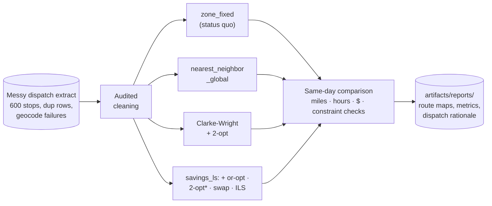

# 🚚 Route Optimization

**Every dispatcher already has routes. The question is what the extra miles cost.**


UPS built ORION and reports saving on the order of 100 million miles a year with it, and
other large carriers run their own dynamic route optimization. That work is the
inspiration here, and it answers the same deceptively simple question this use case makes measurable:
your depot already delivers every package every day, so how many of today's miles are
the routing rather than the geography? This project routes one identical delivery day
four ways under identical fleet constraints, prices the difference in dollars, and
writes a dispatch sheet a driver could actually run.

Pure-python optimization is a feature, not a compromise. There is no OR-Tools, no MIP
solver, no sklearn; the entire optimizer is numpy you can read in one sitting
([solve.py](src/route_opt/solve.py)), which means you can audit every decision it makes
and port it anywhere python runs.

One command runs everything, no data downloads, about fifteen seconds on a laptop:

```bash
pip install -e .
route-opt all
```



## 🎯 The headline numbers

One delivery day: 592 routable stops, 1,147 packages, trucks that hold 180 packages,
9-hour driver shifts, 25 mph between stops. Every policy serves the identical cleaned
stop list, so the differences below are pure routing:

| Policy | Miles | Trucks | Route hours | Max route | $/day | Saved vs zones/yr |
|---|---:|---:|---:|---:|---:|---:|
| zone_fixed (status quo) | 354 | 7 | 51.4 | 8.03h | $2,252 | — |
| nearest_neighbor_global | 378 | 7 | 52.3 | 8.95h | $2,309 | **-$14,288** |
| savings_2opt | 325 | 7 | 50.2 | 8.92h | $2,184 | +$16,965 |
| **savings_ls** | **312** | 7 | 49.7 | 8.95h | **$2,154** | **+$24,318** |

Loose lower bound: 231 miles. No plan can beat that number, so the optimizer's 312 is
in the right neighborhood, not just better than the alternatives it was compared to.

Two findings worth reading twice:

1. **The obvious greedy upgrade is a downgrade.** Global nearest-neighbor, the first
   thing every team tries, drives 7% MORE miles than the dispatchers' fixed zones.
   Early trucks cherry-pick the close stops and the last trucks inherit leftovers
   scattered across the whole metro. If your pitch to a depot is "we replaced your
   zones with a greedy algorithm", the depot was right to say no.
2. **The optimizer wins on miles, not on hours worked.** All four plans use 7 trucks
   and finish inside shift. The saving is 41 miles and 1.6 route-hours a day, 11.6% of
   miles on this day (the simpler savings_2opt alone ranged 8 to 23% across generator
   seeds, and this seed is the zone plan's best showing). At $0.85/mile plus
   $38/driver-hour that is $97/day, about **$24k a year for a single 7-truck depot**,
   and route optimization is a per-depot multiplier: a 500-depot network at this rate
   clears $12M/yr. That arithmetic is why ORION was worth a decade of UPS's attention.
   Scale check: ORION reported roughly 6-8 miles saved per route per day; this
   synthetic depot yields ~6 per truck against an honest, workload-balanced baseline.

## 🗺️ The money chart

Same metro, same 592 stops, same star of a depot. Left: fixed zones, each truck sweeping
its wedge. Right: what the full optimizer (savings_ls) does with the same day:


Look at what the optimizer chose to do differently. The zone plan chains rural
stragglers to whatever wedge they happen to fall in, so several trucks each make their
own long excursion to the metro's edge. The optimizer instead dedicates two trucks
(green and pink, right panel) to complementary sweeps of the rural perimeter and lets
the other five work compact cluster territory. No rule told it to do that; it falls
out of the savings arithmetic and the local-search moves.

| Fewer miles | More stops per hour |
|---|---|
|  |  |

## 🧾 The audit trail: a sheet a driver could run

No SHAP in this use case; there is no model to attribute. What a routing recommendation
must survive instead is the dispatcher's question: "can my driver actually run this
sheet?" So the pipeline writes `rationale.md` with full manifests for two example
trucks, cumulative load and clock time checked line by line. Verbatim from this run,
the fullest truck (105 stops, 180 of 180 packages, back at 16:16):

| # | Stop | Type | Leg mi | Cum mi | Pkgs | Load | Arrive |
|---:|---|---|---:|---:|---:|---:|---|
| 1 | STP0700026 | residential | 3.21 | 3.2 | 1 | 1 | 08:07 |
| 2 | STP0700249 | residential | 0.51 | 3.7 | 1 | 2 | 08:11 |
| ... | _101 more stops_ | | | | | | |
| 104 | STP0700329 | residential | 0.59 | 64.8 | 2 | 179 | 16:04 |
| 105 | STP0700352 | residential | 0.33 | 65.2 | 1 | 180 | 16:08 |
| 106 | DEPOT | return | 2.20 | 67.4 | 0 | 180 | 16:16 |

The rationale also attributes the savings between the algorithm stages, so nobody
takes "the optimizer did it" on faith:

| Stage | Total miles | Saved at this stage |
|---|---:|---:|
| zone_fixed (status quo) | 353.5 | — |
| after Clarke-Wright construction | 332.6 | 20.9 |
| after per-route 2-opt | 324.9 | 7.7 |
| after or-opt + 2-opt* + swap local search | 316.6 | 8.3 |
| after 40-round ILS (final plan) | 312.5 | 4.1 |

Construction is still the largest single stage because it decides WHICH stops share a
truck — but notice that the improvement stack (2-opt + the inter-route moves + ILS)
now collectively matches it, 20.1 miles to 20.9. The old 73/27 construction-vs-polish
split was really a statement about how weak plain 2-opt is: it can only reorder within
a truck. The moves that earn the rest (or-opt relocations, 2-opt* tail swaps, stop
swaps) work BETWEEN trucks, quietly repairing assignment mistakes construction locked
in — which is exactly where serious solvers spend their effort.

## 📏 Benchmarked against CVRPLIB

Beating your own baselines proves nothing by itself, so both optimizers are also
scored against [CVRPLIB](https://galgos.inf.puc-rio.br/cvrplib), the standard academic
benchmark library for the capacitated VRP, where every instance has a best-known
solution (BKS) — for the sets below, a proven optimum. Same code as the pipeline above
(`solve.py`, unmodified), run under CVRPLIB's rules: instance capacity, no shift clock,
TSPLIB-rounded integer distances, depot round trips counted the standard way.

| Instance | Customers | CW+2-opt | Gap | savings_ls | Gap | BKS | NN (context) | Runtime |
|---|---:|---:|---:|---:|---:|---:|---:|---:|
| A-n32-k5 | 31 | 829 | 5.7% | 784 | **0.0%** | 784 | +46% | 0.4s |
| A-n45-k6 | 44 | 992 | 5.1% | 970 | **2.8%** | 944 | +57% | 0.5s |
| A-n65-k9 | 64 | 1,265 | 7.8% | 1,203 | **2.5%** | 1,174 | +49% | 0.5s |
| A-n80-k10 | 79 | 1,838 | 4.2% | 1,818 | **3.1%** | 1,763 | +33% | 0.9s |
| B-n50-k7 | 49 | 745 | 0.5% | 741 | **0.0%** | 741 | +40% | 0.5s |
| B-n78-k10 | 77 | 1,257 | 3.0% | 1,247 | **2.1%** | 1,221 | +44% | 0.7s |
| X-n101-k25 | 100 | 28,936 | 4.9% | 28,205 | **2.2%** | 27,591 | +52% | 0.6s |
| X-n153-k22 | 152 | 22,607 | 6.5% | 22,243 | **4.8%** | 21,220 | +42% | 2.1s |
| **mean** | | | **4.7%** | | **2.2%** | | +45% | |

Reproduce it (downloads ~8 instances into `data/cvrplib/` on first run, offline after):

```bash
route-opt bench
```

What the gaps mean, stated honestly: Clarke-Wright + 2-opt alone leaves 0.5–7.8% on
the table against solutions nobody has ever beaten; the local-search stack + ILS cuts
that to **0–4.8%, mean 2.2%, and finds the proven optimum outright on two of the
eight instances** — 31 to 152 customers, at most ~2 seconds per instance, still
deterministic. Production engines close most of the rest — OR-Tools' guided local
search or LKH-3 typically land within 0–2% of BKS given seconds to minutes — and if a
percent of miles pays for a dependency, use them. What they don't give you is a solver
you can read: the price of "auditable numpy, zero dependencies, deterministic" is now
a measured 2.2% mean, not a hand wave. The nearest-neighbor column is the same context
as in the pipeline above: the simple greedy everybody tries first is 33–57% above
optimal on these instances, and the distance from NN to either of our solvers is far
larger than the distance from our solvers to perfect.

## 🧠 Design decisions that make or break routing projects

**Why a readable local-search stack and not a MIP solver.** An exact CVRP formulation
at 600 stops needs a commercial solver, hours of tuning, and still gets solved
heuristically under the hood. What actually wins CVRP benchmarks — LKH-3, HGS, the
whole modern lineage — is not exact optimization either: it is construction plus a
stack of cheap improvement moves (2-opt, or-opt, 2-opt*, swaps) driven to a local
optimum, plus a metaheuristic to escape it. `savings_ls` is that same family,
implemented small: Clarke-Wright (1964) construction, the four classic moves over
nearest-neighbor candidate lists, and a seeded 40-round iterated local search — a few
hundred lines of commented numpy, deterministic, byte-identical output on every run.
The measured price of that transparency dropped from ~4.7% mean above proven optima
(plain CW + 2-opt) to **2.2% mean, 4.8% worst** on the CVRPLIB bench above. When a
routing decision gets challenged (and it will be), "here is the savings formula, the
move that fired, and the stage-by-stage attribution" beats "the solver said so". If
you outgrow it, the evaluation harness here doesn't change; only `solve.py` does.

**Why fixed zones are the right comparator.** Benchmarks love comparing against random
or nothing. Depots run zones: fixed territories keep drivers on familiar streets, make
dispatch trivial, and survive because they are genuinely decent. This baseline is
deliberately strong; zone boundaries are balanced on package volume, not naive equal
angles (an equal-angle strawman loses by 41% and proves nothing). What stays fixed is
what stays fixed in real depots: the lines never move when today's demand shifts, and
that is precisely the slack the optimizer collects. Beating a strawman by a lot is
easy; beating the real thing by 12% is worth money.

**Euclidean distance, stated plainly.** Travel here is straight-line miles at a blended
25 mph. Real deployments use road-network distances and time-of-day speeds, and the
difference is not cosmetic: one-way streets, rivers and highway access change which
merges are profitable. What survives the swap is everything structural: the savings
construction, every local-search move, the constraint checks and the evaluation
harness all operate on a distance matrix and never assume geometry. Plug a routing engine (OSRM, Valhalla) into
`distance_matrix()` and the rest of the pipeline runs unchanged. Expect the optimizer's
edge to grow, not shrink, on road networks; fixed zones cope even worse with bridges
than with clusters.

**Where time windows would slot in.** Real days have "business closes at 17:00" and
"apartment building, morning only". Both constraints belong in exactly two kinds of
place: the feasibility check that guards each Clarke-Wright merge, and the acceptance
test of every improvement move (a reversal, relocation or swap that shortens miles can
still violate a window — the capacity and shift checks already sit exactly there in
`_Plan`). The dispatch sheet already computes per-stop arrival clocks, so the
reporting side is ready today. That is also the honest reason commercial tools are
big: windows, driver breaks and packing rules multiply, and each one lands in those
same few functions.

**The lower bound keeps everyone honest.** Every stop must be reached and left, and
each truck must leave and re-enter the depot, so half the sum of each node's two
cheapest links bounds any feasible plan from below. It is a LOOSE bound (it ignores
tour consistency and the shift clock entirely) and the README says so rather than
implying near-optimality. Its job is context: 312 heuristic miles against a 231-mile
bound says the remaining headroom is at most ~26%, and in practice far less — on
CVRPLIB, where true optima are known, savings_ls's real headroom averages 2.2%.

**Cleaning is audited because routing is literal.** One stop geocoded to (0, 0) drags
a truck to null island; a duplicated stop gets two visits; a negative package count
quietly inflates capacity. The generator plants all three faults, and
[cleaning.py](src/route_opt/cleaning.py) logs every fix into `cleaning_report.csv`.
Geocode failures are dropped to a re-geocode worklist rather than imputed, since an
invented coordinate is worse than a missing one.

<details>
<summary>📁 Repository layout</summary>

```
src/route_opt/
  synthetic.py   one depot day: clustered residential, a commercial strip,
                 rural stragglers; messy extract faults planted on demand
  cleaning.py    audited cleaning: dup stops, null-island geocodes, bad counts
  solve.py       zone_fixed / nearest_neighbor_global / savings_2opt /
                 savings_ls (or-opt + 2-opt* + swap local search + seeded ILS),
                 shared constraint checks, degree-based lower bound
  evaluate.py    per-policy miles/trucks/hours/$, route maps, bar charts
  explain.py     dispatch sheets with load + clock, stage-by-stage savings
                 attribution (construction / 2-opt / local search / ILS)
  cvrplib.py     TSPLIB parser, instance registry + fetch, adapters running
                 both solvers under CVRPLIB rules
  bench.py       gap-to-BKS benchmark for both solvers, bench_results.csv +
                 markdown table
  cli.py         route-opt generate | all | bench
tests/           stops served exactly once, capacity + shift respected,
                 optimizer margin on two seeds, savings_ls never loses to
                 savings_2opt, every operator preserves feasibility,
                 byte-determinism with the seeded ILS, bound holds;
                 CVRPLIB parser + BKS-cost round-trip + gap and mean-gap
                 assertions on two committed instances
                 (tests/fixtures/{A-n32-k5, A-n65-k9}, attributed)
```

</details>

## 🤝 Contributing

Issues and PRs welcome, especially time-window support in the merge and move
acceptance checks, a 3-opt or segment-reversal or-opt extension to the move stack,
and a road-network distance adapter. Please keep the two invariants: every policy
respects capacity and shift duration on every route, and no recommended plan without
a dispatch sheet a human can check by hand.

## License

Apache-2.0
