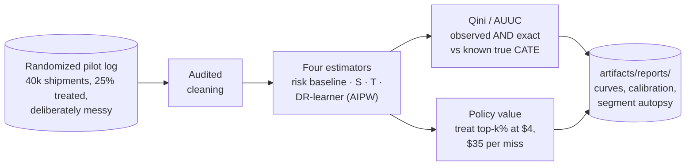
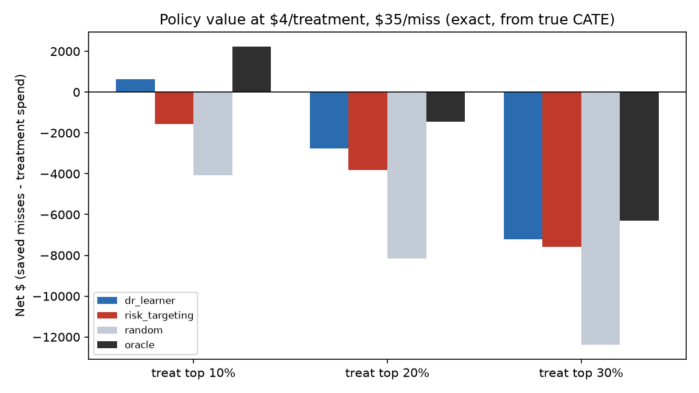
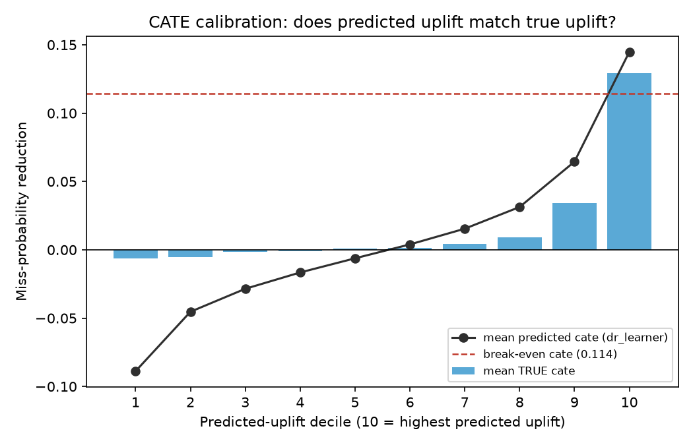

# 🎯 Uplift Modeling

**The riskiest shipment is not the one you can save. Target interventions by treatment effect, not by risk.**


The [intervention-optimization](../intervention-optimization/) use case turns risk scores
into budgeted decisions, and it quietly assumes the intervention works the same on every
shipment. It doesn't. A reroute fixes a congestion problem and does nothing about a storm,
yet storm-bound shipments carry the highest risk scores in the network. Every dollar a
risk-ranked program spends on them is wasted, and no amount of model accuracy fixes that,
because risk was the wrong quantity to rank by. This use case estimates each shipment's
individual treatment effect (CATE) from a randomized pilot and shows, in dollars, what
switching the sort key from risk to uplift is worth.

One command runs the entire comparison, no data downloads, a few seconds on a laptop:

```bash
pip install -e .
uplift-model all
```



## 🎯 The headline numbers

Held-out 30% of the pilot (12,129 shipments, ~13% base miss rate). AUUC is the area
between each method's Qini curve and the random-targeting diagonal, normalized so the
oracle (ranking by the generator's true CATE) is 1.0:

| Method | AUUC (share of oracle) |
|---|---:|
| oracle (true effect) | 1.000 |
| s_learner | 0.928 |
| **dr_learner** | **0.804** |
| t_learner | 0.706 |
| risk targeting (status quo) | 0.667 |
| random | 0.018 |


The right-hand panel is the honest one: it shows the same six policies evaluated the way
a real pilot would have to (observed outcome differences between arms), and the noise it
carries relative to the exact left panel is the variance a production uplift program
lives with.

Ranking quality becomes money when you fix a budget. Treat the top k% by each method's
score, at $4 per treatment and $35 per missed commitment, scored exactly against the true
effects:

| Method | k | Treated | Misses prevented | Spend | Net |
|---|---|---:|---:|---:|---:|
| **dr_learner** | 10% | 1,213 | **157.0** | $4,852 | **+$643** |
| risk targeting | 10% | 1,213 | 94.3 | $4,852 | -$1,553 |
| random | 10% | 1,213 | 22.3 | $4,852 | -$4,071 |
| oracle | 10% | 1,213 | 202.3 | $4,852 | +$2,229 |
| dr_learner | 20% | 2,426 | 198.2 | $9,704 | -$2,766 |
| risk targeting | 20% | 2,426 | 167.9 | $9,704 | -$3,827 |
| oracle | 20% | 2,426 | 235.5 | $9,704 | -$1,460 |



Two things worth reading twice in that table. At the same 10% budget, the same shipments
and the same intervention, switching the ranking from risk to the DR-learner moves the
program from losing $1,553 to making $643. And even the oracle goes negative at 20%
depth: only about 8% of shipments have a true effect above the $4/$35 break-even
(CATE > 0.114), so past that point every policy is buying misses it cannot prevent. The
right budget question is not "how do we rank" but "how deep is the uplift supply", and a
CATE model is what lets you ask it.

## 💡 The money insight: the riskiest segment is the least treatable

The generator plants three effect regimes, and the autopsy table (verbatim from
`artifacts/reports/segment_autopsy.csv`) is the whole argument for uplift modeling in
four rows:

| Segment | n | Mean risk score | Mean control miss prob | Mean TRUE cate | Mean dr predicted cate |
|---|---:|---:|---:|---:|---:|
| routing_driven | 1,186 | 0.316 | 0.317 | **0.162** | **0.130** |
| weather_driven | 1,430 | **0.379** | **0.397** | -0.003 | -0.013 |
| overnight | 1,569 | 0.088 | 0.091 | -0.020 | -0.040 |
| other | 7,944 | 0.065 | 0.065 | 0.006 | 0.002 |

Read the weather row. It is the riskiest segment in the network by a wide margin (40%
miss probability), it sits at the very top of the risk model's ranking, and its true
treatment effect is zero: you can re-plan a linehaul path, you cannot reroute around a
storm parked on the destination. Risk targeting burns its budget exactly there. The
DR-learner scores the segment at -0.013 and skips it, while finding the routing-driven
segment (congested origin, long ground lane, the thing a reroute actually fixes) at
0.130 predicted vs 0.162 true.

The overnight row is the third regime: rerouting an overnight parcel inserts an extra
handling leg into a window with no slack, and the true effect is negative (+2pp miss
probability). Treating everyone is not a neutral default; some interventions hurt.

CATE calibration by predicted-uplift decile, with the break-even line the policy needs
to clear:



The ranking is clean and the top decile is nearly unbiased (0.145 predicted vs 0.129
true), but the low deciles over-shoot downward. That over-dispersion is the signature of
the DR pseudo-outcomes' variance, and it is why the policy layer should consume the
RANKING plus a break-even threshold, not the raw point estimates.

## 🧪 An honest upset: the simplest learner wins the ranking

The AUUC table above does not put the DR-learner first; the S-learner (one model with
the treatment flag as a feature) beats it, 0.928 to 0.804. This repo has a tradition of
load-bearing baselines (delivery-commit's logistic regression beats its XGBoost, and the
README there explains why that is the point), so the result stays in the table rather
than getting tuned away.

It is also explainable. This pilot is the S-learner's best case: assignment is truly
randomized, the treated arm is a full 25%, and the planted effect is large and dense, so
a single well-fit outcome model captures it directly. The DR-learner pays a real variance
price for its robustness: its pseudo-outcomes multiply outcome noise by 1/e = 4 on the
treated arm. What the DR-learner buys with that price is insurance you cannot photograph
on this dataset: consistency when treatment assignment is NOT clean, when the propensity
must be estimated, and when either the outcome or the propensity model is misspecified.
On a randomized pilot you may ship the S-learner; the moment your log drifts toward
observational (and every production log does, the instant targeting goes live), the
doubly-robust construction is the one still standing. The tests therefore hold the
DR-learner to the bar that matters: it must beat risk targeting decisively on two seeds,
and it does, by ~0.14 AUUC and by about $2,200 of policy value at the 10% budget.

## 🧠 Design decisions that make or break uplift programs

**You cannot learn uplift from a targeted log.** This is the same lesson as
[dynamic-pricing](../dynamic-pricing/)'s "you cannot learn elasticity from a disciplined
cost-plus log", wearing a different hat. If historical reroutes only ever went to
shipments the old risk rule flagged, treatment is a deterministic function of the
features, treated and untreated shipments never overlap on the strata that matter, and
no estimator can separate "the reroute helped" from "these shipments were different".
The generator randomizes 25% of shipments precisely because identification comes from
the DATA COLLECTION, not the model. If you cannot run a full experiment, inject
exploration: even a small randomized holdout inside a targeted policy keeps the
counterfactual learnable.

**Known propensity is a luxury; say so out loud.** Because the pilot is randomized, the
AIPW pseudo-outcomes use the design constant e = 0.25. On observational data you would
estimate e(x), check overlap (no stratum where e(x) approaches 0 or 1), and lean on the
doubly-robust property: the estimate stays consistent if either the outcome model or the
propensity model is right. Those two diagnostics, propensity calibration and overlap,
are the first thing to demand from any vendor claiming uplift from historical logs.

**The DR final stage is not a normal regression.** Pseudo-outcomes carry
inverse-propensity noise, so the final regressor needs far heavier regularization than a
model fit to real labels. Fitting it with the same parameters as the classifiers costs
about 0.2 of normalized AUUC on this data, which is the single biggest implementation
pitfall in the whole pipeline. The two parameter sets sit side by side in
[models.py](src/uplift_modeling/models.py) with a comment saying exactly this.

**Evaluate both ways, and know which one you trust.** Every Qini curve is computed twice:
from observed outcomes (the only option in production, unbiased under randomization,
noisy) and exactly from the generator's true CATE (the synthetic luxury that makes the
test suite possible). Plotting them side by side is deliberate; the day you adapt this
to real data, the left panel disappears and the right panel's noise is your life. Keep
the synthetic harness as the regression test for the evaluation stack itself.

**A ranking is a policy only after it meets a budget and a break-even.** The policy layer
here is intentionally minimal: flat $4 treatment, flat $35 miss, treat top-k%. The tiered
miss-cost model from [intervention-optimization](../intervention-optimization/) (base
cost by customer tier plus a share of declared value) slots in where `MISS_COST_USD`
appears in [evaluate.py](src/uplift_modeling/evaluate.py), and turns this into
value-weighted uplift targeting: rank by `cate x miss_cost - cost` instead of `cate`.

## ⚠️ Honest limitations

The pilot is assumed perfectly randomized with a known, constant propensity; real pilots
suffer non-compliance, contamination and logging gaps that this pipeline does not model.
The miss cost is flat, one intervention is evaluated (no action catalog, no capacity
constraints), and effects are assumed stable over the pilot window. On observational
data the DR-learner additionally requires estimated propensities, overlap diagnostics
and unconfoundedness, and that last assumption is untestable; the exactness of every
dollar figure here comes from the synthetic ground truth and is replaced by
holdout-experiment estimates the moment the data is real.

<details>
<summary>📁 Repository layout</summary>

```
src/uplift_modeling/
  synthetic.py   randomized pilot generator: documented p0, TRUE_EFFECT with
                 three planted regimes, exposed true_cate, mess injection
  cleaning.py    audited cleaning: duplicate ids, negative distances, casing,
                 bounds -> NaN -> impute with flags
  models.py      risk baseline / S / T / DR-learner (AIPW, cross-fitted),
                 whitelist model matrix, hash split
  evaluate.py    Qini observed + exact, AUUC vs oracle, CATE calibration,
                 policy value, segment autopsy
  cli.py         uplift-model generate | all
tests/           determinism, cleaning per mess class, truth-column pollution
                 guard, RCT balance, DR beats risk on 2 seeds, segment shape
                 recovery, oracle bounds
```

</details>

## 🤝 Contributing

Issues and PRs welcome, especially value-weighted policy targeting (plug in the tiered
miss-cost model), an R-learner or causal-forest comparison arm, estimated-propensity +
overlap diagnostics for observational adaptation, and budgeted policies that stop at the
break-even depth instead of a fixed k. Please keep the two invariants: the ground-truth
columns never reach a model matrix, and no estimator claim without a test that grounds
it against the generator.

## License

Apache-2.0
