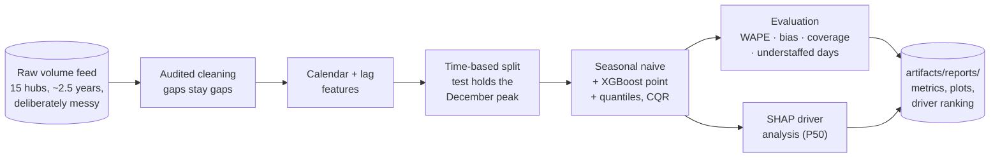
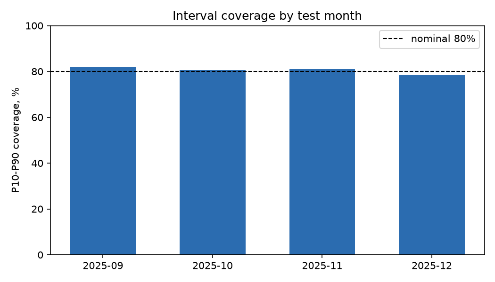
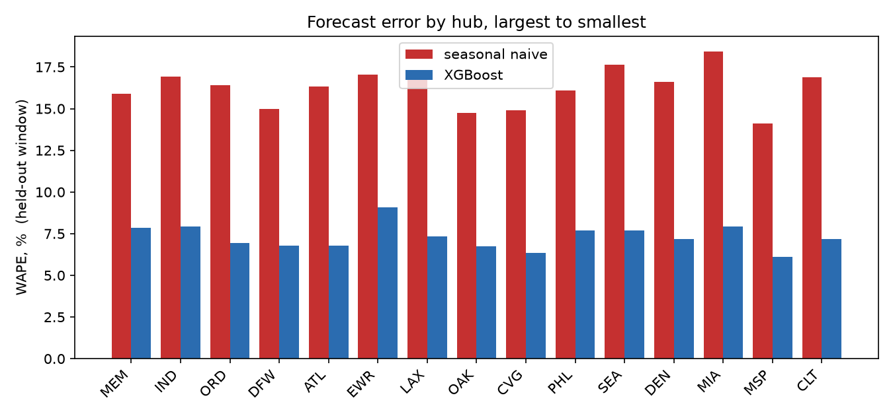
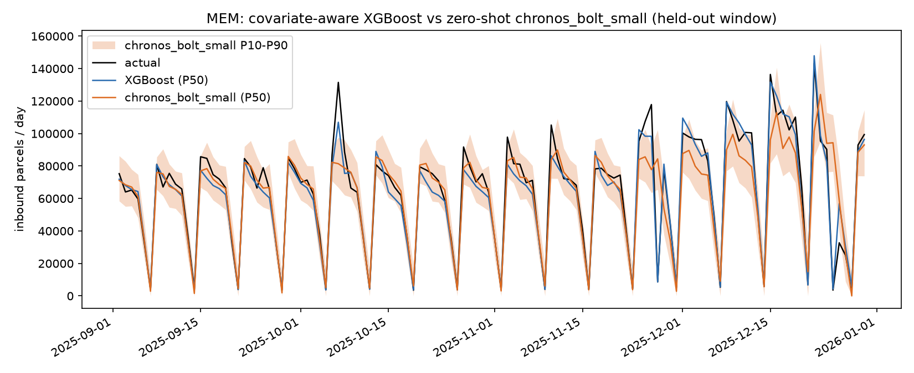
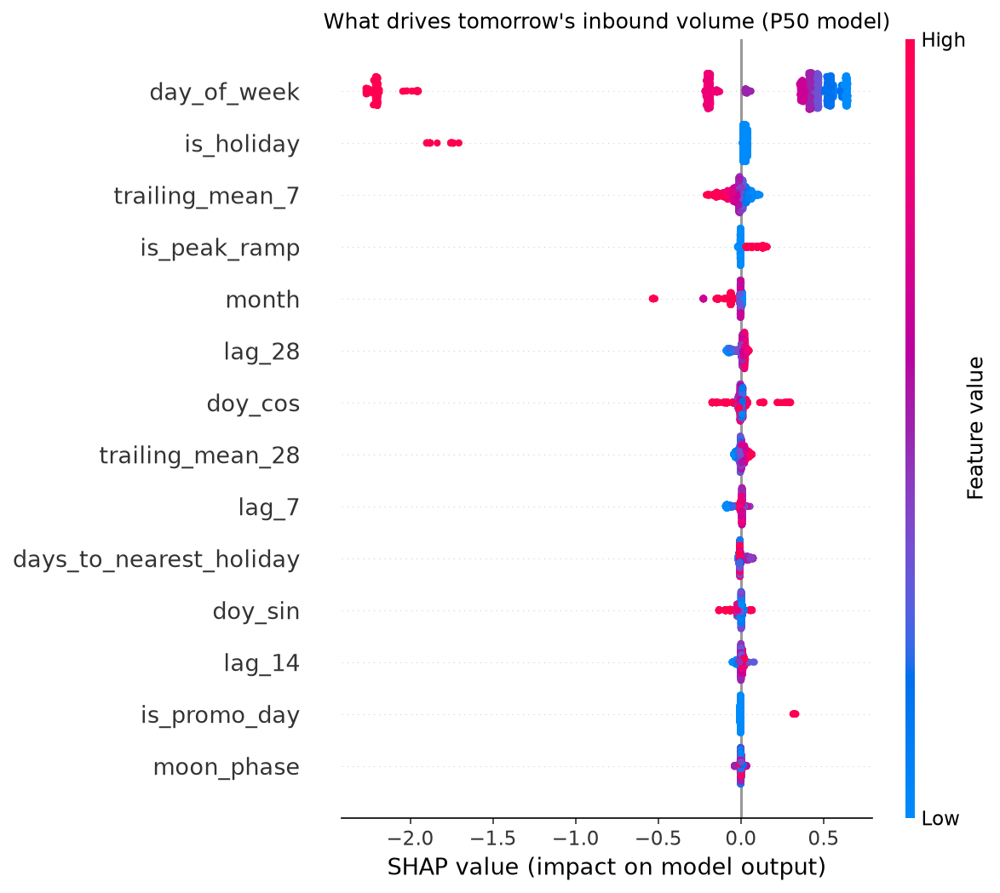
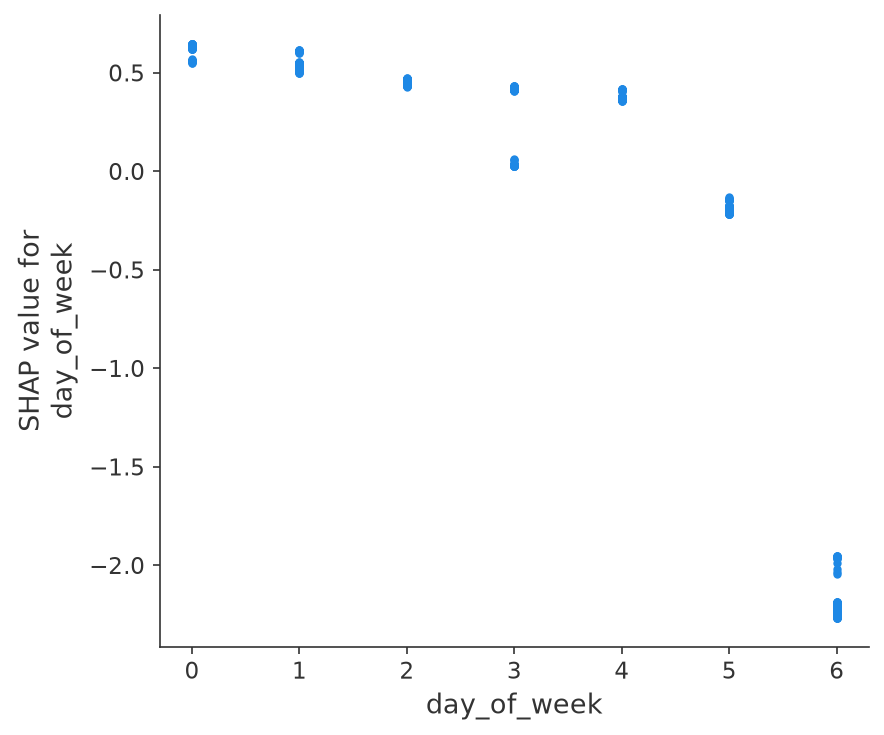
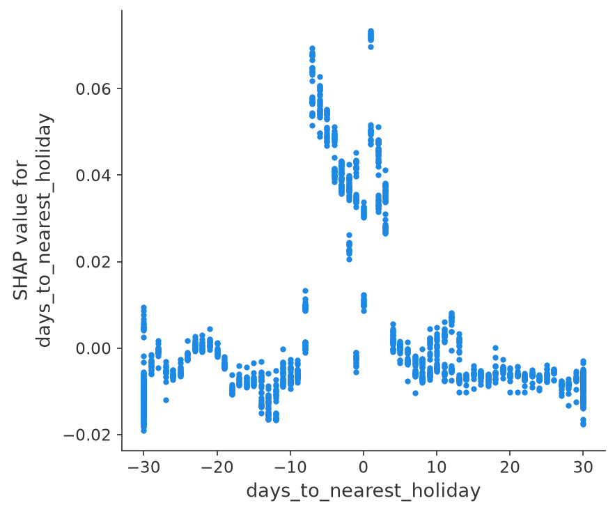

# 📈 Volume Forecasting

**How many parcels hit each hub tomorrow, next week, next month — so you can staff and position capacity before the wave arrives.**


Every sort facility staffs against a guess. Get the guess low and parcels queue on the
dock while overtime gets phoned in; get it high and a shift stands around. This project
forecasts daily inbound volume for each of 15 hubs as a full quantile set: P50 is the
plan, P10–P90 is the honest range, and P80 is the capacity you actually staff to,
because an understaffed Monday costs far more than a quiet Tuesday. The benchmark it
must beat is the forecast every ops floor already uses: same weekday last week.

One command runs the entire journey, no data downloads, ~1 minute on a laptop:

```bash
pip install -e .
volume-forecast all
```



## 🎯 The headline numbers

Held-out final 4 months (Sep 2 – Dec 30, 2025; 1,744 hub-days), which contain the
entire November–December peak. Nothing was tuned on the test window.

| | Seasonal naive | XGBoost |
|---|---:|---:|
| WAPE, overall | 16.2% | **7.5%** |
| WAPE, peak season (Nov 20 – Dec 22) | 17.8% | **7.1%** |
| sMAPE, overall | 17.0% | **7.6%** |
| Bias, overall | +0.3% | -1.1% |
| Bias, peak season | **-9.3%** | -1.6% |

The error halves, but the row worth reading twice is peak-season bias. The naive rule
under-forecasts the December ramp by 9.3% every single week, because "same as last
Monday" is always one rung behind a climb of 3–4% per day. That is a systematic
staffing shortfall in exactly the weeks when agency labor is scarcest and most
expensive. The model rides the ramp instead:


Worth noticing in that chart: the flash-sale spike in mid-October is caught by the
model (the promo calendar is a feature; marketing publishes it weeks ahead) while the
naive misses it and then *falsely predicts it again* a week later. The naive makes the
same double error around every holiday collapse.

## 👷 The staffing decision

This is the table the whole project exists for. Staff each hub-day to a planned
capacity and count the days the wave overtops it:

| Staffing policy | Understaffed days | Parcels over capacity | Idle capacity |
|---|---:|---:|---:|
| Seasonal naive | 54.2% | 8.0% | 8.2% |
| Point forecast | 52.4% | 4.3% | 3.2% |
| **Staff to P80** | **19.4%** | **1.1%** | 8.5% |

A good point forecast is not a staffing plan. The point forecast halves the parcels
caught over capacity, yet it still leaves the floor short on half of all days, because
a median is *designed* to be exceeded half the time. Staffing to the P80 quantile cuts
understaffed days to 19% and uncovered parcels to 1.1%, and the cost is spelled out in
the same table: 8.5% planned capacity that goes idle. Whether that trade is right for
your network is a business decision; the quantile model is what turns it into one.

## 📏 Intervals you can plan against

The P10–P90 band is honest: **80.5% empirical coverage against the 80% nominal**, and
it holds right through the hardest month instead of quietly failing in December:



Coverage in the peak weeks themselves is 80.5% as well. The residual misses are
concentrated where they should be: a two-day regional weather shutdown in the test
window that no calendar feature could have seen coming.

Accuracy also holds across the hub-size spectrum, from the 52k-parcel superhub to a
1.8k-parcel regional sort (WAPE 7.5% / 7.6% / 7.3% across large / mid / small
terciles), so small hubs are not paying for the big ones:



## 🤖 Foundation models vs gradient boosting

The loudest current argument in forecasting is whether a pretrained time-series
foundation model — hand it raw history, get quantiles back, no features, no training —
makes a tuned pipeline like the one above obsolete. This repo can answer for its own
data instead of arguing by blog post: Amazon's **Chronos-Bolt** (tiny and small),
zero-shot on CPU, scored on the *identical* held-out window as everything else. The
protocol is the honest one, rolling-origin day-ahead: for every test day, the context
is the actual cleaned history up to the day before (feed gaps stay NaN; Chronos masks
missing values natively), the model predicts one step, and no forecast is ever fed
back in as history. All 15 hubs batch into one model call per day, so the full
protocol — 120 days x 15 hubs x 2 models — takes about 7 seconds of model time on a
laptop CPU.

| | Seasonal naive | XGBoost (P50 + band) | Chronos-Bolt tiny | Chronos-Bolt small |
|---|---:|---:|---:|---:|
| WAPE, overall | 16.2% | **7.5%** | 28.3% | 13.6% |
| WAPE, peak season (Nov 20 – Dec 22) | 17.8% | **7.1%** | 34.5% | 20.3% |
| Bias, peak season | -9.3% | **-1.2%** | -14.0% | -13.0% |
| Pinball loss, P10 / P50 / P90 (parcels) | — | **274 / 634 / 286** | 1268 / 2391 / 962 | 713 / 1152 / 684 |
| P10–P90 coverage, overall (nominal 80%) | — | 80.5% | 75.6% | 84.2% |
| P10–P90 coverage, peak season | — | **80.5%** | 61.4% | 62.5% |

Per-hub WAPE: **XGBoost wins 15 of 15 hubs** against both Chronos sizes; the closest
any hub gets is still roughly a 2x error gap. But read the middle columns fairly,
both ways. Chronos-Bolt small, which has never seen a parcel network, beats the
seasonal naive overall (13.6% vs 16.2%) and its overall interval is honestly
calibrated (84.2% against the 80% nominal) — that is a real forecast from nothing but
a column of history, no feature pipeline, no training run. Bolt-tiny is a caution
instead: it cannot hold this data's 19:1 weekly amplitude (in a spot check it put a
Sunday at 40k parcels against an actual of 5.8k) and lands *worse than the
spreadsheet*, so "a foundation model" is not one thing — size matters.



The overlay shows where the gap lives. Chronos-small tracks the weekly rhythm well
through the quiet months, then December arrives and every orange peak sits below the
black one: peak-season bias -13.0%, nearly identical to the naive's -9.3%, while
coverage collapses to 62% in exactly the weeks a staffing plan leans on the band. And
the mid-October flash sale that XGBoost catches from the published promo calendar is
invisible to Chronos — a promo spike simply does not exist in the history it
conditions on.

That is the actual industry tradeoff, stated both ways. Chronos is univariate and
zero-shot: it never saw the promo calendar, the holiday table, or a peak-ramp flag —
the covariates XGBoost gets as features — and no amount of pattern-matching on raw
history can forecast an event that is only announced in a marketing calendar. XGBoost,
in turn, needed everything Chronos skips: a feature pipeline, documented holiday and
promo tables, a log-ratio target, tuning, and conformal calibration. A zero-shot FM is
the right call when that apparatus doesn't exist yet — cold-start series, hundreds of
heterogeneous series nobody will hand-feature, a credible forecast needed this
afternoon. The GBM earns its keep the moment the future is partly *known* — promos,
holidays, peak ramps — because known-future covariates are precisely what a
history-only model cannot see, and this data (like most retail-adjacent volume) puts
its money weeks on exactly those days.

Reproduce it (torch is a ~200MB wheel, which is why this is an optional extra and not
a default dependency — the core pipeline and CI never install it):

```bash
pip install -e ".[fm]"
volume-forecast fm-bench            # ~1 minute total; models download from HF Hub
```

Outputs land next to the standard reports: `artifacts/reports/fm_benchmark.json`,
`fm_comparison.csv`, and the overlay above.

## 🔍 What actually drives tomorrow's volume

SHAP on the P50 model. The weekly rhythm dominates, exactly as the generative process
says it should (Sunday runs at ~6% of a Monday), with holiday effects and recent
history layered on top:



The global ranking, with every feature mapped to its operational lever group:

| Rank | Driver | Lever group | Share of model explanation | |
|---:|---|---|---:|---|
| 1 | Day of week | calendar | 70.8% | `██████████████████` |
| 2 | Holiday flag | holiday & peak | 5.9% | `██` |
| 3 | Trailing 7-day mean | volume history | 4.1% | `█` |
| 4 | Peak-ramp flag | holiday & peak | 3.1% | `█` |
| 5 | Month | calendar | 2.7% | `█` |
| 6 | Volume lag-28 | volume history | 2.4% | `█` |
| 7 | Day-of-year (cos) | calendar | 2.0% | `█` |
| 8 | Trailing 28-day mean | volume history | 1.8% | `█` |
| 9 | Volume lag-7 | volume history | 1.6% | `█` |
| 10 | Days to nearest holiday | holiday & peak | 1.5% | `█` |

And the control rows that make the ranking trustworthy. The generator plants two
features with exactly zero causal effect, and the model buries both:

| Planted noise feature | Share of model explanation |
|---|---:|
| Moon phase | 0.37% |
| Hub paint color code | 0.11% |

Hub identity dummies land at 0.6% *combined*, which is not a failure: the model
forecasts the ratio to each hub's own recent history, so hub scale is already cancelled
before the trees ever see a row. An explanation that matches the architecture is
another sign the explanation stack is wired correctly.

### Dependence plots: the shapes ops would predict

The day-of-week curve is the sort profile every hub manager carries in their head, and
the days-to-holiday curve shows the surge-then-collapse signature: contributions climb
in the final week before a holiday (shoppers beating the closure) and the holiday
itself is handled by the separate holiday flag:

| Day of week | Days to nearest holiday |
|---|---|
|  |  |

### The trick that makes the SHAP report testable

The synthetic generator ([synthetic.py](src/volume_forecasting/synthetic.py)) exposes
its entire generative process as `TRUE_COMPONENTS`: the per-hub base scales, the
day-of-week profile, the holiday table with its multipliers, the promo dates, the
weather shutdowns, the noise level. The test suite asserts that SHAP surfaces the true
drivers (weekly rhythm, recent history, holiday proximity) and that the planted noise
stays under 1% of the explanation. If a refactor silently breaks feature engineering or
the explanation grouping, **CI fails**. Keep this harness when you adapt the pipeline:
it is the regression test for your whole explanation stack.

## 🏭 Adapting to your own volume data

1. Produce a DataFrame with the columns in
   [schema.py](src/volume_forecasting/schema.py): a hub id, a date, and the daily
   inbound volume. That is the whole input; everything else is derived.
2. Replace the fixed holiday and promo calendars in
   [features.py](src/volume_forecasting/features.py) with your network's holiday file
   and your marketing team's promo calendar. Both are known well before any forecast is
   made, which is what makes them legal features.
3. **Respect forecast time.** Nothing same-day: no scan counts, no door telemetry, no
   linehaul manifests for the day being predicted. History enters through lags only.
4. Run `volume-forecast all` and read `artifacts/reports/`.

## 🧠 Design decisions that make or break volume forecasts

**WAPE and bias, never MAPE.** Sundays here run at ~6% of a Monday, so percentage
errors on near-dark days are enormous numbers about nothing: a 40-parcel miss on a
60-parcel Sunday is a 67% MAPE contribution the staffing plan does not care about.
WAPE weights by parcels, which is what the labor plan is denominated in. Bias gets its
own column because the two error directions are not symmetric for staffing: chronic
under-forecast (see the naive's -9.3% in peak) means missed sorts every week, while
zero-mean noise mostly washes out over a pay period.

**The test window must contain the peak.** A random split, or a test window that ends
in October, certifies the model on ten easy months and hides the six weeks the
forecast exists for. Here the held-out window is pinned to the final four months so it
always spans Nov 20 – Dec 22, and every metric is reported peak-only as well as
overall. Early stopping and conformal calibration use only the last slice of
*training* time, so the December being graded is never the December being fitted.

**Lags only, and gaps stay gaps.** Every feature is knowable before the forecast day
starts: calendar, published promo dates, and volume history through yesterday. Lags
are computed on a per-hub daily calendar, so a lag that reaches into a feed gap comes
back NaN (XGBoost routes it natively) instead of silently becoming a lag of the wrong
day. Cleaning counts the gaps but refuses to interpolate them, because invented
history poisons every lag feature downstream.

**Forecast the ratio, not the level.** All XGBoost models predict
`log1p(volume) - log1p(trailing 7-day mean)`. Hub scale and the e-commerce growth
trend cancel in the subtraction, which matters because trees cannot extrapolate a
trend they have never seen; a ratio model never needs to. What remains for the model
to learn is the compact calendar structure shared by all hubs, and the anchor's
own noise is kept low by averaging seven days rather than trusting one lucky Monday.

**Staff to P80, and calibrate the quantiles.** Raw in-sample quantile fits are always
slightly overconfident, since the model's own estimation error is invisible to them.
A split-conformal margin measured on the last 90 days of training time widens the band
just enough to be honest (73% -> 80.5% coverage here) without touching the models. The
choice of P80 as the staffing quantile is not sacred: the understaffed-days table is
recomputed for any quantile you train, and the right level is wherever your cost of an
idle hour crosses your cost of a missed sort.

<details>
<summary>📁 Repository layout</summary>

```
src/volume_forecasting/
  schema.py      canonical hub-day schema + validation
  synthetic.py   messy synthetic generator; every component exposed as
                 TRUE_COMPONENTS (dow profile, holiday table, promos, weather)
  cleaning.py    audited cleaning: duplicates, negatives, same-weekday
                 corruption rule; gaps counted, never filled
  features.py    calendar + lag features on a gap-tolerant daily calendar,
                 time-based split pinned to the December peak
  train.py       seasonal naive + XGBoost point + quantile models on a
                 log-ratio target, refit after early stopping, CQR calibration
  evaluate.py    WAPE/sMAPE/bias by segment, coverage, pinball, the
                 understaffed-days table, overlay and coverage plots
  explain.py     SHAP on the P50 model: beeswarm, lever-grouped ranking,
                 dependence plots
  fm_benchmark.py  zero-shot Chronos-Bolt (tiny + small) vs XGBoost on the
                 same held-out window, rolling-origin day-ahead; optional
                 "fm" extra so torch never enters the default install
  cli.py         volume-forecast generate | all | fm-bench
tests/           end-to-end tests incl. "beats the seasonal naive", honest
                 coverage, and "SHAP recovers the true drivers"
```

</details>

## 🤝 Contributing

Issues and PRs welcome, especially adapters for public demand datasets (M5 is the
obvious one), longer-horizon variants (the same feature frame supports 7-day-ahead
forecasts if the trailing means shift by a week), and cost-weighted staffing policies
that turn the understaffed-days table into dollars. Please keep the two invariants: no
feature that isn't knowable before the forecast day, and no explanation output without
a test that grounds it.

## License

Apache-2.0
